# GLAMDRING

<div align="center">


</div>

**Reads Splunk, Sentinel/Defender, QRadar, CEF/LEEF/syslog, Netskope and Zscaler, and turns
them into a navigable 3D incident graph.** Entities as nodes, actions as directed edges,
time as an axis. The SIEM stays the source of truth: every node and every edge opens the
literal log that produced it. Runs locally, one process, no authentication.

> Documentation is in Spanish, under [`docs/`](docs/). This README is the English entry point.

---

## Quick start

```powershell
cd GLAMDRING
python -m venv .venv
.\.venv\Scripts\Activate.ps1
pip install -r requirements.txt
powershell -ExecutionPolicy Bypass -File tools\run.ps1
```

Open <http://localhost:8000> and press **Demo**.

---

## What it looks like

The whole incident on one screen: entities as nodes, actions as directed edges, the
timeline underneath. Filters on the left narrow by severity, role, entity, relation,
source and MITRE tactic — and the counts update as you go.

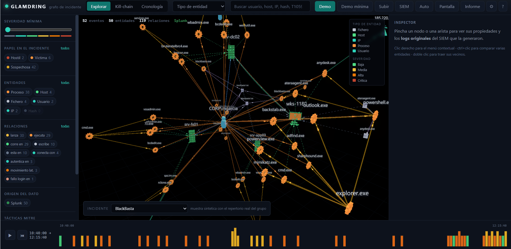

Click any node and the inspector gives you its risk, its time window, the MITRE tactics it
took part in, which product saw it, and every relation it has. From there, the original
SIEM log is one more click away — that is the rule the whole tool is built on.

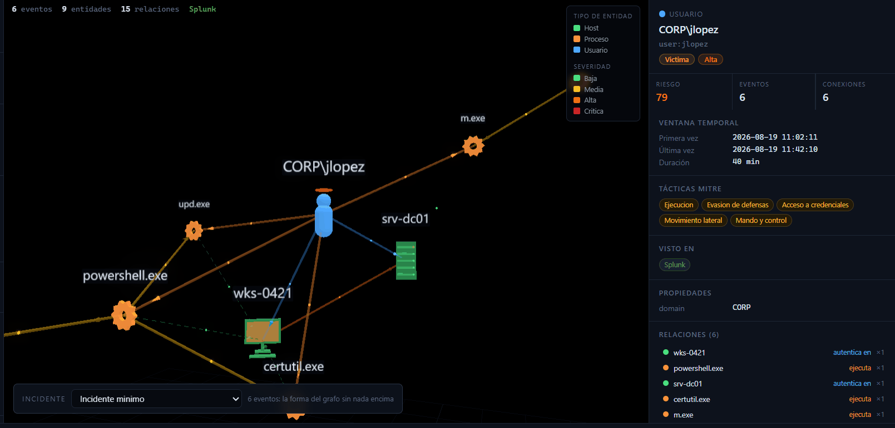

---

## What it does

### Six sources, one vocabulary

| Source | What it understands | How it gets in |
|---|---|---|
| **Splunk** | `WinEventLog:Security` (4624, 4625, 4634, 4648, 4720, 4728, 1102, 7045, 4104), Sysmon (1, 2, 3, 5, 7, 8, 10, 11, 12, 13, 15, 22, 23), firewall/proxy/DNS sourcetypes and CIM fields | pull, service token |
| **Sentinel / Defender** | `DeviceProcessEvents`, `DeviceNetworkEvents`, `DeviceFileEvents`, `DeviceLogonEvents`, `DeviceRegistryEvents`, `DeviceEvents`, `IdentityLogonEvents`, `CloudAppEvents`, `SigninLogs`, `EmailEvents`, `SecurityAlert` | pull, Service Principal with *Log Analytics Reader* |
| **IBM QRadar** | Ariel results (`starttime`, `sourceip`, `magnitude`, `categoryname`…) and offenses | pull, token in the `SEC` header |
| **CEF / LEEF / syslog** | CEF 0.x, LEEF 1.0 and 2.0, syslog RFC5424 and RFC3164, and arbitrary JSON as a safety net | file, or pushed to the receiver |
| **Netskope** | Application events: the cloud app, the action inside it, the policy verdict and bytes each way | pull, stateful iterator |
| **Zscaler** | ZIA web and tunnel logs, ZPA private-app access | **ZIA pushes** via NSS · ZPA pulls |

The common target is a pragmatic subset of [OCSF](https://schema.ocsf.io/), the
vendor-neutral schema backed by AWS and Splunk (`glamdring/normalize/`).

### A closed activity vocabulary

Not a style preference — it is what makes cross-SIEM correlation possible at all.

Before, each normalizer emitted whatever string seemed reasonable. Measured result: **14
values with no definition, and the same fact under three different names.** A DNS
resolution of the same domain came out as `query` from Splunk, `connect` from QRadar and
`create` from CEF. If the same fact does not produce the same value, the graph cannot join
what one tool says with what another says — which is the entire point of the tool.

Now: **34 activities**, each with a definition, an OCSF class and the node it produces
([`docs/VOCABULARIO.md`](docs/VOCABULARIO.md)). Three rules, each backed by a measurement:

- **The outcome is not an activity — it lives in `status`.** `blocked` and `logon_failed`
  are gone. Measured by collapsing them: nodes, edges, narrative sentence and
  `is_key_event` came out **identical across all 11 events** that carried them.
- **A value exists only if it changes something.** The counter-proof: `logon_remote`
  stays, because collapsing it into `logon` changes the edge from `lateral` to `connected`.
- **Values are unique across the whole vocabulary,** not within their class. `create` used
  to mean file created, DNS query *and* antivirus detection at the same time.

---

## At a glance

Nine diagrams that explain the whole system without reading a line of code.

### Where it sits on the network

It installs no agents and responds to nothing: it reads what the tools already collected.
The one exception is the receiver, which does listen — and that is why it carries a
per-source key and a rate limit.

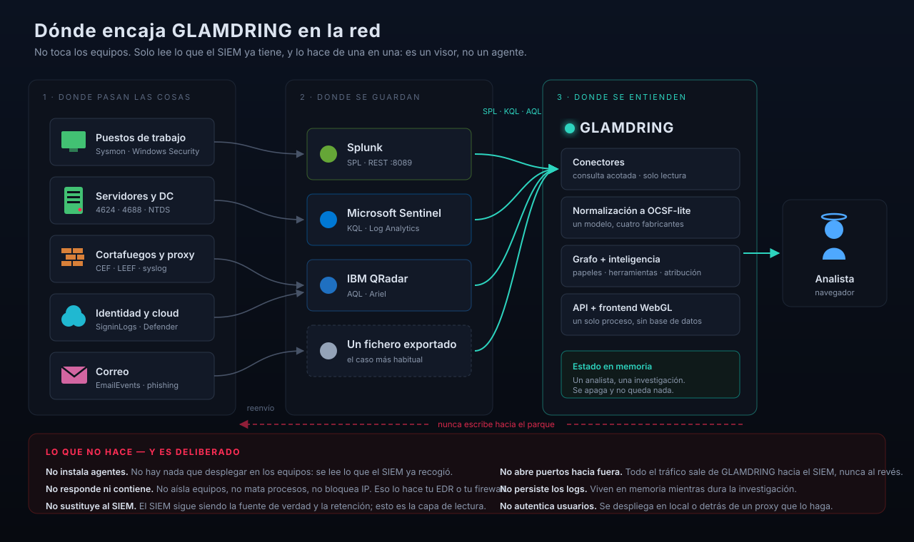

### Two intake paths, because some sources cannot be queried

Zscaler ZIA web logs **do not come out of its API** — NSS pushes them. That is not a vendor
quirk: it is how syslog, webhooks and Splunk's HEC all work. Designing for it is why
`POST /api/receive/{source}` exists.

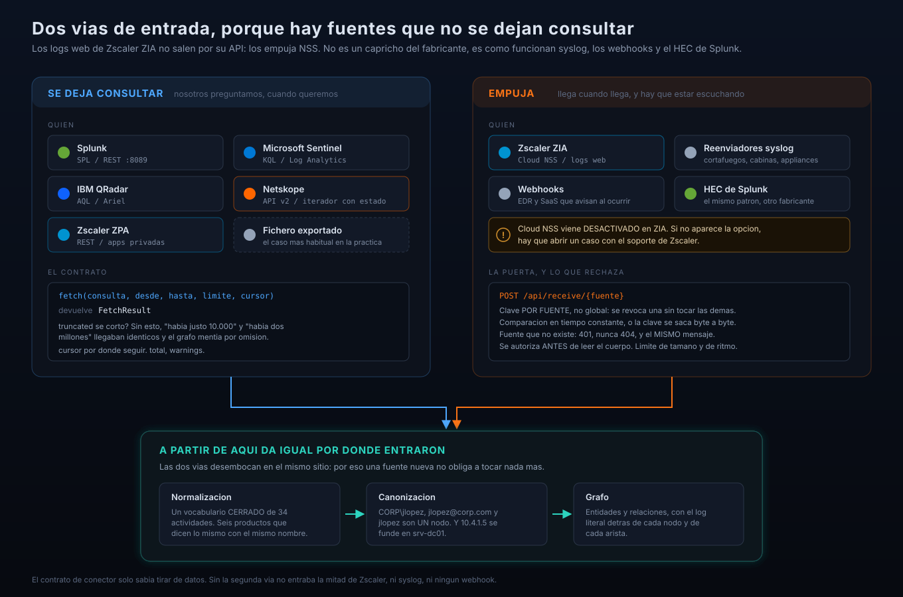

### What happens to a log once it enters

Six stages, each with its own contract. At the bottom, the same Splunk record crossing all
of them: raw, normalized, graph, with judgement.

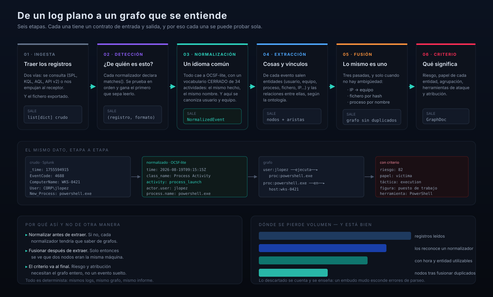

### How the graph is drawn

No npm and no build step: ES modules with an `importmap` and three.js r168, pinned to the
revision `3d-force-graph` ships. At the foot, the three traps that raise no error and cost
the most time.

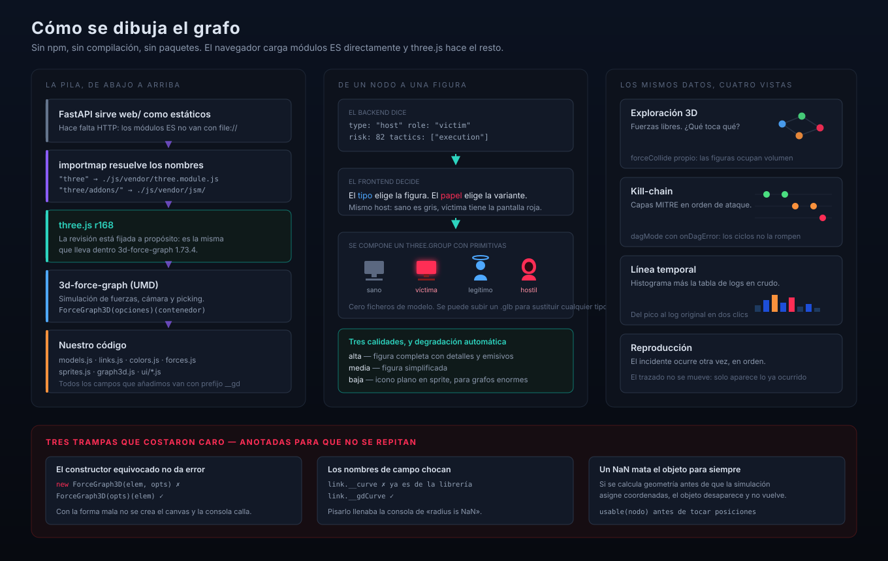

Full-screen mode strips everything but the graph, for a wall display or a handover. The
background switches between room, black and paper, and the incident selector keeps working
so the unattended loop can move from one case to the next.

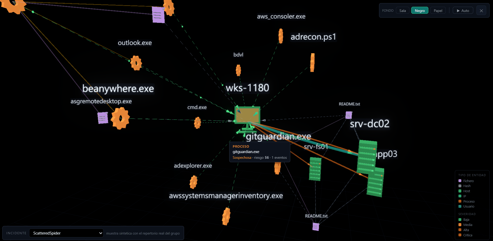

### What the perimeter adds

A firewall log does not say which process opened the connection, but it says when, how much
and where to. Crossed with the endpoint, it closes the case.

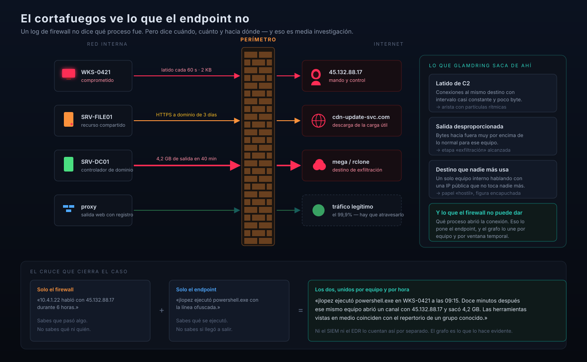

### Why six sources are needed

Each one sees one part well and the rest badly, and each calls the same person something
different. Canonicalisation is what joins them.

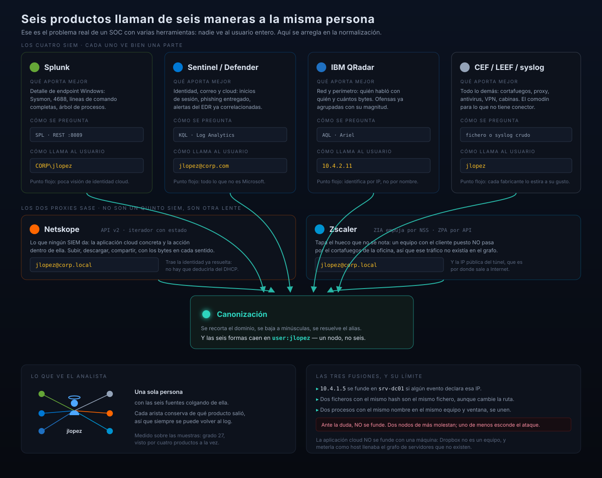

### How a ransomware deployment is detected

Eight stages. By the time you see the eighth it is too late, so what you look for is the
trail of the previous seven.

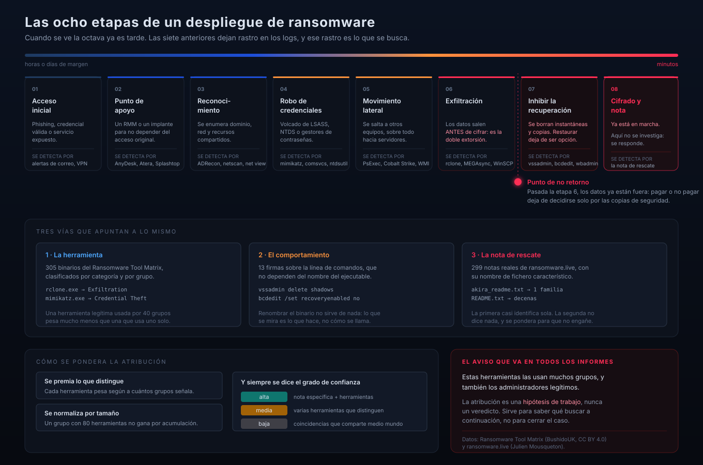

---

## What each source sees, and what happens when there are two

None of them sees everything. The useful question is not which is best, but **what gets
lost when there are two and nobody crosses them**.

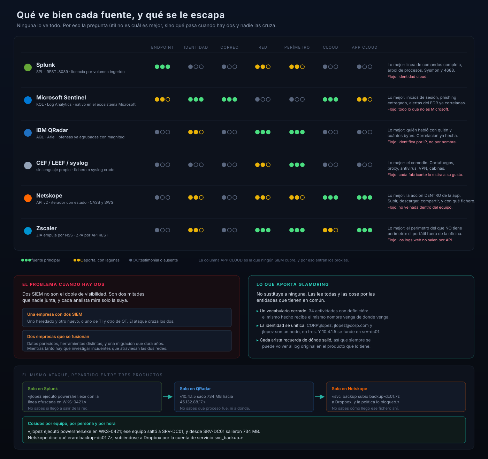

| | Endpoint | Identity | Email | Network | Perimeter | Cloud | Cloud app |
|---|:---:|:---:|:---:|:---:|:---:|:---:|:---:|
| **Splunk** | ●●● | ●○○ | ●○○ | ●●○ | ●●○ | ●○○ | ●○○ |
| **Sentinel / Defender** | ●●○ | ●●● | ●●● | ●○○ | ●○○ | ●●● | ●●○ |
| **IBM QRadar** | ●○○ | ●●○ | ●○○ | ●●● | ●●● | ●○○ | ●○○ |
| **CEF / LEEF / syslog** | ●○○ | ●○○ | ●○○ | ●●○ | ●●● | ●○○ | ●○○ |
| **Netskope** | ●○○ | ●●○ | ●○○ | ●●○ | ●●○ | ●●● | ●●● |
| **Zscaler** | ●○○ | ●●○ | ●○○ | ●●● | ●●● | ●●○ | ●●● |

`●●●` primary source · `●●○` contributes, with gaps · `●○○` token or absent

**The cloud-app column is the one no SIEM covers**, and it is why the proxies are here.

| Source | Its strength | Its blind spot |
|---|---|---|
| **Splunk** | Full command lines, process tree, Sysmon and 4688 | Cloud identity |
| **Sentinel / Defender** | Sign-ins, delivered phishing, EDR alerts already correlated | Everything that is not Microsoft |
| **IBM QRadar** | Who talked to whom and how many bytes; offenses already grouped | Identifies by IP, not by name |
| **CEF / LEEF / syslog** | The wildcard: firewall, proxy, antivirus, VPN, storage arrays | Every vendor stretches it their own way |
| **Netskope** | The action *inside* the cloud app: upload, download, share, and which file | Sees nothing inside the machine |
| **Zscaler** | The perimeter of the machine that has no perimeter: the laptop outside the office | Web logs do not come out of the API |

Two SIEMs are not twice the visibility, they are **two halves nobody joins**. It happens in
two very ordinary situations:

- **One company with two SIEMs.** One inherited and one new, or one for IT and one for OT.
  The attack crosses both and each analyst only looks at their own.
- **Two companies merging.** Similar data, different tools, and a migration that takes
  years. Meanwhile you have to investigate incidents that cross both networks.

| Only Splunk | Only QRadar | Only Netskope | Stitched by host, person and time |
|---|---|---|---|
| "jlopez ran `powershell.exe` with an obfuscated command line on WKS-0421" | "10.4.1.5 pushed 734 MB to 45.132.88.17" | "svc_backup uploaded `backup-dc01.7z` to Dropbox — blocked" | The whole case, with what the file was and where it went |
| You do not know if it ever left the network | You do not know which process, or what the data was | You do not know how the file got there | |

What makes it possible:

- **One vocabulary.** All six land on OCSF-lite with the same 34 activities, so a Splunk
  process and a QRadar flow can be compared.
- **Identity is unified.** `CORP\jlopez`, `jlopez@corp.com` and `jlopez` are one node, not
  three. And `10.4.1.5` merges into `srv-dc01`.
- **Every edge remembers where it came from**, so you can always return to the original log.

Measured over the sample set: 64 events from six products produce **58 nodes and 118 edges
with zero orphans**, and `user:jlopez` is a single node with degree 27 seen by four
products at once.

---

## Reporting

Five formats, because the same incident goes to five different places: a self-contained
HTML you can print to PDF, Markdown for Jira or the SOC wiki, full JSON, STIX-lite for a
TIP, and a plain IOC list to paste into a firewall or EDR.

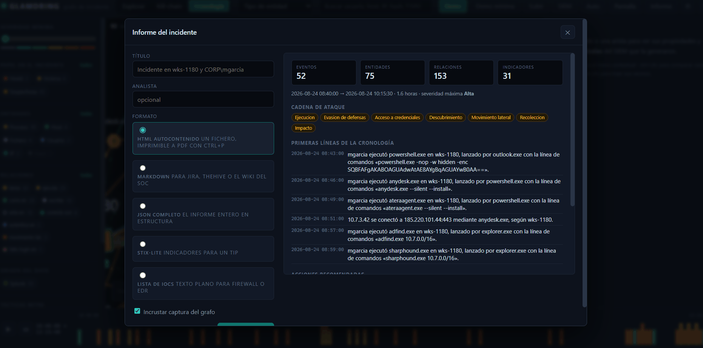

---

## Connecting it to real sources

Everything that can be queried goes in `.env` (see [`.env.example`](.env.example)):

```
SPLUNK_URL=            SPLUNK_TOKEN=
SENTINEL_WORKSPACE_ID= AZURE_TENANT_ID=   AZURE_CLIENT_ID=  AZURE_CLIENT_SECRET=
QRADAR_URL=            QRADAR_TOKEN=
NETSKOPE_URL=          NETSKOPE_TOKEN=
ZPA_URL=               ZPA_CLIENT_ID=     ZPA_CLIENT_SECRET=  ZPA_CUSTOMER_ID=
```

`GET /api/connectors/ping` checks them for real and returns latency or the reason it failed.

**Zscaler ZIA is the exception** — it pushes. In the ZIA portal, under *Administration →
Nanolog Streaming Service → Cloud NSS Feed*:

```
API URL:   https://YOUR-GLAMDRING/api/receive/zscaler
Header:    X-Glamdring-Key = <the key>
```

and declare that key in `.env`:

```
GLAMDRING_RECEIVE_KEYS=zscaler:<key>
```

Generate it with `python -c "import secrets; print(secrets.token_urlsafe(32))"`. Keys under
24 characters are rejected with a warning: a short key leaves an endpoint that *looks*
protected, which is worse than no protection at all.

> Cloud NSS ships **disabled** in ZIA. If the option is not there, you need to open a case
> with Zscaler support. Worth knowing before promising dates.

And with no credentials at all: export the search from your SIEM and drag the file in. That
is how it gets used most in practice, because the analyst rarely has the API token.

### Before you expose it

**The API has no authentication.** Ten write routes, and only `POST /api/receive/{source}`
is protected. Anyone who can reach the port can wipe the running investigation, run queries
against your SIEM with the credentials in your `.env`, or download the report.

Locally that does not matter. On a network it does. Run it on your own machine, or behind a
proxy that authenticates.

---

## The 17 recognised ransomware groups

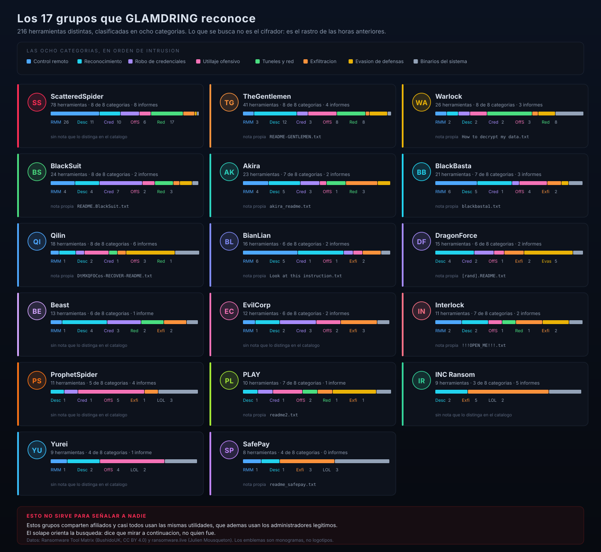

Ordered by repertoire size. The eight categories follow the order of an intrusion:
**RMM** remote control · **Desc** reconnaissance · **Cred** credential theft ·
**OffS** offensive tooling · **Red** tunnelling · **Exfi** exfiltration ·
**Evas** defence evasion · **LOL** living-off-the-land binaries.

| Group | Total | RMM | Desc | Cred | OffS | Red | Exfi | Evas | LOL | Distinctive note |
|---|--:|--:|--:|--:|--:|--:|--:|--:|--:|---|
| **ScatteredSpider** | 78 | 26 | 11 | 10 | 6 | 17 | 6 | 1 | 1 | — |
| **TheGentlemen** | 41 | 3 | 12 | 3 | 8 | 8 | 1 | 5 | 1 | `README-GENTLEMEN.txt` |
| **Warlock** | 26 | 2 | 2 | 2 | 3 | 8 | 1 | 3 | 5 | `How to decrypt my data.txt` |
| **BlackSuit** | 24 | 4 | 4 | 7 | 2 | 3 | 1 | 2 | 1 | `README.BlackSuit.txt` |
| **Akira** | 23 | 4 | 5 | 3 | 1 | 3 | 5 | 2 | — | `akira_readme.txt` |
| **BlackBasta** | 21 | 6 | 5 | 1 | 4 | — | 2 | 1 | 2 | `blackbasta1.txt` |
| **Qilin** | 18 | 1 | 2 | 1 | 3 | 1 | 1 | 6 | 3 | `DtMXQFOCos-RECOVER-README.txt` |
| **BianLian** | 16 | 6 | 5 | 1 | 1 | — | 2 | — | 1 | `Look at this instruction.txt` |
| **DragonForce** | 15 | — | 4 | 2 | 1 | — | 2 | 5 | 1 | `[rand].README.txt` |
| **Beast** | 13 | 1 | 4 | 3 | — | 2 | 2 | — | 1 | — |
| **EvilCorp** | 12 | 1 | 2 | 3 | 2 | — | 3 | — | 1 | — |
| **Interlock** | 11 | 2 | 2 | — | 1 | 1 | 2 | 2 | 1 | `!!!OPEN_ME!!!.txt` |
| **ProphetSpider** | 11 | — | 1 | 1 | 5 | — | 1 | — | 3 | — |
| **PLAY** | 10 | — | 1 | 1 | 2 | 1 | 1 | 3 | 1 | `readme2.txt` |
| **INC Ransom** | 9 | — | 2 | — | — | — | 5 | — | 2 | — |
| **Yurei** | 9 | 1 | 2 | — | 4 | — | — | — | 2 | — |
| **SafePay** | 8 | 1 | 1 | — | — | — | 3 | — | 3 | `readme_safepay.txt` |

- **The profile matters more than the total.** ScatteredSpider has 26 remote-control tools
  and 17 networking ones: it gets in and stays. INC Ransom has 5 of 9 in exfiltration: it
  comes to take data.
- **The distinctive note** is the only one it shares with no other group in the catalogue.
  Those showing "—" only use generic names like `README.txt`, which identify nothing: the
  engine weights them 0.1 against the 10 of a group-specific note
  (`glamdring/threat/attribution.py:88` and `:93`).
- **The emblems in the diagram are monograms, not logos.** These groups have no
  redistributable brand, and inventing one would be asserting something false.

> **This does not point at anyone.** They share affiliates and nearly all of them use the
> same utilities, which legitimate administrators also use. Overlap directs the search — it
> says what to look at next — it does not say who did it.

The table is generated from the catalogue, not written by hand:

```powershell
python tools/fetch_threat_intel.py   # refresh the catalogue from its sources
python tools/make_group_table.py     # regenerate docs/diagrams/08-grupos-ransomware.svg
```

---

## Tests

```powershell
.\.venv\Scripts\python.exe -m pytest -q
python tools/check_diagrams.py        # the SVGs are valid and nothing overflows
```

456 tests. The ones worth knowing about are the ones that fail when the fix is reverted:

- Sentinel's synchronous SDK call must run in a thread. Verified by removing
  `asyncio.to_thread` on purpose: the event loop goes from ~50 heartbeats to **1** while a
  query is in flight, and the test goes red.
- ZPA's `expires_in` is in **milliseconds**. Verified the same way: treating it as seconds
  gives a token "valid" for 41 days and then an inexplicable run of 401s.
- Every line of every sample lands in its own class, fixed line by line
  (`tests/test_clasificacion.py`), and no sample leaves an orphan node.

---

## Documentation

| | |
|---|---|
| [`docs/ARCHITECTURE.md`](docs/ARCHITECTURE.md) | How the pieces fit together |
| [`docs/VOCABULARIO.md`](docs/VOCABULARIO.md) | The 34 activities, with the measurements behind each rule |
| [`docs/HALLAZGOS-CLASIFICACION.md`](docs/HALLAZGOS-CLASIFICACION.md) | 39 confirmed classification defects, each reproduced by running code |
| [`docs/PROXIES-SASE.md`](docs/PROXIES-SASE.md) | Netskope and Zscaler, with what is verified marked as such |
| [`docs/CONNECTORS.md`](docs/CONNECTORS.md) | The connector contract and how to add a source |
| [`docs/ONTOLOGY.md`](docs/ONTOLOGY.md) | Entity and relation types |
| [`docs/INGESTA-Y-SEGURIDAD.md`](docs/INGESTA-Y-SEGURIDAD.md) | Ingest and channel security review |
| [`docs/PENDIENTE.md`](docs/PENDIENTE.md) | What is left, and where to pick it up |
