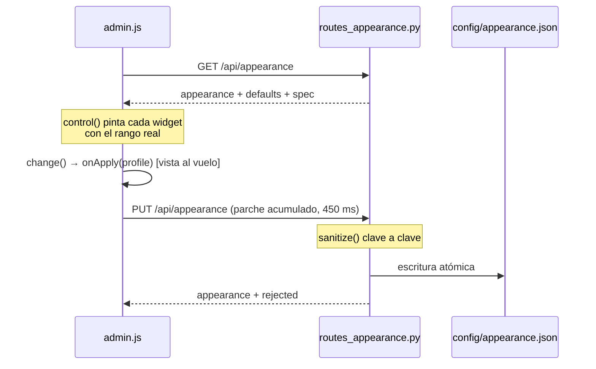
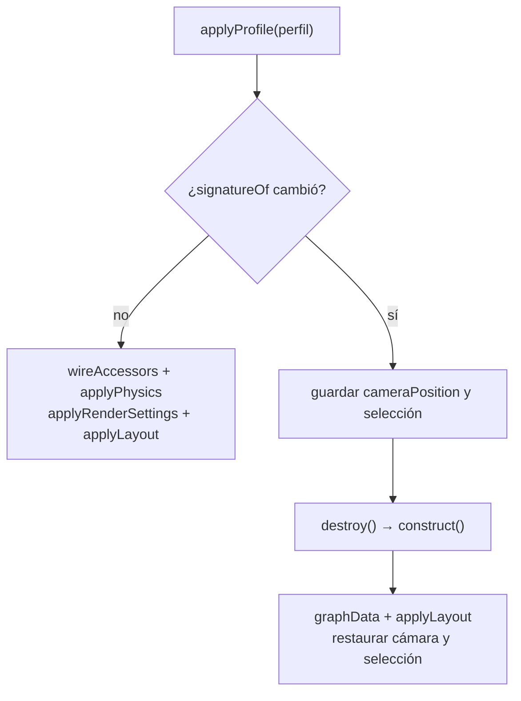

# Panel de administrador

Cómo se genera el panel a partir de lo que declara el servidor, qué toca cada
control por dentro y por qué el perfil visual del equipo vive en un solo fichero
del servidor y no en el navegador de cada uno.

Se abre con el botón `⚙` de la barra superior o con la tecla `a`.

---

## Los controles no están escritos a mano

En [`web/js/ui/admin.js`](../web/js/ui/admin.js) no hay un slider por ajuste. Hay
una función `control(section, key, rule, value)` que recibe una **regla** y decide
qué widget pintar. Las reglas las manda el servidor: `GET /api/appearance`
devuelve, junto al perfil, un `spec` serializado desde el diccionario `SPEC` de
[`glamdring/appearance.py`](../glamdring/appearance.py).

```json
{
  "appearance": { "...": "perfil efectivo" },
  "defaults":   { "...": "perfil de fábrica" },
  "spec": {
    "sections": { "render": { "nodeResolution": ["int", 3, 32] } },
    "entity":   { "scale": ["number", 0.2, 5.0] },
    "relation": { "width": ["number", 0.1, 12] }
  },
  "colorModes": [ { "id": "type", "label": "Tipo de entidad" } ]
}
```

Cinco tipos de regla, cinco widgets:

| Regla | Widget que genera `control()` |
|---|---|
| `("bool",)` | casilla |
| `("color",)` | `input[type=color]` + campo hexadecimal de texto |
| `("enum", [...])` | `select`, con las etiquetas de `ENUM_LABELS` |
| `("int", min, max)` | slider con `step = 1` |
| `("number", min, max)` | slider con `step = max((max-min)/200, 0.0001)` |

Esto no es elegancia gratuita: el validador del servidor y el rango del slider son
**el mismo dato**. Si `nodeResolution` se declara `("int", 3, 32)`, el slider no
puede llegar a 40 y el servidor no puede recortar en silencio algo que el panel
permitía pintar. La alternativa —duplicar los rangos en JavaScript— se
desincroniza la primera vez que alguien ajusta un límite en Python y se olvida del
`.js`, y el síntoma es el peor posible: un control que parece funcionar y cuyo
valor el servidor recorta sin decir nada.

El orden de los controles también sale de ahí: `sectionTab()` itera
`Object.entries(spec.sections[section])`, que conserva el orden de inserción del
diccionario Python. Reordenar el panel es reordenar `SPEC`. Añadir un ajuste son
tres pasos: entrada en el `_default_*()` correspondiente, regla en `SPEC` y
etiqueta en `FIELD_LABELS`.



---

## Un solo perfil, en el servidor

`config/appearance.json` no está en el navegador. La razón está escrita en la
cabecera de `appearance.py` y es operativa: **una captura de pantalla en un informe
tiene que significar lo mismo para quien la envía y para quien la recibe**. Con un
`localStorage` por analista, el rojo de uno sería el naranja de otro y "mira el
nodo grande de la izquierda" dejaría de ser una instrucción válida.

- No hay perfiles por usuario: quien toca el panel cambia lo que ve **todo el
  equipo**. El pie del panel lo dice explícitamente.
- No hay autenticación delante; se asume el mismo modelo de despliegue que el
  resto de GLAMDRING, una instancia dentro del SOC.
- Los cambios se ven antes de guardarse: `change()` llama a `onApply(profile)` de
  inmediato y solo después programa el guardado.
- El guardado va con 450 ms de retardo y **acumula** el parche (`scheduleSave` +
  `deepMerge`): arrastrar un slider dispara decenas de eventos `input` y no tiene
  sentido reescribir el fichero en cada píxel.

---

## Saneado clave a clave y el campo `rejected`

`PUT /api/appearance` acepta un parche parcial y lo recorre contra `SPEC` antes de
tocar nada:

- Clave desconocida → descartada, anotada en `rejected` como `seccion.clave`.
- Fuera de rango → se **recorta** al límite, no se rechaza.
- Tipo imposible de convertir → `_coerce()` devuelve `None` y va a `rejected`.
- Colores: solo `#rgb`, `#rrggbb` o `#rrggbbaa`, por expresión regular.
- Booleanos desde cadena: `"1"`, `"true"`, `"yes"`, `"on"` y `"si"` son verdadero.
- Entidades y relaciones: además del campo, el **nombre** tiene que existir en
  `ontology.ENTITIES` / `ontology.RELATIONS`.

La respuesta es `{"appearance": perfil, "rejected": [...]}` y **nunca falla entera**
por un campo malo: si el panel manda diez ajustes y uno está mal, aplicar nueve y
decir cuál falló es mejor que perder los diez. El panel enseña esa lista en rojo en
la barra de estado. Lo único que devuelve `400` es un cuerpo que no sea un objeto JSON.

```bash
curl -X PUT http://localhost:8000/api/appearance \
  -H 'Content-Type: application/json' \
  -d '{"render": {"nodeResolution": 999, "inventado": 1}}'
# → nodeResolution recortado a 32, rejected: ["render.inventado"]
```

---

## Persistencia

`_write_stored()` escribe a un temporal creado con `tempfile.mkstemp(dir=CONFIG_DIR)`
y hace `os.replace()`. El temporal se crea **en el mismo directorio** a propósito:
`os.replace` solo es atómico dentro del mismo sistema de ficheros, y un `/tmp` en
otro volumen convertiría el rename en una copia. Si el proceso muere a mitad, el
fichero anterior sigue intacto en vez de quedarse truncado y dejar al equipo sin
perfil.

`reset()` **borra el fichero** en lugar de escribir los valores de fábrica: así, si
una versión futura cambia esos valores, el equipo se beneficia sin volver a pulsar
el botón.

Si el JSON se corrompe, `_read_stored()` lo ignora y devuelve `{}`, de modo que la
herramienta arranca de fábrica en lugar de no arrancar. El precio es que la vuelta
a fábrica es **silenciosa**, así que un perfil que "se ha reseteado solo" es lo
primero que hay que mirar en [[Troubleshooting]]. `load()` tiene además un efecto
lateral deliberado: llama a `set_risk_weights()`, de modo que cualquier lectura del
perfil reinstala los pesos de riesgo en
[`glamdring/graph/enrich.py`](../glamdring/graph/enrich.py).

---

## Pestaña por pestaña

Las siete primeras se generan desde `SPEC`. Las tres últimas (`Ontología`,
`Reglas`, `Perfil`) están a mano porque no son campos escalares.

### Tema → variables CSS

`applyTheme()` en [`web/js/app.js`](../web/js/app.js) vuelca el tema a variables CSS
del `<html>`, así que afecta a **toda** la interfaz, no solo al grafo.

| Control | Dónde acaba |
|---|---|
| `preset` | reescribe los siete colores de golpe (`THEME_PRESETS`) y pone `data-theme` en `<html>` |
| `background` | `--bg` y el color de la niebla en `applyFog()` |
| `panel` · `panelAlt` | `--bg-panel` · `--bg-panel-alt` |
| `border` | `--border` |
| `text` · `textDim` | `--text` · `--text-dim` |
| `accent` | `--accent` |
| `fontScale` | `--font-scale`; el `body` usa `calc(13px * var(--font-scale))` |

Preajustes: **SOC oscuro** (`soc-dark`), **Matrix** (`matrix`), **Alto contraste**
(`contrast`) y **Claro (informes)** (`paper`).

`--danger`, `--warn` y `--ok` se quedan fijos en
[`web/css/glamdring.css`](../web/css/glamdring.css) a propósito: la severidad tiene
que leerse igual se ponga el tema que se ponga. `--bg-elevated`, `--border-strong`
y `--text-faint` tampoco se reescriben, pero eso no es una decisión: `applyTheme()`
solo mapea siete claves, y con `paper` esos tres conservan sus valores oscuros.

### Render

| Control | Qué llama |
|---|---|
| `modelQuality` | `qualityFor()` → `buildModel({quality})`; en `auto`, `low` por encima de `heavyThreshold` y `medium` por encima de 140 nodos |
| `nodeResolution` · `linkResolution` | `.nodeResolution()` · `.linkResolution()`; con grafo pesado se fuerzan 6 y 3 |
| `linkOpacity` | `.linkOpacity()` |
| `bloom` · `bloomStrength` · `bloomRadius` · `bloomThreshold` | `postProcessingComposer().addPass(new UnrealBloomPass())` |
| `fog` · `fogDensity` | `scene().fog = new THREE.FogExp2(theme.background, fogDensity)` |
| `grid` | `scene().add(new THREE.GridHelper(...))` — 1400/28 en kill-chain, 900/18 en el resto |
| `enablePointerInteraction` | `.enablePointerInteraction()` — apagarlo acelera mucho |
| `linkHoverPrecision` | `.linkHoverPrecision()` |
| `showNavInfo` | `.showNavInfo()` |
| `heavyThreshold` | `setData()` marca `heavy` y degrada resolución y partículas |
| `nodeOpacity` | **hoy no hace nada**: está en `SPEC` y en el panel, pero ningún accesor de `graph3d.js` lo lee |

El bloom funciona porque nuestra copia de three y la que empaqueta la librería son
la **misma** revisión (r168); con versiones distintas revienta con errores de shader.

### Física

| Control | Qué llama |
|---|---|
| `forceEngine` | `.forceEngine('d3' \| 'ngraph')` |
| `numDimensions` | `.numDimensions(1\|2\|3)` — a 2 el grafo se aplana |
| `chargeStrength` | `d3Force('charge').strength()` |
| `linkDistance` | `d3Force('link').distance(base + peso_de_la_relación * 4)` |
| `collide` · `collideRadius` | `d3Force('collide', forceCollide(n => radiusOf(n) * factor))` |
| `d3AlphaDecay` · `d3VelocityDecay` · `warmupTicks` · `cooldownTicks` | homónimos |
| `dagMode` · `dagLevelDistance` | `.dagMode()` · `.dagLevelDistance()`, **solo** en la vista kill-chain |
| `layerSpacing` | `node.fx = __gdLevel * spacing - offset` |

`forceCollide` es propio ([`web/js/render/forces.js`](../web/js/render/forces.js)):
el bundle UMD no expone `d3-force-3d` y vendorizar la librería entera por una
función no compensa.

Hay **dos caminos** para la kill-chain y el panel elige entre ellos. Por defecto se
fija `node.fx` a la capa MITRE: nunca falla. Con `dagMode` no vacío se sueltan las
posiciones fijas y conduce la librería, más vistoso pero exige un grafo acíclico;
`onDagError(() => false)` silencia el error cuando hay ciclos, que en un incidente
real es lo normal.

### Etiquetas

| Control | Qué hace |
|---|---|
| `nodeMode` | `shouldLabelNode()`: `never` · `hover` · `selection` · `smart` · `always` |
| `nodeRiskThreshold` | en modo `smart`, riesgo mínimo para rotular |
| `nodeSize` | multiplica el `textHeight` del `SpriteText`; el camino CSS2D lo ignora |
| `linkMode` | `links.shouldLabel()`: `never` · `hover` · `selection` · `busy` · `always` |
| `linkBusyThreshold` | en modo `busy`, a partir de cuántos eventos |
| `linkSize` | `textHeight = 2.2 * size` en `links.linkLabel()` |
| `renderer` | `sprite` (SpriteText) o `css2d` (`CSS2DObject`) — **opción de construcción** |

`smart` es el único modo que no se vuelve ilegible al crecer el grafo: si hay
selección rotula la selección; si hay menos de 60 nodos rotula todo; si no, solo lo
que supere el umbral de riesgo.

### Aristas

| Control | Qué llama |
|---|---|
| `particles` · `particleDensity` | `.linkDirectionalParticles()` → `min(8, ceil(log10(1+count) * 3 * densidad))` |
| `particleSpeed` | `(0.004 + min(0.012, count/4000)) * factor` |
| `particleWidth` | `.linkDirectionalParticleWidth()` |
| `arrows` · `arrowLength` | `.linkDirectionalArrowLength()`, 0 si está apagado o la arista atenuada |
| `dashed` | `links.dashedLine()` en las relaciones marcadas como inferidas |
| `curvature` | `links.assignCurvature()` → `__gdCurve` / `__gdCurveRot` |
| `widthScale` | multiplica `widthOf()`, logarítmico sobre el volumen |
| `gradient` | **hoy no hace nada**: `links.gradientLine()` existe pero `graph3d.js` no lo invoca |

Con `dashed`, la línea nativa de la librería se devuelve transparente en `colorOf()`:
si no, las dos quedarían superpuestas y la sólida rellenaría los huecos del trazo,
anulando el efecto. La geometría sigue ahí, así que el ratón la detecta igual. Las
partículas se apagan solas con grafo pesado: con miles de aristas asfixian.

### Cámara

| Control | Qué llama |
|---|---|
| `controlType` | `ForceGraph3D({ controlType })` — **opción de construcción** |
| `autoOrbit` · `orbitSpeed` | `setInterval` de 16 ms con `cameraPosition({x: d·sin, z: d·cos})`, `d = max(200, focusDistance*3)` |
| `focusDistance` | distancia al enfocar un nodo en `selectNode()` |
| `transitionMs` | tercer argumento de `cameraPosition()` |

### Interacción

| Control | Qué hace |
|---|---|
| `dimOnSelect` | activa `isDimmedNode()` / `isDimmedLink()` |
| `dimOpacity` | opacidad de los materiales clonados, con suelo de 0.04 |
| `hoverHighlight` | `onNodeHover` / `onLinkHover` propagan el resaltado |
| `fixOnDrag` | `onNodeDragEnd` fija `fx`/`fy`/`fz` |
| `expandOnDoubleClick` | `app.js` llama a `expandNode(node)` |

### Ontología, Reglas y Perfil

**Ontología.** Por entidad: color, figura 3D (las quince de `availableModels()`),
escala y visible. Por relación: color, trazo discontinuo y visible. Se aplican
**encima** de la ontología del servidor (`ont.applyProfile()`; orden: ontología
primero, perfil después), así que un tipo nuevo en `glamdring/graph/ontology.py`
aparece sin tocar el perfil. Ver [[Ontology]].

**Reglas.** Los pesos de la puntuación de riesgo, tomados de `defaults.riskWeights`.
Importan más de lo que parece: el riesgo decide el orden de la tabla del informe, el
tamaño de cada figura (`radiusOf()` usa la raíz cuadrada del riesgo, no el riesgo
lineal) y qué nodos sobreviven al recorte. Es la única pestaña que **no** llama a
`onApply()`: los pesos se recalculan en el servidor, así que se aplican al recargar
el grafo.

**Perfil.** Exportar (`glamdring-perfil.json`), importar —que es un `PUT` normal y
pasa el mismo saneado, con su `rejected`—, restablecer y subir modelos.

---

## Opciones de construcción: `controlType`, `extraRenderers`, `rendererConfig`

No son *setters*. `ForceGraph3D` las lee al crear la instancia y después ignora
cualquier cambio. Como el panel sí deja tocarlas, `graph3d.js` calcula una firma y,
si cambia, **destruye y reconstruye** la instancia. De ahí que todo el estado
(datos, adyacencia, selección, resaltado) viva fuera del objeto de la librería.

```javascript
function signatureOf(options) {
  return `${options.controlType}|${options.extraRenderers ? 'css2d' : 'sprite'}`;
}
```



En la práctica: cambiar **Tipo de control** (cámara) o **Motor de etiquetas**
(etiquetas) provoca un parpadeo visible; el resto de controles solo recablean
accesores.

`rendererConfig` lleva `preserveDrawingBuffer: true` y no es cosmético: sin él,
`toDataURL()` devuelve un lienzo en blanco y el informe se queda sin la captura del
grafo. Por lo mismo, `snapshot()` fuerza un `renderer.render()` antes de capturar,
porque el búfer conserva el **último** fotograma dibujado.

---

## Modelos 3D propios (`.glb`)

```
POST   /api/appearance/model/{nombre}   multipart, campo 'file'
DELETE /api/appearance/model/{nombre}
```

Las quince figuras sustituibles son las claves de `BUILDERS` en
[`web/js/render/models.js`](../web/js/render/models.js): `workstation`, `server`,
`router`, `firewall`, `person`, `attacker`, `gear`, `document`, `alert`, `globe`,
`envelope`, `cloud`, `key`, `hashcube`, `endpoint`.

| Control del servidor | Por qué |
|---|---|
| `SAFE_NAME = ^[A-Za-z0-9._-]{1,64}$` | el nombre acaba en una ruta de fichero; sin esto, `../` |
| `MAX_MODEL_BYTES = 25 MB` | lo que se sube lo descarga el navegador de todo el equipo |
| Cabecera `glTF` (`payload.startswith(b"glTF")`) | comprobar la extensión no comprueba nada: esto se sirve como estático |

El fichero se guarda como `{nombre}.glb` en `config/models/`, que
[`glamdring/main.py`](../glamdring/main.py) monta como estático en `/config/models`.
`unregister_model()` quita la ruta del perfil **y borra el fichero**.

En el cliente, `loadGlb()` normaliza el modelo a la caja de una figura procedural
(`scale.setScalar(2 / lado_mayor)` y recentrado): sin eso, cualquier `.glb`
descargado sale a una escala arbitraria y descuadra el grafo entero. La carga es
diferida —mientras llega se ve la figura procedural y al terminar se refresca—, y un
modelo que falle se cachea como `null` para que un `.glb` roto no tumbe la vista.

`modelUrlFor()` busca primero por **tipo de entidad** y luego por nombre de figura
(`models[node.type] || models[modelName]`), así que subir un modelo con el nombre
`host` lo aplica solo a los hosts, aunque el panel no ofrezca esa opción.

---

## Perfiles de ejemplo

Se pegan tal cual en **Importar perfil** o se mandan por `PUT`.

**Equipos modestos** (portátiles sin GPU decente):

```json
{
  "render": { "bloom": false, "fog": false, "modelQuality": "medium",
              "nodeResolution": 8, "heavyThreshold": 150 },
  "links":  { "particles": false },
  "physics": { "collide": false, "cooldownTicks": 120 }
}
```

Lo que más pesa no es el bloom sino el número de objetos: bajar `heavyThreshold`
adelanta la degradación automática. Si aun así va a tirones, lo siguiente es apagar
`enablePointerInteraction`.

**Modo escaparate** para una pantalla del SOC:

```json
{
  "camera": { "autoOrbit": true, "orbitSpeed": 0.6 },
  "labels": { "nodeMode": "smart", "nodeRiskThreshold": 70 },
  "render": { "bloom": true, "bloomStrength": 1.4, "showNavInfo": false }
}
```

Umbral de riesgo alto a propósito: en una pantalla que nadie está tocando solo
deben leerse los nombres de lo que importa.

**Capturas para informes impresos:**

```json
{
  "theme":  { "preset": "paper" },
  "render": { "bloom": false, "fog": false, "grid": false },
  "labels": { "nodeMode": "always", "renderer": "css2d" }
}
```

Fondo claro porque el negro se come el tóner; sin niebla ni rejilla porque en papel
son ruido; `css2d` porque da texto nítido a cualquier distancia. Cambiar `renderer`
reconstruye la instancia: hazlo **antes** de encuadrar la cámara.

---

## Endpoints

| Método | Ruta | Devuelve |
|---|---|---|
| `GET` | `/api/appearance` | `appearance`, `defaults`, `spec`, `colorModes` |
| `PUT` | `/api/appearance` | `appearance`, `rejected` |
| `POST` | `/api/appearance/reset` | `appearance`, `rejected: []` |
| `POST` | `/api/appearance/model/{nombre}` | `appearance`, `model`, `bytes` |
| `DELETE` | `/api/appearance/model/{nombre}` | `appearance`, `model`, `removed` |

---

Relacionadas: [[Visual-Language]] · [[Ontology]] · [[API-Reference]]
