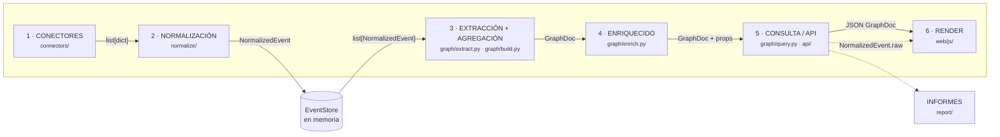

# Architecture

Cómo un registro crudo de SIEM acaba siendo un nodo en pantalla: las seis etapas, el contrato de datos de cada frontera y por qué cada decisión es la que es.

---

## El flujo completo



Cada etapa tiene un contrato explícito y ninguna conoce la anterior más allá de ese
contrato. Eso es lo que permite añadir un SIEM sin tocar el grafo, o cambiar la
figura de un nodo sin tocar la normalización.

| Frontera | Tipo que cruza | Definido en | Quién lo produce |
|---|---|---|---|
| SIEM → conector | `list[dict]` (registro tal cual) | — | `connectors/*.py::fetch()` |
| conector → normalizador | `dict` | — | `normalize/base.py::normalize_record()` |
| normalizador → almacén | `NormalizedEvent` | `glamdring/models.py` | `normalize_all()` |
| almacén → grafo | `list[NormalizedEvent]` | `glamdring/store.py` | `STORE.events` |
| grafo → API | `GraphDoc` | `glamdring/models.py` | `graph/query.py::build_filtered()` |
| API → navegador | JSON de `GraphDoc` (camelCase) | `glamdring/api/routes_graph.py` | `model_dump(by_alias=True)` |

### La regla de oro

**Para dibujar, el frontend solo conoce `GraphDoc`.** No sabe qué es Splunk, no sabe
qué es un `EventCode 4688` y no sabe si los datos vienen de una consulta en vivo, de
un CEF pegado a mano o de un fixture de test. `web/js/render/graph3d.js` recibe
`{ meta, nodes, links }` y con eso le basta.

El motivo es que la alternativa —que el navegador supiera de fuentes— convertía
cada SIEM nuevo en un cambio en dos lenguajes y dos sitios, y las dos copias del
criterio acababan divergiendo. Con esta regla, el conjunto de tests que valida el
grafo no necesita navegador, y el navegador no necesita SIEM.

La única excepción es deliberada y va en sentido contrario: el inspector pide
`GET /api/events` bajo demanda para enseñar el **log literal**
(`glamdring/api/routes_graph.py::get_events`). Sin esa vuelta al registro original
la herramienta no es defendible en un informe, así que el `raw` viaja al navegador,
pero solo cuando el analista pincha algo.

---

## 1 · Conectores — `glamdring/connectors/`

Una sola responsabilidad: devolver registros crudos. No normalizan, no filtran por
severidad y no construyen grafo. El contrato completo está en
`glamdring/connectors/base.py`:

```python
async def fetch(self, query: str,
                time_from: Optional[datetime] = None,
                time_to: Optional[datetime] = None,
                limit: int = 10_000) -> List[Dict[str, Any]]
```

Cuatro implementaciones registradas en `_FACTORIES` (`connectors/__init__.py`):
`splunk`, `sentinel`, `qradar` y `files`. Se instancian de forma **perezosa** a
propósito: importar el paquete no debe obligar a tener instalados los SDK de Azure
si el despliegue solo va a leer ficheros.

Un fallo hablando con el SIEM lanza `ConnectorError(connector, message, status)`, que
`glamdring/main.py` traduce a un **502** con mensaje legible. Es intencionado que no
sea un 500 genérico: el analista tiene que poder distinguir «mi consulta está mal»
de «el SIEM no responde». Detalle por conector en [[Connectors]].

---

## 2 · Normalización — `glamdring/normalize/`

Registro con prioridad (`normalize/base.py::register`): **menor número, se evalúa
antes**. Los específicos van a 10 (`splunk_windows`, `sentinel_defender`, `qradar`) y
el genérico CEF/LEEF/syslog a 99, porque es la red de seguridad.

Dos detalles del bucle de `normalize_record()` que no son cosméticos:

- Un normalizador que **lanza una excepción** no tumba la ingesta: se captura y se
  pasa al siguiente candidato.
- Un normalizador que dice «esto es mío» pero devuelve `None` **no se queda el
  registro**: se sigue probando. Reclamar y hacer desaparecer es peor que no
  reclamar.

### El modelo: `NormalizedEvent` (OCSF-lite)

Subconjunto pragmático de OCSF con ocho clases (`glamdring/models.py`):
`Authentication` · `Process Activity` · `Network Activity` · `File System Activity` ·
`DNS Activity` · `Email Activity` · `Account Change` · `Detection Finding`. La
correspondencia con los `class_uid` reales de OCSF vive en `CLASS_UIDS`, por si algún
día hay que exportar a un data lake que los espere.

Un evento real del incidente de demostración, tal y como sale de `/api/events`:

```json
{
  "uid": "ed5d310a6b01cc14",
  "time": "2026-08-19T09:35:12Z",
  "source": "qradar",
  "origin": "SRV-DC01",
  "class_name": "Authentication",
  "activity": "logon_failed",
  "severity": 4,
  "status": "failure",
  "message": "Multiple Login Failures for Single Username",
  "actor": { "user": "administrator", "domain": null, "sid": null, "session_id": null },
  "src": { "hostname": null, "ip": "10.4.2.11", "port": null, "mac": null, "os": null },
  "dst": { "hostname": null, "ip": "10.4.1.5", "port": null, "mac": null, "os": null },
  "device": { "hostname": "srv-dc01", "ip": null, "port": null, "mac": null, "os": null },
  "process": null, "file": null, "email": null, "domain": null, "url": null, "app": null,
  "mitre": [{ "id": "T1110", "name": "Brute Force", "tactic": "credential-access" }],
  "raw": {
    "starttime": 1787132112000,
    "qid": 38750001,
    "qidname": "Multiple Login Failures for Single Username",
    "categoryname": "Authentication Failure",
    "logsourcename": "SRV-DC01",
    "sourceip": "10.4.2.11",
    "destinationip": "10.4.1.5",
    "username": "administrator",
    "magnitude": 7,
    "credibility": 8,
    "relevance": 7,
    "eventcount": 14
  }
}
```

Lo que hay que leer en ese ejemplo:

- `starttime` es epoch en **milisegundos** (QRadar) y sale como UTC ISO-8601.
  `parse_time` acepta segundos y milisegundos precisamente por esto.
- `magnitude: 7` en escala 1-10 baja a `severity: 4` en escala 0-5 (`parse_severity`).
- `logsourcename: "SRV-DC01"` acaba en `device.hostname` ya canonicalizado a
  minúsculas, no como un host nuevo llamado `SRV-DC01`.
- **`raw` nunca se descarta.** Es la condición para que todo nodo y toda arista
  puedan volver al log literal.
- `app` existe aparte de `dst` porque una aplicación cloud no es una máquina:
  meterla como host llenaba el grafo de «equipos» llamados `Microsoft Office 365 Portal`.

Los nombres de campo aquí son **snake_case** (`class_name`, `session_id`) y en
`GraphDoc` son camelCase. No es un descuido: `GraphDoc` lleva alias porque
`3d-force-graph` los espera así; `NormalizedEvent` no cruza esa frontera para
dibujar, solo para leerse.

La canonicalización (`normalize/base.py`) es la pieza que decide si el grafo miente
o no, y tiene página propia: [[Normalizers]].

---

## 3 · Extracción y agregación — `glamdring/graph/`

`extract.py::extract(event) -> (entities, relations)` decide **qué merece ser un
nodo** mirando UN evento. Devuelve `EntitySpec` (con `key` = `"<tipo>:<valor>"`) y
`RelSpec`. La regla es conservadora: solo hay nodo si hay identidad estable; un
puerto o un id de sesión son propiedades. Las reglas por clase de evento están en
[[Ontology]].

`build.py::build_graph()` agrega: miles de eventos colapsan en decenas de nodos y
aristas. 400 logons del mismo usuario contra el mismo servidor son **una** arista con
`count=400`. Cada arista guarda los `eventUids` que la produjeron, recortados a
`MAX_UIDS_PER_LINK = 200` (y `MAX_UIDS_PER_NODE = 200` en nodos) para que el JSON no
explote; el recuento real sigue en `count`.

Después de agregar corren tres pasadas de fusión, en este orden:

| Pasada | Qué funde | Cuándo se abstiene |
|---|---|---|
| `_merge_ip_into_hosts` | `ip:10.4.1.5` dentro de `host:srv-dc01` | si dos hosts reclaman la misma IP (DHCP, NAT, inventario sucio) |
| `_merge_files_by_hash` | `file:m.exe` dentro de `file:c:\...\m.exe` que comparte `has_hash` | si hay más de un fichero con ruta bajo el mismo hash: son copias reales |
| `_merge_processes_by_name` | `explorer.exe` dentro de `c:\windows\explorer.exe`, **en el mismo host** | si hay dos rutas candidatas (`C:\Windows\svchost.exe` y `C:\Users\x\svchost.exe`) |

Las tres delegan en `_apply_alias()`, que suma contadores, une `sources` y `tactics`,
extiende la ventana temporal y **recablea las aristas**, descartando las que quedan
uniendo un nodo consigo mismo. Está factorizado porque el trabajo sucio es idéntico y
dos copias divergirían.

La abstención es lo importante de esa tabla: fundir cuando hay ambigüedad se inventa
un hecho, y esa ambigüedad suele ser justo el hallazgo.

### Riesgo (0-100)

Es una heurística de **priorización**, no un veredicto. Vive en
`enrich.py::score()`, no en `build.py`, porque el panel de administrador puede
cambiar los pesos en caliente y dos copias de la fórmula harían que el grafo y el
informe puntuaran distinto. `build.py::_risk()` solo delega.

```python
DEFAULT_RISK_WEIGHTS = {
    "severity": 12,        # x severidad máxima (0-5) -> hasta 60, factor dominante
    "tactic": 6,   "tacticCap": 18,
    "degree": 2,   "degreeCap": 12,
    "volumeDivisor": 25, "volumeCap": 5,
    "weightDivisor": 10, "weightCap": 5,
    "alertBonus": 15,
}
```

El volumen aporta como mucho 5 puntos a propósito: que una máquina sea habladora no
la hace peligrosa, y un servidor con 50.000 eventos informativos no debe tapar a la
workstation con una alerta crítica.

---

## 4 · Enriquecido — `glamdring/graph/enrich.py`

La diferencia con `extract.py` es de alcance: allí se decide **qué** es un nodo
mirando un evento, aquí **qué papel juega** mirando el grafo entero ya montado. Una
IP no es hostil por sí misma: lo es porque es externa, porque una alerta apunta a
ella y porque su tráfico está etiquetado como mando y control.

`enrich(graph)` hace dos pasadas y escribe todo en `node.props`:

- **`assign_roles`** → `external`, `touchedByAlert`, `role`, `deviceClass`, `model`.
  El orden interno importa: primero se marca lo externo, después se propaga la
  evidencia desde las alertas a sus vecinos, y solo al final se decide el rol. Al
  revés, un host que solo aparece como destino de una alerta se quedaría como activo
  sano.
- **`assign_clusters`** → `cluster`, por propagación de etiquetas. Se recorren los
  nodos en orden **determinista** (no aleatorio, como en el algoritmo original) y los
  empates los gana la etiqueta menor alfabéticamente. Sin eso, dos refrescos del
  mismo grafo dan números de cluster distintos y los colores bailan en pantalla.

El `model` (la figura 3D) se resuelve **en servidor** para que el grafo, la leyenda y
el informe dibujen exactamente la misma figura. Los cinco papeles y su aspecto están
en [[Visual-Language]].

`enrich` corre **después de la poda**, no antes (ver `query.py::build_filtered`). El
papel depende de los vecinos: calcularlo sobre el grafo completo y recortar luego
dejaría nodos marcados como víctimas por una alerta que ya no está en pantalla.

---

## 5 · Consulta y API — `glamdring/graph/query.py` + `glamdring/api/`

Hay **dos tipos de filtro y no son lo mismo**:

| | Filtros sobre eventos | Podas sobre el grafo |
|---|---|---|
| Cuáles | tiempo, severidad mínima, fuente, clase OCSF, táctica, texto libre | tipos de entidad, tipos de relación, foco a N saltos, tope de nodos |
| Función | `filter_events()` | `prune()` |
| Efecto | **el grafo se reconstruye** | recorte topológico |
| Por qué | filtrar por tiempo y dejar el `count` de las aristas al total sería mentir | los agregados ya son correctos, solo sobra grafo |

`build_filtered()` es la secuencia completa que usa la API: filtrar → `build_graph` →
`prune` → `enrich` → `assign_levels`.

Dos detalles de `prune()` que se notan al usarlo: cuando hay que recortar por
`max_nodes` se conservan los de **mayor riesgo** y se marca `meta.truncated` con una
nota; y al descartar nodos aislados se salvan los de `risk >= 60`, porque un nodo
suelto con riesgo alto puede ser la alerta que todavía no ha correlado con nada.

**Capas de la kill-chain** (`assign_levels`): el criterio principal es la táctica
MITRE; los nodos sin táctica heredan por BFS la capa mínima de un vecino que sí la
tenga; lo que sigue sin capa cae al `rank` de la ontología. Al final se compactan a
enteros consecutivos para no dejar columnas vacías. Se calcula en servidor y no con
`dagMode()` de la librería porque dagMode exige un grafo acíclico y un incidente real
casi nunca lo es.

### Endpoints

| Método | Ruta | Qué hace |
|---|---|---|
| GET | `/api/health` | estado y conectores configurados, nunca las credenciales |
| GET | `/api/ontology` | tipos, colores, figuras y relaciones |
| GET | `/api/connectors` | conectores, lenguaje de consulta y ejemplo |
| GET | `/api/samples` · `/api/ingest-log` | ficheros de demo y traza de ingestas |
| POST | `/api/ingest` · `/api/demo` · `/api/query` · `/api/reset` | entrada de datos |
| GET | `/api/graph` · `/api/graph/neighbors` | el `GraphDoc` con filtros |
| GET | `/api/timeline` · `/api/events` · `/api/export` | histograma, logs crudos, grafo sin recortar |
| GET/PUT/POST/DELETE | `/api/appearance*` | perfil visual y modelos `.glb` |
| POST/GET | `/api/report` · `/api/report/preview` · `/api/iocs` | informes e indicadores |

Los filtros se aplican **en servidor**: con 100.000 eventos no tiene sentido mandarlo
todo al navegador. Las dos únicas excepciones están en
`web/js/app.js::applyClientFilters()` y tienen motivo: el filtro por **papel** depende
de un dato que solo existe una vez montado el grafo, y los **nodos ocultados a mano**
son una decisión del analista que no tiene sentido persistir en una URL.

Códigos de error con intención: `400` consulta mal formada o falta un parámetro,
`404` nodo inexistente, `409` conector sin credenciales, `413` fichero mayor que
`MAX_UPLOAD_BYTES` (200 MB), `502` el SIEM falló. Referencia completa en
[[API-Reference]].

### El contrato `GraphDoc`

Salida real de `GET /api/graph` sobre el incidente de `samples/` (los `eventUids`
van recortados aquí, en la respuesta salen enteros hasta 200):

```jsonc
{
  "meta": {
    "generated": "2026-08-20T15:00:07.623539Z",
    "window": { "from": null, "to": null },
    "counts": { "events": 52, "nodes": 38, "links": 74, "clusters": 2, "levels": 6 },
    "sources": ["generic", "qradar", "sentinel", "splunk"],
    "truncated": false,
    "notes": []
  },
  "nodes": [{
    "id": "host:wks-0421",          // clave canónica "<tipo>:<valor normalizado>"
    "type": "host",
    "label": "wks-0421",
    "firstSeen": "2026-08-19T08:58:12Z",
    "lastSeen": "2026-08-19T10:05:00Z",
    "eventCount": 32, "maxSeverity": 5, "risk": 96, "degree": 15,
    "sources": ["generic", "qradar", "sentinel", "splunk"],
    "tactics": ["initial-access", "execution", "persistence", "defense-evasion",
                "credential-access", "discovery", "lateral-movement",
                "command-and-control", "exfiltration"],
    "props": {
      "ip": "10.4.2.11", "private": true,        // de extract.py
      "external": false, "touchedByAlert": true, // de enrich.assign_roles
      "role": "victim", "deviceClass": "workstation", "model": "workstation",
      "cluster": 0,                              // de enrich.assign_clusters
      "level": 0,                                // de query.assign_levels
      "eventUids": ["d12a5c10d9a4db49", "bcee7ca4787be863", "..."]
    }
  }],
  "links": [{
    "id": "l1",
    "source": "user:jlopez", "target": "host:wks-0421",
    "type": "authenticated",
    "count": 6, "severity": 4,
    "firstSeen": "2026-08-19T08:58:12Z", "lastSeen": "2026-08-19T09:26:41Z",
    "eventUids": ["d12a5c10d9a4db49", "1fa680f1a5c58092", "..."],
    "sources": ["generic", "qradar", "splunk"],
    "props": { "logon_type": "interactivo" }
  }]
}
```

Tres cosas a fijarse:

- `id`, `source` y `target` se llaman así **exactamente** porque son los nombres que
  `3d-force-graph` espera por defecto: cero accesores que reconfigurar en el frontend.
- `count: 6` con seis `eventUids` es la agregación en funcionamiento: seis logons de
  `jlopez` contra `wks-0421`, vistos por tres fuentes distintas, en una sola arista.
- `props` es la bolsa donde cada etapa deja su marca, y por eso se puede saber qué
  etapa escribió qué sin leer el código: `ip`/`private` vienen de la extracción,
  `role`/`model` del enriquecido, `level` del cálculo de capas.

---

## 6 · Render — `web/js/`

Módulos ES con `importmap`, servidos por el mismo FastAPI que la API
(`main.py` monta `StaticFiles(WEB_DIR, html=True)` en `/`). Mismo origen, sin CORS,
sin `npm install` y un solo proceso que arrancar.

El estado vive en un único objeto en `web/js/app.js` y **todo cambio pasa por
`reload()`**, que pide `/api/graph` y `/api/timeline` en paralelo y vuelve a pintar.
No hay estado duplicado entre paneles, así que no hay dos sitios que puedan
discrepar. Las vistas, las figuras y las trampas de la librería
(`3d-force-graph` 1.73.4 sobre three.js r168) están en [[Visual-Language]] y
[[Views-and-Interaction]].

---

## El almacén en memoria y sus límites

`glamdring/store.py` es una lista de `NormalizedEvent` con índice por `uid`, un
`threading.RLock` y nada más. Deliberadamente simple: un proceso, una investigación.

| Aspecto | Comportamiento |
|---|---|
| Deduplicación | por `uid` (`models.py::make_uid`, SHA-256 de `source` + `raw` con claves ordenadas). El mismo evento reenviado a Sentinel y a Splunk entra una vez |
| Orden | `add()` reordena por `time` en cada ingesta, así que el almacén siempre está ordenado |
| Tope | `MAX_EVENTS = 500_000`; lo que sobra se cuenta en `dropped` y no se guarda |
| Secretos | `redact()` tacha recursivamente `password`, `token`, `api_key`, `authorization`, `cookie`… **en el momento de guardar**, hasta 6 niveles de anidamiento |
| Traza | `ingest_log` guarda las últimas 50 ingestas (origen, nuevos, duplicados, descartados) |
| Persistencia | ninguna. Reiniciar el proceso vacía la investigación |

La redacción se hace al guardar y no al servir porque el `raw` se enseña tal cual en
el inspector, y los logs de autenticación arrastran credenciales en líneas de comando
y cabeceras más a menudo de lo que uno querría. Es más barato tacharlas siempre que
confiar en que no aparezcan.

**Los límites reales**, dichos claramente: no hay multiusuario, no hay sesiones y no
hay disco. Dos analistas contra el mismo servidor comparten la misma investigación.
Cuando eso deje de valer, `EventStore` es la **única** pieza que cambia —se sustituye
por un backend con clave de sesión— porque nadie más en el sistema toca los eventos
directamente.

---

## Decisiones y por qué

| Decisión | Alternativa descartada | Motivo |
|---|---|---|
| OCSF-lite propio (8 clases) | OCSF completo | ~400 clases para alimentar 13 tipos de nodo |
| Almacén en memoria | Neo4j / Postgres | un analista, un incidente; sin dependencia externa que instalar |
| Filtrar en servidor | Filtrar en cliente | los `count` de las aristas dependen del filtro |
| Reconstruir el grafo al filtrar por tiempo | reutilizar el grafo y ocultar aristas | un `count` que no corresponde a la ventana es un dato falso en un informe |
| `enrich` después de `prune` | enriquecer el grafo completo | el papel depende de los vecinos que quedan en pantalla |
| Capas calculadas en servidor (`assign_levels`) | `dagMode()` de la librería | dagMode exige aciclicidad; los incidentes reales tienen ciclos |
| Papel y figura decididos en servidor | deducirlos en el navegador | el informe y el grafo tienen que dibujar la misma figura |
| Pesos del riesgo en `enrich.py` | copiarlos en `build.py` | dos copias harían que el grafo y el informe puntuaran distinto |
| Propagación de etiquetas determinista | el algoritmo original con orden aleatorio | los clusters cambiaban de número en cada refresco y los colores bailaban |
| No fundir ante ambigüedad | fundir siempre por heurística | inventar un hecho es peor que enseñar dos nodos; la ambigüedad suele ser el hallazgo |
| Alias camelCase solo en `GraphDoc` | camelCase en todo el backend | los nombres los impone `3d-force-graph`, no el gusto propio |
| Módulos ES + importmap | React + Vite | el frontend se sirve tal cual; no hay `npm install` ni build |
| API y frontend en el mismo proceso | dos servicios | mismo origen, sin CORS, un solo comando para arrancar |
| Conectores instanciados en perezoso | importarlos todos al arrancar | un despliegue de solo ficheros no debería necesitar los SDK de Azure |
| `redact()` al guardar | tachar al servir | el `raw` sale por varias rutas; tacharlo en la entrada cierra todas |
| `.env` leído a mano | pydantic-settings | 30 líneas, una dependencia menos, precedencia explícita |

---

Cómo se traduce cada fuente y por qué la canonicalización decide si el grafo miente: [[Normalizers]] ·
Los tipos, relaciones y reglas de extracción: [[Ontology]] ·
Añadir un SIEM, una entidad o un formato de informe: [[Extending]]
