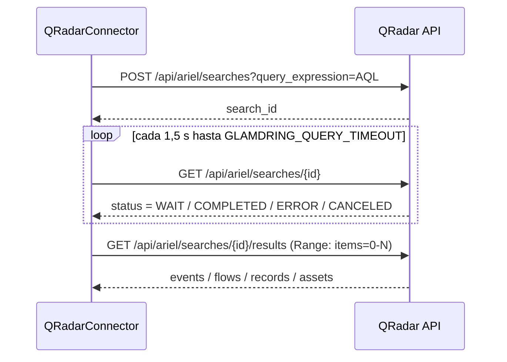

# Conectores

Cómo se dan de alta las credenciales de Splunk, Sentinel y QRadar, qué hace
exactamente cada conector contra la API del SIEM, y qué consultas producen un
grafo decente en lugar de una nube de nodos sueltos.

---

## El contrato

Un conector tiene una sola responsabilidad: **devolver registros crudos**. No
normaliza, no construye grafo, no filtra por severidad. `glamdring/connectors/base.py`:

```python
class Connector(abc.ABC):
    name: str = "base"
    query_language: str = ""
    example_query: str = ""

    @property
    @abc.abstractmethod
    def configured(self) -> bool: ...

    @abc.abstractmethod
    async def fetch(self, query, time_from=None, time_to=None,
                    limit=10_000) -> List[Dict[str, Any]]: ...
```

Los fallos se lanzan como `ConnectorError(connector, message, status)` y la API
los traduce a **502**, no a 500: el analista tiene que poder distinguir "mi AQL
está mal" de "el servidor de GLAMDRING se ha roto". Si el conector existe pero no
tiene credenciales, `POST /api/query` corta antes con un **409**
(`glamdring/api/routes_ingest.py`).

| Conector | `name` | Lenguaje | `configured` cuando hay… |
|---|---|---|---|
| Splunk | `splunk` | SPL | `SPLUNK_URL` **y** (token **o** usuario+contraseña) |
| Microsoft Sentinel | `sentinel` | KQL | `SENTINEL_WORKSPACE_ID` |
| IBM QRadar | `qradar` | AQL | `QRADAR_URL` **y** `QRADAR_TOKEN` |
| Ficheros | `files` | ruta o fichero subido | siempre |

El registro vive en `glamdring/connectors/__init__.py` y se instancia de forma
perezosa: importar el paquete no obliga a tener `httpx` ni los SDK de Azure
instalados, porque un despliegue que solo trabaje con ficheros exportados no los
necesita.

### Cómo se lanza una consulta

```bash
curl -X POST http://localhost:8000/api/query \
  -H "Content-Type: application/json" \
  -d '{"connector":"splunk","query":"index=wineventlog EventCode=4625 | head 5000","from":"-24h","limit":5000}'
```

`from` y `to` aceptan ISO-8601 o atajos relativos (`-30m`, `-24h`, `-7d`, `-2w`);
los resuelve `parse_moment` en `glamdring/graph/query.py`. El `limit` se recorta
siempre a `GLAMDRING_MAX_RESULTS`. Con `reset: false` (el valor por defecto) el
resultado **se fusiona** con lo que ya había: es lo normal en una investigación,
se van sumando consultas y el almacén deduplica por `uid`.

Desde la interfaz es el modal *Consultar SIEM en vivo*: el desplegable se rellena
con `GET /api/connectors`, los conectores sin credenciales salen deshabilitados
con la etiqueta `(sin credenciales)` y la caja de consulta se precarga con el
`exampleQuery` que declara cada conector.

---

## Splunk

### Credenciales

Token de servicio en **Settings → Tokens → New Token**. Basta con permiso de
búsqueda sobre los índices que vayas a consultar.

```ini
SPLUNK_URL=https://splunk.corp.local:8089    # puerto de gestión, no el 8000 de la web
SPLUNK_TOKEN=eyJra...
SPLUNK_USERNAME=                             # alternativa al token
SPLUNK_PASSWORD=
SPLUNK_VERIFY_TLS=1
SPLUNK_APP=search
```

El token va con el esquema `Splunk`, **no `Bearer`**:
`Authorization: Splunk <token>`. Si no hay token pero sí usuario y contraseña, el
conector cae a basic auth; es peor, porque la contraseña viaja en cada consulta.

`SPLUNK_VERIFY_TLS=0` solo si tu Splunk on-prem tiene certificado autofirmado **y**
sabes contra qué servidor estás hablando.

### El flujo

`POST {SPLUNK_URL}/servicesNS/-/{SPLUNK_APP}/search/jobs/export`, como formulario:

| Campo | Valor |
|---|---|
| `search` | la SPL, con `search ` antepuesto si no empezaba por `search ` ni por barra vertical |
| `output_mode` | `json` |
| `count` | `min(limit, GLAMDRING_MAX_RESULTS)` |
| `earliest_time` / `latest_time` | solo si se pasó ventana, en ISO-8601 |

Se antepone el `search` porque la REST API lo exige y la barra de búsqueda de la
UI de Splunk lo pone sola: quien copia y pega una consulta de la interfaz no
escribe esa palabra.

Se usa el endpoint `export` (equivalente a *oneshot*) en vez de crear un job y
sondearlo porque para consultas acotadas de investigación el job no aporta nada y
sí añade dos viajes más. Para búsquedas de horas haría falta `exec_mode=normal`
más polling de `/services/search/jobs/{sid}`; está anotado como límite conocido.

La respuesta es **NDJSON**, un objeto por línea. `_parse_export` descarta las
líneas con `preview: true` —resultados parciales que duplicarían eventos— y se
queda con el `result` de cada línea.

### Consultas que van bien

```
index=wineventlog EventCode IN (4624,4625,4648,4688,4720) host=WKS-0421 | head 5000

index=sysmon EventCode IN (1,3,11,22) | head 5000

index=wineventlog EventCode=4625 Source_Network_Address=45.132.88.17 | head 2000
```

Si tu TA de Windows usa nombres distintos (`TargetUserName` en lugar de
`Account_Name`), no pasa nada: el normalizador prueba varios candidatos por campo
(`glamdring/normalize/splunk_windows.py`).

### Por qué `| stats` no sirve para el grafo

`| stats` y `| table` son perfectos para contar y pésimos para construir un grafo,
y el motivo es mecánico, no estético:

1. **El registro deja de parecer de Splunk.** `matches()` del normalizador exige
   que el registro traiga `_time` o `_raw`. Una fila de `stats` no trae ninguno de
   los dos, así que ningún normalizador de fabricante la reclama y cae al
   normalizador `generic` (prioridad 99, acepta cualquier cosa), que clasifica por
   pistas de texto y produce un evento mucho más pobre.
2. **La cronología se colapsa.** Sin `_time`, `parse_time` devuelve
   `datetime.now(timezone.utc)`: todos los eventos agregados se apilan en el
   instante de la ingesta y la línea temporal deja de significar nada.
3. **Desaparecen las entidades.** Solo sobreviven los campos del `by`. El proceso,
   el hash, el `Logon_Type`, el puerto o el fichero —justo lo que se convierte en
   nodo y en arista— no están en la fila agregada.

Deja los eventos crudos y deja que agregue GLAMDRING. Si quieres un recuento
rápido, hazlo en Splunk y aparte; no lo ingestes.

---

## Microsoft Sentinel / Log Analytics

### Credenciales

Service Principal con rol **Log Analytics Reader** sobre el workspace:

```bash
az ad sp create-for-rbac --name glamdring-reader
az role assignment create --assignee <appId> --role "Log Analytics Reader" \
  --scope /subscriptions/<sub>/resourceGroups/<rg>/providers/Microsoft.OperationalInsights/workspaces/<ws>
```

```ini
SENTINEL_WORKSPACE_ID=00000000-0000-0000-0000-000000000000   # el Workspace ID, no el resource ID
AZURE_TENANT_ID=...
AZURE_CLIENT_ID=...
AZURE_CLIENT_SECRET=...
```

Ojo con una asimetría: `configured` solo mira `SENTINEL_WORKSPACE_ID`, así que el
conector aparece como configurado en `/api/health` aunque falten las variables
`AZURE_*`. El error aparece al ejecutar, no al configurar.

### Los dos caminos

`fetch()` intenta el SDK y, solo si no está instalado, cae a REST:

| | SDK | REST |
|---|---|---|
| Cuándo se usa | `azure-monitor-query` y `azure-identity` importan | `ImportError` al importarlos |
| Autenticación | `ClientSecretCredential` si están las tres `AZURE_*`; si no, `DefaultAzureCredential` | client-credentials contra `login.microsoftonline.com` |
| Requiere secreto en `.env` | No: valen `az login` y managed identity | Sí, las tres `AZURE_*` o error explícito |
| Refresco de token | Lo gestiona el SDK | Un token por consulta, sin caché |

```bash
pip install azure-monitor-query azure-identity   # activa el camino del SDK
```

El camino REST existe porque en entornos corporativos no siempre se pueden
instalar los SDK de Azure, y quedarse sin conector por una política de paquetería
sería absurdo. Hace dos llamadas:

1. `POST https://login.microsoftonline.com/{tenant}/oauth2/v2.0/token` con
   `grant_type=client_credentials` y `scope=https://api.loganalytics.io/.default`
2. `POST https://api.loganalytics.io/v1/workspaces/{workspace_id}/query` con
   `Authorization: Bearer <token>` y cuerpo `{"query": ..., "timespan": "<desde>/<hasta>"}`

Si no se pasa ventana, el conector aplica **las últimas 24 horas** por su cuenta:
una KQL sin acotar contra un workspace grande no es una consulta, es un incidente.

En ambos caminos se recorren las tablas de la respuesta y se inyecta `Type` con el
nombre de la tabla en cada fila (`record.setdefault("Type", table_name)`). Las
filas de Log Analytics no lo traen, y `matches()` del normalizador de Sentinel
decide precisamente por ahí qué tabla está leyendo.

### Consultas que van bien

```kql
DeviceProcessEvents
| where Timestamp > ago(24h) and DeviceName == "wks-0421.corp.local"
| take 5000

DeviceNetworkEvents | where RemoteIP == "45.132.88.17" | take 2000

SecurityAlert | where TimeGenerated > ago(7d) | take 500

DeviceLogonEvents | where ActionType == "LogonFailed" | take 5000
```

`SecurityAlert.Entities` llega como **cadena JSON**, no como lista; `_parse_entities`
la parsea y cada entidad (host, cuenta, IP, fichero) acaba colgando de la alerta
por una arista `affects`.

Mismo aviso que en Splunk, aquí con `| summarize`: agrega y se lleva por delante
los campos que alimentan las entidades.

---

## IBM QRadar

### Credenciales

**Admin → Authorized Services → Add**, con permiso de lectura sobre Ariel.

```ini
QRADAR_URL=https://qradar.corp.local
QRADAR_TOKEN=aaaaaaaa-bbbb-cccc-dddd-eeeeeeeeeeee
QRADAR_API_VERSION=20.0
QRADAR_VERIFY_TLS=1
```

Cabeceras de cada petición:

```
SEC: <token>
Version: <QRADAR_API_VERSION>
Accept: application/json
```

`Version` es obligatoria y **determina el esquema de la respuesta**, así que se
fija por configuración en vez de dejarla al valor por defecto del servidor: una
actualización de QRadar cambiaría el formato de los datos sin que nadie tocara
nada.

### Ariel no es síncrono: se pide y se recoge

Dos pasos con un sondeo en medio, todo dentro de `glamdring/connectors/qradar.py`,
porque fuera de ese fichero a nadie le importa que exista un `search_id`:



- `ERROR` y `CANCELED` son estados terminales: se aborta con `ConnectorError` en
  cuanto aparecen, sin agotar el temporizador.
- Si se agota `GLAMDRING_QUERY_TIMEOUT`, el error dice en qué estado se quedó la
  búsqueda; es la diferencia entre "QRadar está saturado" y "la AQL no valía".
- La clave del array de resultados depende de lo que consultaras, así que se
  prueban `events`, `flows`, `records` y `assets` en ese orden.
- El tope de resultados viaja en la cabecera `Range: items=0-N`, no en la URL.

**Ofensas por otro camino.** Si la consulta empieza por `offenses`, no se toca
Ariel: `GET /api/siem/offenses` con `filter=status=OPEN` y `sort=-magnitude`.

**La ventana temporal solo se añade si la AQL no trae la suya.** `_apply_window`
busca `LAST`, `START` o `STOP` en la consulta y, si los encuentra, la deja
intacta; si no, le pega `START <ms> STOP <ms>`. Sobrescribir lo que escribió el
analista sería desconcertante.

### Consultas que van bien

```sql
SELECT starttime, sourceip, destinationip, sourceport, destinationport,
       username, qidname(qid), categoryname(category), magnitude, payload
FROM events
LAST 24 HOURS
LIMIT 5000
```

Incluye siempre `qidname(qid)` y `categoryname(category)`: la taxonomía de QRadar
es lo más fiable para clasificar el evento, porque un mismo QID puede llegar desde
cientos de log sources distintos. Además, `matches()` del normalizador reconoce el
registro por acumular al menos dos de `qid`, `starttime`, `logsourcename`,
`magnitude`, `categoryname` o `devicetype`: una proyección demasiado escuálida se
queda por debajo de ese umbral y acaba en el normalizador genérico.

`magnitude` (1-10) es lo que se traduce a la severidad 0-5 de la ontología: ya
combina credibilidad, relevancia y severidad del evento. `payload` llega en base64
y se decodifica al normalizar. Para ofensas abiertas basta con `offenses`.

---

## Ficheros

El conector que más se usa, porque casi ningún analista tiene credenciales de API
del SIEM pero cualquiera puede exportar el resultado de su búsqueda.

| Formato | Cómo se detecta | Devuelve `detect_format` |
|---|---|---|
| JSON | Empieza por `[` o `{` y el `json.loads` del texto completo funciona | `json` |
| NDJSON | Empieza por `[` o `{` pero ese `json.loads` falla: se va línea a línea | `ndjson` |
| CSV | Primera línea con 2+ comas y sin `=` en los 40 primeros caracteres | `csv` |
| CEF | `CEF:` en alguna de las 20 primeras líneas no vacías | `cef` |
| LEEF | `LEEF:` en alguna de las 20 primeras líneas no vacías | `cef` (mismo camino línea a línea) |
| syslog | Primera línea con `<prioridad>`, y valor por defecto cuando nada encaja | `syslog` |
| vacío | Texto en blanco | `empty` |

Detalles que evitan sorpresas (`glamdring/normalize/detect.py` y
`glamdring/normalize/cef.py`):

- El JSON envolvente se desenvuelve buscando `results`, `events`, `value`,
  `records`, `data`, `hits` o `rows`; también entiende `hits.hits[]._source` de
  Elasticsearch y el `{tables:[{name, columns, rows}]}` de Log Analytics, del que
  reconstruye una fila por registro con su `Type`.
- El separador de CSV lo decide `csv.Sniffer` sobre los primeros 4096 caracteres,
  entre coma, punto y coma, tabulador y barra vertical; si no lo saca, cae a
  `csv.excel`.
- LEEF 1.0 usa tabulador; LEEF 2.0 declara su delimitador en el sexto campo del
  cabecero, incluida la forma hexadecimal (`x09`).
- Un syslog que lleva CEF o LEEF dentro del mensaje se parsea por el interior: la
  envoltura solo aporta la prioridad, y de ahí sale la severidad.
- `format_hint` fuerza el formato cuando la detección se equivoca. El caso típico
  es un CSV cuya primera fila lleva comas dentro del mensaje.

### Las tres vías de entrada

| Vía | Cómo |
|---|---|
| Arrastrar al lienzo | Se sueltan uno o varios ficheros sobre el grafo |
| Botón **Subir** | Selector de ficheros, admite selección múltiple |
| `POST /api/ingest` | Formulario con `file`, `text` o `path`, más `format_hint` y `reset` |

```bash
curl -X POST http://localhost:8000/api/ingest -F "file=@export.csv"
curl -X POST http://localhost:8000/api/ingest -F "text=<contenido pegado>" -F "format_hint=cef"
```

El tope es de **200 MB** por fichero o por texto, tanto en el endpoint (413) como
en el propio conector. Por encima de eso ya no es una investigación puntual, y el
sitio correcto para filtrar es el SIEM.

`POST /api/demo` carga de una vez todo `samples/` (`.json`, `.ndjson`, `.csv`,
`.cef`, `.log`, `.txt`) y es la puerta de entrada de la herramienta: sin ella
haría falta un SIEM delante solo para comprobar que arranca.

---

## Seguridad

**Los secretos solo entran por el entorno.** `glamdring/config.py` lee el `.env` a
mano con precedencia explícita (entorno real > `.env` > valor por defecto), que es
justo lo que hay que poder razonar cuando algo no coge las credenciales. Nada de
credenciales en el código ni en el JSON del grafo.

**La API no devuelve credenciales, ni siquiera parcialmente.** `public_status()`
dice si un conector está configurado y poco más: de las URL solo sale el host
(`_host_of`) y del workspace una máscara `abcd...wxyz` (`_mask`). Eso es lo que
publica `GET /api/health`.

**Los campos sensibles del log crudo se tachan al guardar.** `redact()` en
`glamdring/store.py` recorre el registro crudo hasta seis niveles de profundidad y
sustituye por `***redactado***` el valor de cualquier clave que case con:

```
password | passwd | pwd | secret | token | api_key | authorization |
credential | client_secret | private_key | session_key | cookie
```

Se aplica dentro de `STORE.add()`, antes de que el evento entre en el almacén, así
que el inspector, la API y los informes ya reciben el registro tachado. El motivo
es que el log crudo se enseña **tal cual** en el inspector, y los logs de
autenticación arrastran credenciales en líneas de comando y cabeceras más de lo
que parece: sale más barato tachar siempre que confiar en que nunca aparezcan.

**La lectura de rutas del servidor está desactivada por defecto.**
`GLAMDRING_ALLOW_FILE_PATHS=0`. El campo `path` de `/api/ingest` convierte el
endpoint en una lectura de ficheros arbitrarios del disco servida en bandeja, así
que solo tiene sentido activarlo si la herramienta corre en tu propia máquina. Con
la variable a 0, `read_path()` responde con un error pidiendo que subas el
fichero. Dos matices del código:

- Los ficheros que cuelgan de `samples/` se leen siempre, esté la variable como
  esté.
- La comprobación solo frena las **rutas absolutas**: una ruta relativa se busca
  primero en `samples/` y, si no está allí, se resuelve contra el directorio de
  trabajo del proceso. Si expones el puerto fuera de tu máquina, ponlo detrás de
  algo que autentique.

**TLS.** `SPLUNK_VERIFY_TLS` y `QRADAR_VERIFY_TLS` valen 1 por defecto y se pasan
tal cual a `httpx.AsyncClient(verify=...)`. Bajarlos es una decisión consciente
para un on-prem con certificado autofirmado, no un apaño para que "deje de dar
error".

---

Relacionadas: [[Normalizers]] · [[API-Reference]] · [[Troubleshooting]]
