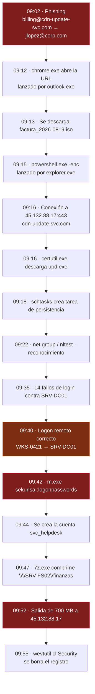

# El incidente de ejemplo

Recorrido guiado por lo que trae `samples/`: 52 eventos, cuatro fuentes, una hora y
diecisiete minutos de ataque completo. No hace falta ningún SIEM ni ninguna
credencial — botón **Demo** y ya está.

---

## La historia

---

## Paso a paso, y qué produce en el grafo

### Acceso inicial — 09:02

| | |
|---|---|
| **Fuente** | Sentinel · `EmailEvents` |
| **Evento** | `billing@cdn-update-svc.com` → `jlopez@corp.com`, asunto «Factura pendiente 2026-0819», `ThreatTypes: Phish`, `DeliveryAction: Delivered` |
| **Nodos** | `mailbox:billing@cdn-update-svc.com`, `mailbox:jlopez@corp.com`, `user:jlopez`, `domain:cdn-update-svc.com` |
| **Aristas** | `emisor −envía a→ receptor`, `user −posee→ mailbox`, `mailbox −contiene URL→ dominio` |

Entregado **y** malicioso: llegó a la bandeja. Por eso la severidad sube a 4 aunque
`DeliveryAction` diga `Delivered`. Se miran los dos campos, no uno.

### Ejecución — 09:12 a 09:17

`outlook.exe` lanza `chrome.exe`, que descarga un `.iso` (contenedor clásico para
esquivar la marca de la web), y de ahí sale `powershell.exe` con `-nop -w hidden
-enc`. Ninguna alerta del SIEM etiqueta la técnica: la infiere
`mitre.infer_from_cmdline()` a partir de la línea de comandos.

| Lo que se ve | Técnica inferida |
|---|---|
| `powershell -enc <base64>` | **T1027** ofuscación **+ T1059.001** PowerShell |
| `certutil -urlcache -split -f https://…` | **T1105** Ingress Tool Transfer |

Las reglas se recorren **todas**, no se para en la primera: un `powershell -enc` que
además invoca `certutil` merece las dos etiquetas.

Que se infiera una técnica **sube la severidad a 3 como mínimo**, para que el evento
sobreviva a los filtros. Un `powershell.exe` sin más es ruido; con `-enc` no lo es.

### Mando y control — 09:16 en adelante

Cuatro fuentes ven la misma conexión desde ángulos distintos, y el grafo las une:

| Fuente | Qué aporta |
|---|---|
| Splunk (Sysmon 3) | el **proceso** que abre el socket |
| Sentinel (`DeviceNetworkEvents`) | la **URL** completa |
| QRadar (proxy y firewall) | la **decisión** del perímetro y el volumen |
| CEF (FortiGate, Zscaler, Umbrella) | la **categoría** del dominio |

El destino es público y el origen RFC1918, así que `T1071.001` se marca sola.

### Persistencia y descubrimiento — 09:18 a 09:24

`schtasks /create /tn "MicrosoftEdgeUpdateTaskCore" … /rl highest` → **T1053.005**.
El nombre imita una tarea legítima de Edge.

Después, `net group "Domain Admins" /domain` y `nltest /dclist:corp.local` →
**T1087** y **T1018**.

### Acceso a credenciales por fuerza bruta — 09:35

Catorce fallos de login contra `SRV-DC01` desde `10.4.2.11`. Splunk los ve como
eventos 4625 sueltos; QRadar ya los trae correlados como
«Multiple Login Failures for Single Username» con magnitud 7.

En el grafo son **una** arista `failed_auth` con `count`. En la cronología del
informe, **una** línea con su `×14`. Catorce fallos idénticos son un hecho, no
catorce hechos.

### Movimiento lateral — 09:40

| | |
|---|---|
| **Fuente** | Splunk (4624 tipo 3) · Sentinel (`DeviceLogonEvents`) · QRadar |
| **Evento** | `CORP\jlopez` inicia sesión de red en `SRV-DC01` desde `WKS-0421` |
| **Arista** | `host:wks-0421 −movimiento lateral→ host:srv-dc01` |

Es el único sitio donde el grafo **infiere** una relación entre dos máquinas: un
logon de red o RDP correcto, con origen y destino identificados, es exactamente la
firma del movimiento lateral. Peso 5, el máximo.

### Volcado de credenciales — 09:42

`m.exe "sekurlsa::logonpasswords" exit`, lanzado por `services.exe`. La regla
`\bsekurlsa\b` lo caza sin depender de que el binario se llame `mimikatz`.

Sentinel además dispara `SecurityAlert` con `AlertSeverity: Critical` y
`Techniques: T1003.001`. Cuando el SIEM ya etiqueta la técnica, se usa la suya.

### Persistencia de cuentas — 09:44

Evento 4720: se crea `svc_helpdesk`. Nombre de cuenta de servicio, creada por un
usuario normal, en mitad de un incidente.

### Recolección y exfiltración — 09:47 a 09:52

`7z.exe a -p3xf1l … \\SRV-FS02\finanzas\*` → **T1560** (archivo cifrado con
contraseña). Cinco minutos después salen **700 MB** hacia `45.132.88.17`, que el
firewall registra con `cn1=734003200`.

### Evasión — 09:55

`wevtutil.exe cl Security` → **T1070.001**. La telemetría posterior a este momento
puede estar incompleta, y el informe lo dice en las recomendaciones.

---

## Qué demuestra esta demo

Aquí está lo difícil, y es lo que conviene mirar con calma.

### El mismo usuario, tres nombres, un nodo

| Fuente | Cómo lo llama |
|---|---|
| Splunk | `CORP\jlopez` |
| Sentinel | `jlopez@corp.com` |
| QRadar / CEF | `jlopez` |

En el grafo hay **un** `user:jlopez`, y sus `sources` dicen `["generic", "qradar",
"sentinel", "splunk"]`. Sin `canon_user()` habría tres usuarios y la historia se
partiría en tres.

### La misma máquina, con nombre y con IP

Splunk y Sentinel llaman a la máquina `SRV-DC01`. QRadar y el firewall solo conocen
`10.4.1.5`. Son **un** nodo.

Funciona porque `DeviceNetworkEvents` de Sentinel trae `DeviceName` **y** `LocalIP`
en el mismo evento: en una conexión saliente el origen *es* la máquina que reporta,
así que ahí se aprende su dirección. Con eso, la pasada de fusión de `build.py`
funde `ip:10.4.1.5` dentro de `host:srv-dc01`.

Y si dos hosts reclamaran la misma IP, **no se funde**: unirlos sería inventarse un
hecho.

### El mismo binario, con ruta y sin ella

La alerta de Sentinel nombra el fichero como `m.exe` a secas. Sysmon lo da como
`C:\Windows\Temp\m.exe`. Comparten hash, así que son **uno**, y gana la versión con
ruta completa.

Lo mismo con `explorer.exe`: Sysmon lo da con ruta, Defender solo por nombre en el
campo del proceso iniciador.

### Lo que NO se convierte en nodo

| Aparece en los logs | Por qué no es un nodo |
|---|---|
| `TrendMicro-AV`, `Bluecoat-Proxy`, `PaloAlto-Perimeter`, `InfoBlox-DNS` | son **productos**, no máquinas del parque |
| `Microsoft Office 365 Portal` | es una **aplicación cloud**: sale como `service`, no como host |
| Cuentas de máquina y `SYSTEM` | aparecen en todos los eventos y unirían el grafo por el sitio equivocado |

### El buzón del atacante está del lado correcto

`billing@cdn-update-svc.com` es un buzón, y los buzones se consideran nuestros por
defecto. Pero su dominio ya está marcado como hostil, así que hereda ese papel: se
dibuja como figura encapuchada, no como víctima.

`jlopez@corp.com` sigue siendo nuestro.

### Los papeles reparten el grafo

| Papel | Cuántos | Ejemplos |
|---|---|---|
| Hostil | 8 | `45.132.88.17`, `cdn-update-svc.com`, las 3 alertas, el buzón del atacante |
| Víctima | 9 | `wks-0421`, `srv-dc01`, `jlopez`, `administrator` |
| Sospechosa | 16 | los procesos y ficheros del ataque |
| Activo sano | 1 | lo que solo aparece de refilón |
| Contexto | 5 | hashes y artefactos de apoyo |

---

## Qué buscar en cada vista

| Vista | Qué se ve |
|---|---|
| **Explorar** | los clústeres emergen solos: la cadena del atacante por un lado y el ruido de fondo por otro. `SRV-DC01`, `WKS-0421` y `jlopez` son los tres nodos más grandes (riesgo 96) |
| **Kill-chain** | las capas ordenadas de izquierda a derecha, con la táctica dominante rotulada encima. Se lee acceso inicial → ejecución → persistencia → credenciales → lateral → C2 → exfiltración |
| **Cronología** | el eje X es el tiempo: se ve el hueco entre el reconocimiento (09:24) y la fuerza bruta (09:35) |
| **Replay** | pulsa ▶ y la historia se reconstruye sola en unos veinte segundos, con un destello en cada arista al ocurrir |

Y los modos de color:

| Modo | Para qué |
|---|---|
| **Papel** | quién es el atacante y quién la víctima, de un vistazo |
| **Riesgo** | por dónde empezar a mirar |
| **Origen del dato** | qué SIEM vio qué, y dónde hay un solo testigo |
| **Táctica MITRE** | en qué fase del ataque está cada pieza |
| **Comunidad** | si el incidente es uno o son dos cosas distintas |

---

## Cosas que probar

1. Pon la severidad mínima en **4** y mira cómo el grafo se reduce a la cadena del
   incidente.
2. Pincha la arista `wks-0421 −movimiento lateral→ srv-dc01` y lee el evento 4624
   crudo, tal y como salió de Splunk.
3. Doble clic en `cdn-update-svc.com` para traer sus vecinos.
4. Clic derecho en `45.132.88.17` → **Copiar como IOC**.
5. Genera el informe en Markdown y compáralo con el HTML: cuentan lo mismo porque
   parten del mismo diccionario.
6. Abre el panel de administrador y cambia el color del tipo `host`. Recarga la
   página: sigue cambiado, porque el perfil vive en el servidor.
7. Arrastra sobre el histograma para acotar a `09:35–09:45` y mira cómo los
   `count` de las aristas **bajan**: los filtros de tiempo reconstruyen el grafo, no
   lo esconden.

---

Relacionadas: [[Getting-Started]] · [[Views-and-Interaction]] · [[Ontology]]
