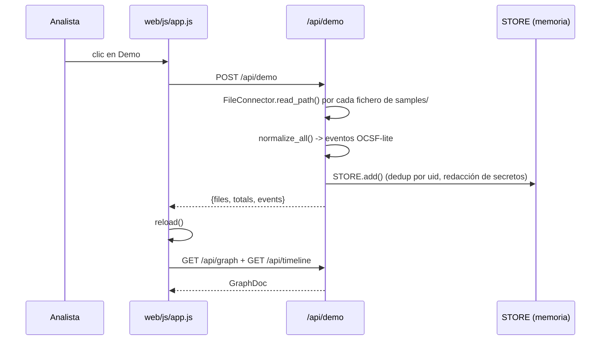

# Getting Started

De un repositorio recién clonado a un incidente en pantalla, sin SIEM, sin
credenciales y sin `npm install`.

---

## Requisitos

| Necesitas | Versión | Por qué |
|---|---|---|
| Python | **3.11+** | el código usa `X \| None`, `set[str]` y `from __future__ import annotations` por todas partes |
| Navegador | uno moderno con WebGL | el render es `three.js` r168 sobre un canvas WebGL; no hay modo 2D de respaldo |
| Node / npm | **no** | el frontend son módulos ES servidos tal cual, con las librerías ya vendorizadas en `web/js/vendor/` |
| Base de datos | **no** | el almacén es en memoria (`glamdring/store.py`), un proceso, una investigación |
| Credenciales de SIEM | **no**, para empezar | la demo y los tests corren enteros contra `samples/` |

No hay `pyproject.toml` ni paso de empaquetado: se ejecuta desde el directorio
del repo. Por eso `tests/conftest.py` mete la raíz en `sys.path` a mano.

---

## Instalación

### Windows (PowerShell)

```powershell
cd GLAMDRING
python -m venv .venv
.\.venv\Scripts\Activate.ps1
pip install -r requirements.txt
```

### Linux / macOS

```bash
cd GLAMDRING
python3 -m venv .venv
source .venv/bin/activate
pip install -r requirements.txt
```

`requirements.txt` son cuatro líneas de núcleo (`fastapi`, `uvicorn[standard]`,
`pydantic`, `python-multipart`) más `httpx`. Los SDK de Azure están comentados a
propósito: se importan dentro de la función que los usa, así que un despliegue
que solo trabaje con ficheros exportados no los necesita y la vía REST de
Sentinel funciona igual con `httpx`.

`python-multipart` no es opcional aunque lo parezca: sin él, la subida de
ficheros de `/api/ingest` y del `.glb` del panel de administrador falla al
arrancar FastAPI, no al usarla.

---

## Arranque

```bash
uvicorn glamdring.main:app --reload --port 8000
```

Un solo proceso sirve la API en `/api` y el frontend estático en `/`. Van juntos
a propósito: mismo origen, sin CORS, sin build de JavaScript y una sola cosa que
arrancar. En el arranque, el `lifespan` de `glamdring/main.py` imprime dos líneas
que conviene leer:

```
2026-08-20 17:02:48 INFO    glamdring :: GLAMDRING listo. Conectores configurados: files
2026-08-20 17:02:48 INFO    glamdring :: Perfil visual: tema 'noche', modo de color 'type'
```

El perfil visual se carga **ahí** y no bajo demanda porque aplica los pesos de
riesgo guardados antes de que llegue la primera petición de grafo. Si se cargara
perezosamente, el primer grafo se puntuaría con los pesos de fábrica y cambiaría
solo al segundo refresco, que es el tipo de fallo que nadie reproduce.

Abre <http://localhost:8000>.

---

## Primer contacto: el botón Demo

Pulsa **Demo** en la barra superior. No hace falta ningún SIEM ni ninguna
credencial: `POST /api/demo` recorre `samples/` y lo ingiere todo.



Lo que carga, con los números reales del repositorio:

| Fichero | Formato | Eventos |
|---|---|---|
| `samples/perimeter.cef` | CEF | 11 |
| `samples/qradar_ariel.json` | JSON (Ariel) | 8 |
| `samples/sentinel_defender.json` | JSON (Defender) | 12 |
| `samples/splunk_windows.json` | JSON (WinEventLog + Sysmon) | 21 |
| **Total** | | **52 eventos → 38 entidades y 74 relaciones** |

`reset` vale `True` por defecto en `/api/demo`, así que pulsar **Demo** dos veces
no duplica nada: lo primero que hace es vaciar el almacén. Y aunque no lo
hiciera, `STORE.add()` deduplica por `uid`, que es lo que permite ingerir el
mismo export dos veces sin ensuciar el grafo.

En la respuesta hay un campo que vale la pena mirar: **`unmatched`**. Son los
registros que ningún normalizador supo interpretar. Con `samples/` tiene que ser
`0`; si sube al ingerir un export propio, no es un error de la herramienta, es
que falta un normalizador para ese `sourcetype`.

---

## Los primeros cinco minutos

Con la demo cargada, el recorrido que hace el trabajo:

**1 — Mira las cifras del escenario (esquina superior izquierda del lienzo).**
`52 eventos · 38 entidades · 74 relaciones` y las fuentes que han aportado datos.
Si aparece **grafo recortado** en rojo, el backend ha dejado fuera nodos por
límite de tamaño (ver más abajo).

**2 — Encuentra al atacante sin leer una etiqueta.** La figura encapuchada es la
infraestructura hostil. Las figuras no dependen solo del tipo de entidad sino del
**papel** que juega en el incidente, que calcula el backend. Cambia el modo de
color a *Papel en el incidente* con la tecla `c` o el desplegable de la barra
superior; hay siete modos: tipo, papel, severidad, riesgo, origen del dato,
táctica MITRE y comunidad.

**3 — Pincha un nodo.** El inspector de la derecha da métricas, papel, tácticas
MITRE, vecinos y, al final, la sección **Logs originales del SIEM**. Los logs se
piden bajo demanda a `GET /api/events` porque un nodo puede arrastrar doscientos
`uid` y cargarlos siempre haría el inspector inútil. Esa sección es la razón de
ser de la herramienta: un grafo del que no se puede volver al registro crudo no
sirve para un informe.

**4 — Cambia de vista con `1`, `2`, `3`.** *Explorar* deja que los clústeres
emerjan solos; *Kill-chain* pone la táctica MITRE en el eje X y la historia se
lee de izquierda a derecha; *Cronología* pone el tiempo del primer avistamiento
en el eje X.

**5 — Dale a ▶ (o a la barra espaciadora).** El replay hace aparecer nodos y
aristas según ocurrieron **sin mover el layout**: la posición no cambia, solo la
visibilidad, para que el ojo siga a la entidad y no persiga la bolita.

**6 — Acota el tiempo.** Arrastra sobre el histograma de la barra inferior para
fijar una ventana. Los filtros del panel izquierdo (severidad mínima, papel,
tipos de entidad, tipos de relación, origen del dato, tácticas) se aplican **en
el servidor**, no ocultando nodos en el navegador.

**7 — Doble clic sobre un nodo periférico.** Trae sus vecinos desde
`GET /api/graph/neighbors` sin perder lo que ya tenías colocado. Con clic derecho
sale el menú: centrar, expandir, fijar, ocultar, copiar como IOC, copiar
identificador y buscar en el grafo.

**8 — Pulsa `r`.** El informe se genera de forma determinista a partir del grafo,
sin modelo de lenguaje. Detalle en [[Reports]].

### Atajos

| Tecla | Qué hace |
|---|---|
| `1` `2` `3` | explorar · kill-chain · cronología |
| `espacio` | reproducir / pausar la cronología |
| `f` | encuadrar todo el grafo |
| `c` | cambiar el modo de color |
| `/` | ir al buscador |
| `a` | panel de administrador |
| `r` | generar informe |
| `esc` | limpiar selección y cerrar diálogos |
| `?` | la lista completa, dentro de la aplicación |

La lista viva está en `web/js/ui/interactions.js`; el overlay de ayuda se
construye a partir de ella, así que no puede quedarse desfasada.

---

## Comprobar que la instalación está sana

```bash
curl http://localhost:8000/api/health
```

```json
{
  "status": "ok",
  "events": 52,
  "sources": ["generic", "qradar", "sentinel", "splunk"],
  "span": {"from": "2026-08-19T08:58:12+00:00", "to": "2026-08-19T10:15:00+00:00"},
  "connectors": {
    "splunk": {"configured": false, "url": ""},
    "sentinel": {"configured": false, "workspace": ""},
    "qradar": {"configured": false, "url": ""},
    "files": {"configured": true}
  },
  "limits": {"maxResults": 50000, "maxGraphNodes": 1500}
}
```

`/api/health` dice **qué** conectores están configurados, nunca **con qué**: la
URL sale sin esquema ni ruta y el workspace de Sentinel enmascarado
(`_host_of()` y `_mask()` en `glamdring/config.py`). La documentación
interactiva de FastAPI está en `/docs`.

---

## Tests

```bash
pip install -r requirements-dev.txt
pytest -q
```

**214 tests**, ninguno necesita red ni credenciales: todo corre contra
`samples/`, y `respx` mockea `httpx` para probar los conectores sin un SIEM
delante. `tests/conftest.py` vacía el `STORE` antes y después de cada test con
una fixture `autouse`, porque el almacén es un singleton de módulo y sin eso los
tests se contaminarían entre sí.

Además de la lógica, `tests/test_web.py` comprueba la integridad del frontend, que
es la clase de fallo que más veces rompe una página sin build:

- que **todo import resuelva**, siguiendo el `importmap` de `web/index.html` — un
  import roto deja el módulo entero sin cargar y la aplicación en blanco, con un
  404 en la consola como única pista;
- que los `id` que el JavaScript busca con `getElementById` existan en el HTML;
- que las **dos copias de three coincidan en revisión**
  (`test_three_revisions_match`), lo que se explica en la sección siguiente.

`ruff` está en `requirements-dev.txt` para el linter.

---

## Revendorizar el frontend

Las librerías ya están en el repositorio; esto solo hace falta al cambiar de
versión o si el directorio se corrompe.

```bash
python tools/fetch_vendor.py
```

El script baja desde unpkg a `web/js/vendor/` y **resuelve los imports relativos
en cascada** hasta que no queda nada pendiente. Existe por eso: los addons de
three (`CSS2DRenderer`, `UnrealBloomPass`, `OutlinePass`, `GLTFLoader`) son
módulos ES que importan otros módulos, y bajarlos a mano es un juego de cadenas
rotas. Los especificadores desnudos (`three`, `three/addons/…`) no se descargan:
los resuelve el `importmap` contra los ficheros que sí bajamos.

| Librería | Constante en el script | Versión |
|---|---|---|
| `three.module.js` + `jsm/` | `THREE_VERSION` | `0.168.0` (r168) |
| `three-spritetext.mjs` | `SPRITETEXT_VERSION` | `1.9.0` |
| `3d-force-graph.min.js` | `FORCEGRAPH_VERSION` | `1.73.4` |

**La revisión de three no es un detalle de estilo.** Hay dos copias de three en
la página: la nuestra y la que `3d-force-graph` empaqueta dentro de su bundle
UMD. Con la misma revisión conviven sin problema, porque three identifica objetos
por flags (`.isObject3D`) y no por `instanceof`. Con revisiones distintas el
post-procesado revienta con errores de shader que no dicen nada. Antes eran r160
y r168 y funcionaba de milagro; de ahí el test.

El script también borra los ficheros de la etapa anterior (`three.min.js`,
`three-spritetext.min.js`, en la lista `STALE`): si el UMD viejo se queda,
vuelven a haber dos copias de three cargándose.

Necesita salida a internet. Sin red devuelve `SIN RED -> …` y termina con
código 1 sin dejar el directorio a medias.

---

## Límites de tamaño y dónde se tocan

Los tres que se configuran por entorno viven en `.env` (copia de `.env.example`)
y se leen en `glamdring/config.py`. La precedencia es **entorno real > `.env` >
valor por defecto**, y el `.env` se parsea a mano con `os.environ.setdefault()`
justamente para que ese orden sea explícito cuando algo no coge la configuración.

| Ajuste | Valor de fábrica | Qué corta |
|---|---|---|
| `GLAMDRING_QUERY_TIMEOUT` | `120` | segundos por consulta al SIEM |
| `GLAMDRING_MAX_RESULTS` | `50000` | eventos por consulta; `/api/query` aplica `min(limit, max_results)` |
| `GLAMDRING_MAX_GRAPH_NODES` | `1500` | nodos que devuelve `/api/graph` y `/api/graph/neighbors` |
| `GLAMDRING_ALLOW_FILE_PATHS` | `0` | permite que `/api/ingest` lea rutas del disco del servidor |

Al pasarse de `maxGraphNodes`, `build_filtered()` no corta por orden de llegada:
ordena por riesgo descendente, se queda con los de arriba, marca
`meta.truncated` y añade una nota. La barra de estado lo enseña como **grafo
recortado**. `GET /api/export` ignora el límite (`max_nodes=0`) porque su destino
es un informe o una reimportación, no una GPU.

Deja `GLAMDRING_ALLOW_FILE_PATHS=0` salvo que la herramienta corra en tu propia
máquina: activarlo convierte `/api/ingest` en una lectura de ficheros
arbitrarios del servidor.

Hay otros tres límites que son constantes en el código, no variables de entorno,
porque protegen al proceso y no dependen del despliegue:

| Constante | Valor | Fichero | Efecto al superarlo |
|---|---|---|---|
| `MAX_UPLOAD_BYTES` | 200 MB | `glamdring/api/routes_ingest.py` | `413 Fichero demasiado grande.` |
| `MAX_MODEL_BYTES` | 25 MB | `glamdring/api/routes_appearance.py` | rechaza el `.glb` subido |
| `MAX_EVENTS` | 500 000 | `glamdring/store.py` | los eventos sobrantes se cuentan en `dropped` y no entran |

Y uno visual: `heavyThreshold`, 350 nodos por defecto en `glamdring/appearance.py`.
Por encima de esa cifra las figuras se degradan solas a geometrías simples. Se
cambia desde el [[Admin-Panel]], no editando el fichero.

---

## Cuando quieras datos propios

- **Un export del SIEM**: botón **Subir**, o arrastra los ficheros sobre el
  lienzo. Se acepta JSON, NDJSON, CSV, CEF/LEEF y syslog.
- **Pegar texto**: la misma ruta `POST /api/ingest` acepta un campo `text`, útil
  para cuatro líneas de CEF de un correo.
- **SIEM en vivo**: copia `.env.example` a `.env`, rellena **solo** el SIEM que
  uses y pulsa **SIEM**. Permisos, consultas de ejemplo y ventanas temporales en
  [[Connectors]].

Los secretos solo viajan por variables de entorno y `.env` está en `.gitignore`.
Los campos tipo `password`, `token`, `api_key` o `authorization` se tachan del
log crudo **antes** de guardarlo (`redact()` en `glamdring/store.py`), porque el
inspector enseña el registro entero y los logs de autenticación a veces arrastran
credenciales.

---

Sigue por [[Demo-Incident]] para el recorrido guiado del incidente de ejemplo ·
[[Views-and-Interaction]] para las vistas y los gestos ·
[[Troubleshooting]] si algo no arranca
