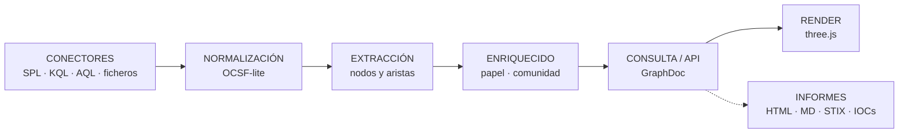

```
   ▄████  ██▓    ▄▄▄       ███▄ ▄███▓▓█████▄  ██▀███   ██▓ ███▄    █   ▄████
  ██▒ ▀█▒▓██▒   ▒████▄    ▓██▒▀█▀ ██▒▒██▀ ██▌▓██ ▒ ██▒▓██▒ ██ ▀█   █  ██▒ ▀█▒
 ▒██░▄▄▄░▒██░   ▒██  ▀█▄  ▓██    ▓██░░██   █▌▓██ ░▄█ ▒▒██▒▓██  ▀█ ██▒▒██░▄▄▄░
 ░▓█  ██▓▒██░   ░██▄▄▄▄██ ▒██    ▒██ ░▓█▄   ▌▒██▀▀█▄  ░██░▓██▒  ▐▌██▒░▓█  ██▓
 ░▒▓███▀▒░██████▒▓█   ▓██▒▒██▒   ░██▒░▒████▓ ░██▓ ▒██▒░██░▒██░   ▓██░░▒▓███▀▒
  ░▒   ▒ ░ ▒░▓  ░▒▒   ▓▒█░░ ▒░   ░  ░ ▒▒▓  ▒ ░ ▒▓ ░▒▓░░▓  ░ ▒░   ▒ ▒  ░▒   ▒
```

# GLAMDRING

**Los logs planos de tu SIEM, convertidos en un grafo 3D navegable del incidente.**

Splunk, Sentinel y QRadar te dan tablas de texto. Durante un incidente, el analista
reconstruye mentalmente *quién tocó qué, desde dónde y en qué orden* saltando entre
búsquedas SPL, KQL y AQL. Esa reconstrucción es el cuello de botella real del
triaje, y es imposible de comunicar a nadie más.

GLAMDRING pone una capa de lectura encima: entidades como nodos, acciones como
aristas dirigidas y el tiempo como dimensión de primera clase.

> **El SIEM sigue siendo la fuente de verdad. GLAMDRING es el mapa.**
> De cualquier nodo o arista se vuelve al log literal que lo generó.

---

## Arranque en treinta segundos

```bash
cd GLAMDRING
python -m venv .venv && .\.venv\Scripts\Activate.ps1   # Linux/macOS: source .venv/bin/activate
pip install -r requirements.txt
uvicorn glamdring.main:app --reload --port 8000
```

Abre <http://localhost:8000> y pulsa **Demo**. No hace falta ningún SIEM ni ninguna
credencial: `samples/` trae un incidente completo repartido entre los cuatro
formatos soportados.

Tampoco hace falta Node ni `npm install`: el frontend son módulos ES servidos tal
cual, con las librerías vendorizadas.

Detalle en [[Getting-Started]].

---

## Cómo funciona



Seis etapas desacopladas, cada una con su contrato. El frontend solo conoce
`GraphDoc`, así que da igual si los datos vienen de Splunk en vivo, de un CEF
pegado a mano o de un fixture de test.

---

## Las páginas

### Para empezar

| Página | De qué va |
|---|---|
| [[Getting-Started]] | Instalación, primer arranque y los primeros cinco minutos |
| [[Demo-Incident]] | Recorrido guiado por el incidente de ejemplo, paso a paso |
| [[Views-and-Interaction]] | Las vistas, los gestos y los atajos de teclado |

### Para entender qué está viendo

| Página | De qué va |
|---|---|
| [[Ontology]] | Entidades, papeles, relaciones y reglas de extracción |
| [[Visual-Language]] | Las figuras 3D, los modos de color y cómo se lee el grafo |
| [[Reports]] | Informes automáticos, cronología narrada e indicadores |

### Para operarlo

| Página | De qué va |
|---|---|
| [[Connectors]] | Credenciales y consultas para Splunk, Sentinel y QRadar |
| [[Admin-Panel]] | El panel del sysadmin y el perfil visual del equipo |
| [[Troubleshooting]] | Síntomas, causas y las trampas que cuestan encontrar |

### Para tocarlo por dentro

| Página | De qué va |
|---|---|
| [[Architecture]] | Las seis etapas, los contratos y las decisiones de diseño |
| [[Normalizers]] | Cómo se traduce cada fuente y la canonicalización |
| [[API-Reference]] | Referencia completa de la API HTTP |
| [[Extending]] | Recetas para añadir un SIEM, una entidad, una figura o un formato |

---

## Qué tiene de particular

**Deduplica de verdad.** Es la pieza menos vistosa y la más importante. Sin ella el
grafo mentiría:

- `CORP\jlopez` (Splunk), `jlopez@corp.com` (Sentinel) y `jlopez` (QRadar) → **un** usuario.
- `SRV-DC01` y `10.4.1.5` → **una** máquina.
- `m.exe` (nombrado en una alerta) y `C:\Windows\Temp\m.exe` (visto por Sysmon) → **un** fichero.

Y lo que no debe ser un nodo, tampoco lo es: cuentas de máquina, cuentas de
servicio de Windows y los nombres de producto que QRadar mete en `logsourcename`
(`TrendMicro-AV` no es una máquina del parque).

**Las figuras hablan.** Los nodos no son bolitas: un servidor es un rack con
pilotos, un cortafuegos es un muro, un puesto comprometido tiene la pantalla en
rojo y el atacante es una figura encapuchada. Y la figura la decide el **papel** que
la entidad juega en el incidente, no solo su tipo.

**Todo vuelve al log.** Pincha cualquier cosa y el inspector te da el registro
original tal y como llegó del SIEM. Un grafo bonito del que no se puede volver al
log crudo no sirve para un informe.

**Se configura sin tocar código.** El panel de administrador genera sus controles a
partir de lo que declara el servidor, y el perfil vive en el servidor: un solo
aspecto para todo el equipo, así que una captura significa lo mismo para quien la
envía y para quien la recibe.

---

## Estado

| | |
|---|---|
| **Fuentes** | Splunk · Microsoft Sentinel / Defender · IBM QRadar · CEF / LEEF / syslog |
| **Backend** | Python 3.11+ · FastAPI · sin base de datos |
| **Frontend** | Módulos ES · three.js r168 · 3d-force-graph 1.73.4 · sin build |
| **Tests** | 214, ninguno necesita red ni credenciales |
| **Idioma** | Interfaz, informes y documentación en español |

---

Empieza por [[Getting-Started]] · o mira directamente el [[Demo-Incident]]
