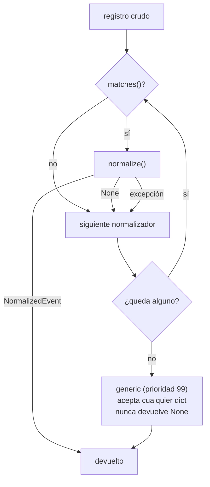

# Normalizadores

Cómo cada SIEM acaba hablando el mismo idioma: el registro por prioridad, la tabla de campos de cada fuente y la canonicalización que impide que el grafo mienta.

Todo lo que entra pasa por dos capas. `parse_payload()` (`glamdring/normalize/detect.py`) convierte el fichero o el texto pegado en una lista de diccionarios — JSON, NDJSON, CSV, CEF/LEEF o syslog — y después la capa de normalizadores traduce cada diccionario a un `NormalizedEvent`, el subconjunto de OCSF que usa el resto del sistema (`glamdring/models.py`).

| Campo de salida | Qué es |
|---|---|
| `uid` | SHA-256 del registro crudo truncado a 16 (`make_uid`), para deduplicar el mismo evento llegado por dos caminos |
| `time` | `datetime` UTC, siempre consciente de zona |
| `source` / `origin` | `splunk` · `sentinel` · `qradar` · `generic` / el `sourcetype`, tabla o `logsourcename` exacto |
| `class_name` | `Authentication`, `Process Activity`, `Network Activity`, `File System Activity`, `DNS Activity`, `Email Activity`, `Account Change`, `Detection Finding` |
| `activity` | `logon`, `logon_remote`, `logon_failed`, `launch`, `connect`, `blocked`, `create`, `delete`, `modify`, `query`, `deliver`, `alert`, `create_account` |
| `severity` / `status` | 0-5 / `success` · `failure` · `unknown` |
| `actor` `src` `dst` `device` `process` `file` `email` `domain` `url` `app` | Los sub-objetos: `ActorRef`, `HostRef`, `ProcRef`, `FileRef`, `EmailRef` |
| `mitre[]` | Técnicas ATT&CK, del SIEM o inferidas (`glamdring/mitre.py`) |
| `raw` | **Siempre** el registro original sin tocar |

`raw` no es un lujo de depuración: es lo que permite volver del nodo al log literal. Un grafo del que no se puede volver al log crudo no se sostiene en un informe.

---

## El registro por prioridad

Cada normalizador declara dos funciones y se da de alta con `register()` (`glamdring/normalize/base.py`):

```python
matches(record)   -> bool                      # "esto lo entiendo yo"
normalize(record) -> NormalizedEvent | None    # la traducción
```

| Normalizador | Fichero | Prioridad |
|---|---|---|
| `splunk_windows` | `glamdring/normalize/splunk_windows.py` | 10 |
| `sentinel_defender` | `glamdring/normalize/sentinel_defender.py` | 10 |
| `qradar` | `glamdring/normalize/qradar_events.py` | 10 |
| `generic` | `glamdring/normalize/cef.py` | 99 |

Menor prioridad = se evalúa antes. `_REGISTRY.sort()` es estable, así que entre los tres que empatan en 10 manda el orden de import de `glamdring/normalize/__init__.py`: Splunk, Sentinel, QRadar. Los tres tienen matchers exigentes y no se pisan.

### El detalle que evita perder eventos



Reclamar un registro **no** da derecho a quedárselo. `normalize_record()` sigue recorriendo la lista en tres casos: `matches()` da `False`; `normalize()` devuelve `None` porque reconoció la forma del registro pero no supo qué hacer con ese evento concreto; o `normalize()` lanza una excepción, que se captura y se ignora para que un normalizador roto no tumbe la ingesta entera.

El caso del `None` pasa de verdad: un export de Splunk con `_time` y `sourcetype` pero con un `EventCode` que no está en `_HANDLERS` y sin campos CIM devuelve `None`, igual que una fila de Sentinel cuya `Type` no está en `_TABLES`. En los tres casos el registro acaba en `generic`, que prefiere un nodo pobre a perder el evento. Si la cadena funcionara con un "el primero que reclama se lo queda", cada bug en un handler se traduciría en eventos que desaparecen sin dejar rastro — el peor fallo posible en una herramienta forense.

`/api/ingest` mide exactamente eso y devuelve `unmatched` (`glamdring/api/routes_ingest.py`). Debería ser `0`: si sube, hace falta un normalizador nuevo, no un parche.

---

## Splunk: WinEventLog Security, Sysmon y CIM

`matches()` exige `_time` o `_raw` más `sourcetype`/`source`, o bien `_time`/`_raw` más `EventCode`/`EventID`. Rechaza de entrada todo lo que traiga `__format__`, porque ese campo lo pone nuestro parser de CEF/LEEF/syslog y también inyecta `_raw`. Y `signature_id` está excluido como pista a propósito: es la cabecera de CEF, no de Windows.

| EventCode | Handler | `class_name` → `activity` |
|---|---|---|
| 4624 / 4648 | `_logon(r, True)` | Authentication → `logon` o `logon_remote` |
| 4625 | `_logon(r, False)` | Authentication → `logon_failed` (T1110.001) |
| 4688 y Sysmon 1 | `_process_create` | Process Activity → `launch` |
| 4720 | `_account_created` | Account Change → `create_account` (severidad 4, T1136) |
| Sysmon 3 | `_network_connect` | Network Activity → `connect` o `blocked` |
| Sysmon 11 | `_file_create` | File System Activity → `create` |
| Sysmon 22 | `_dns_query` | DNS Activity → `query` |

Los códigos bajos (1, 3, 11, 22) **solo** valen si el `sourcetype` contiene `sysmon`: en otro canal esos números significan cualquier otra cosa. Sin `EventCode` reconocido se clasifica por `sourcetype` (`firewall`, `proxy`, `netflow`, `stream:`, `pan:`, `cisco` → red; `dns` → DNS) y en último término por campos CIM presentes (`dest_ip` → red, `process` → proceso, `user` → autenticación). Si tampoco, `None` y a `generic`.

| Campo OCSF | Claves candidatas (orden de `first()`) |
|---|---|
| `time` | `_time`, `time`, `TimeCreated`, `EventTime` |
| `device.hostname` | `ComputerName`, `Computer`, `host`, `dvc`, `dest` → `canon_host` |
| `message` | `Message`, `name`, `signature`, `_raw` (400 caracteres) |
| `actor.user` / `.domain` | `Account_Name`, `TargetUserName`, `user`, `Target_Account_Name` / `Account_Domain`, `TargetDomainName`, `Target_Domain_Name` |
| `actor.sid` / `.session_id` | `Security_ID`, `TargetUserSid` / `Logon_ID`, `TargetLogonId` |
| `src.ip` / `.hostname` / `.port` | `Source_Network_Address`, `IpAddress`, `src_ip`, `src` / `Workstation_Name`, `WorkstationName`, `src_host` / `Source_Port`, `IpPort` |
| `process.path` / `.cmdline` | `New_Process_Name`, `NewProcessName`, `Image`, `process_path`, `process` / `Process_Command_Line`, `CommandLine`, `process`, `cmdline` |
| `process.parent_path` / `.parent_pid` | `Creator_Process_Name`, `ParentProcessName`, `ParentImage`, `Parent_Process_Name`, `parent_process` / `Creator_Process_ID`, `ParentProcessId` |
| `process.pid` / `.integrity` | `New_Process_ID`, `NewProcessId`, `ProcessId`, `process_id` / `Mandatory_Label`, `IntegrityLevel` |
| `file.sha256` / `.md5` | `Hashes`, `hash` → `_sysmon_hashes()` parte `SHA256=ABC,MD5=DEF` |
| `dst.ip` / `.hostname` / `.port` | `DestinationIp`, `dest_ip`, `dest`, `destination_ip` / `DestinationHostname`, `dest_host`, `destination_host` / `DestinationPort`, `dest_port`, `destination_port` |
| `file.path` (Sysmon 11) / `domain` (Sysmon 22) | `TargetFilename`, `file_path`, `file_name` / `QueryName`, `query`, `domain` → `canon_domain` |

Los alias duplicados no son pereza: el TA de Windows cambia `Account_Name` por `TargetUserName` y `New_Process_Name` por `NewProcessName` según la versión, y `first()` resuelve eso sin diez `if` por campo.

Tres decisiones que se toman aquí y no más adelante:

- **Logon remoto.** `Logon_Type` 3, 8, 9 o 10 con éxito cambia `activity` a `logon_remote` y etiqueta T1021.001 (RDP, tipo 10) o T1021.002 (SMB). La etiqueta legible del tipo queda en `raw["_logon_type_label"]` para el inspector.
- **La IP del equipo se aprende de la conexión saliente.** En Sysmon 3, `SourceIp` *es* la máquina que reporta, así que se copia a `device.ip`. Eso es lo que después funde `ip:10.4.2.11` con `host:wks-0421` en vez de dibujar dos nodos.
- **Línea de comandos con técnica sube la severidad.** Si `infer_from_cmdline()` devuelve algo, `severity` sube a 3 como mínimo, para que el evento sobreviva al filtro de la vista.

---

## Sentinel / Defender: Advanced Hunting y Log Analytics

`matches()` acepta si `Type`/`TableName` está en `_TABLES`, o si aparecen **dos** marcadores de `_MS_MARKERS`: `TimeGenerated`, `DeviceName`, `AlertName`, `UserPrincipalName`, `InitiatingProcessFileName`, `ReportId`, `DeviceId`.

El problema propio de esta fuente: una fila de Log Analytics no dice de qué tabla viene, porque la tabla es metadato de la consulta. El conector inyecta `Type`; cuando falta, `_guess_table()` la deduce por huella de campos, en este orden: `AlertName`/`AlertSeverity` → `SecurityAlert`; `ProcessCommandLine`/`FolderPath` → `DeviceProcessEvents`; `RemoteUrl`/`RemoteIP` → `DeviceNetworkEvents`; `UserPrincipalName`+`ResultType` → `SigninLogs`; `SenderFromAddress`/`RecipientEmailAddress` → `EmailEvents`; `SHA256`+`FileName` → `DeviceFileEvents`; `LogonType` → `DeviceLogonEvents`.

| Tabla | `class_name` | Campos leídos |
|---|---|---|
| `DeviceProcessEvents` | Process Activity | `FileName`/`ProcessName`, `FolderPath`, `ProcessCommandLine`, `ProcessId`, `InitiatingProcess*`, `AccountName`/`AccountUpn`, `AccountDomain`, `SHA256`, `MD5` |
| `DeviceNetworkEvents` | Network Activity | `RemoteIP`, `RemoteUrl`, `RemotePort`, `LocalIP`, `LocalPort`, `ActionType`, `InitiatingProcess*` |
| `DeviceFileEvents` | File System Activity | `FileName`, `FolderPath`, `SHA256`, `MD5`, `FileSize`, `ActionType` |
| `DeviceLogonEvents` | Authentication | `ActionType`, `AccountName`/`AccountUpn`, `AccountDomain`, `RemoteIP`, `RemoteDeviceName`, `LogonType` |
| `SigninLogs`, `AADNonInteractiveUserSignInLogs` | Authentication | `ResultType`, `UserPrincipalName`/`UserDisplayName`/`Identity`, `IPAddress`, `AppDisplayName`/`ResourceDisplayName` |
| `EmailEvents` | Email Activity | `SenderFromAddress`, `RecipientEmailAddress`, `Subject`, `Url`/`UrlDomain`, `DeliveryAction`, `ThreatTypes` |
| `SecurityAlert`, `SecurityIncident` | Detection Finding | `AlertName`, `AlertSeverity`, `Techniques`/`Tactics`, `Entities`, `CompromisedEntity` |
| `DeviceEvents` | DNS Activity | `RemoteUrl`, `AdditionalFields`, `InitiatingProcess*` |

- **Las técnicas vienen dadas.** Defender etiqueta `Techniques`/`Tactics` y `techniques()` solo rellena nombre y táctica; aquí casi no se infiere nada. `ResultType == 0` es el único éxito en `SigninLogs`: cualquier otro valor es fallo y etiqueta T1110.
- **La app cloud va en `app`, no en `dst`.** `AppDisplayName` no es una máquina; meterla como host llenaba el grafo de "equipos" llamados *Microsoft Office 365 Portal*.
- **Correo peligroso = entregado, no bloqueado.** `_email()` junta `DeliveryAction` y `ThreatTypes` en un blob: `Delivered` + `Phish` es el caso que importa, y sube `severity` a 4 con T1566.002.
- **`Entities` llega como cadena JSON**, no como lista. `_parse_entities()` la deserializa y vuelca cada entidad (`host`, `account`, `ip`, `file`, `filehash`, `url`, `dnsresolution`) al campo OCSF que le toca. La primera de cada tipo ocupa el campo; las siguientes van a `raw["_extra_entities"]`, de donde el extractor las saca como aristas colgando de la alerta.
- **`LocalIP` alimenta `device.ip`**, por el mismo motivo que `SourceIp` en Splunk.

---

## QRadar: Ariel y ofensas

`matches()` baja las claves a minúsculas (Ariel es inconsistente entre versiones de la API) y pide dos marcadores de `qid`, `starttime`, `logsourcename`, `magnitude`, `categoryname`, `devicetype`. Una ofensa se reconoce sola por `offense_type`, o por `offense_source` + `magnitude`.

Aquí no hay `EventCode` que despachar: la clase se deduce de `categoryname` (taxonomía propia de QRadar) más `qidname`/`eventname`, que es lo más fiable que hay, porque un mismo QID llega desde cientos de log sources distintos. El orden importa, y autenticación va antes que red a propósito: `session opened` tiene que ganar a `session`.

| Orden | Palabras buscadas | Clase |
|---|---|---|
| 1 | `authentication`, `logon`, `login`, `session opened`, `credential` | Authentication |
| 2 | `file`, `malware`, `virus`, `antivirus` | File System Activity |
| 3 | `process`, `exploit`, `application` | Process Activity |
| 4 | `firewall`, `flow`, `network`, `traffic`, `proxy`, `session`, `vpn`, `dns` | Network Activity |
| 5 | hay `sourceip` o `destinationip` | Network Activity |
| — | nada de lo anterior | Detection Finding |

| Campo OCSF | Claves de Ariel |
|---|---|
| `time` | `starttime`, `devicetime`, `endtime`, `time` — epoch en **milisegundos** |
| `severity` | `magnitude` (1-10) o `severity` vía `parse_severity(scale_max=10)`; 2 si no hay |
| `origin` / `message` | `logsourcename`, `devicetype`, `qid` / `qidname`, `eventname`, `message` |
| `src` / `dst` | `sourceip` + `sourceport` / `destinationip` + `destinationport` |
| `device.hostname` | `hostname`, `identityhostname`; si no, `logsourcename` filtrado |
| `actor.user` / `domain` | `username`, `user`, `identityusername` / `url`, `domainname`, `hostname` → `canon_domain` |
| `process` | `processname`/`process`/`image`, `commandline`/`process_command_line` o el payload decodificado |
| `file` | `filename`/`file`/`filepath`, `sha256`/`filehash`, `md5` |
| `raw["_payload_decoded"]` | `payload`, `utf8_payload` (base64 → texto, 2000 caracteres) |

**`logsourcename` no siempre es una máquina.** Unas veces es `SRV-DC01` y otras `TrendMicro-AV` o `Bluecoat-Proxy`. Convertir un nombre de producto en un host llena el grafo de máquinas que no existen, así que `looks_like_product()` filtra contra una lista de fabricantes y sufijos (`-proxy`, `-av`, `-ids`, `-waf`, `firewall`…) y solo acepta el valor como host si no huele a producto. El dato no se pierde: sigue en `origin`.

**El payload viene en base64.** `_decode_payload()` solo acepta el resultado si más del 80 % de los caracteres son imprimibles; si no, deja el valor tal cual. Sin ese filtro, un binario decodificado acababa en el inspector como ruido ilegible.

Salida a Internet desde una IP privada (`dst` público + `src` privado) sube la severidad a 3 y, si no fue bloqueada, etiqueta T1071.001. Una ofensa se traduce a `Detection Finding` con `activity = "alert"`, y `offense_source` va a `src.ip` si es una IP o a `device.hostname` si es un nombre.

---

## CEF, LEEF, syslog y el genérico

`glamdring/normalize/cef.py` hace dos trabajos distintos.

### Capa 1: texto a diccionario

`parse_line()` prueba en orden `parse_cef()` → `parse_leef()` → `parse_syslog()` y marca el resultado con `__format__`, para que el resto del sistema sepa de dónde viene y para que el matcher de Splunk lo descarte.

| Formato | Cómo se trocea |
|---|---|
| CEF | Cabecera de 7 campos separados por `\|` con escape por `\\`: vendor, product, version, `signature_id`, `name`, `cef_severity`, extensiones. El valor de una extensión llega **hasta la siguiente `clave=`**, porque en CEF los valores llevan espacios sin comillas |
| LEEF | Vendor, product, version, `signature_id`. LEEF 2.0 declara el delimitador del cuerpo en el sexto campo (`x09` → tabulador); LEEF 1.0 asume tabulador |
| syslog | Se extrae el PRI (`<134>` → `severity = pri % 8`). Si dentro hay CEF o LEEF, **gana el interior**; si no, se prueba RFC5424 y después RFC3164. Una línea sin forma reconocible va entera a `message` y el evento se conserva igual |

`CEF_KEY_ALIASES` renombra las abreviaturas, porque el inspector enseña estas claves al analista: `src`/`dst` → `src_ip`/`dest_ip`, `spt`/`dpt` → `src_port`/`dest_port`, `suser`/`duser` → `src_user`/`dest_user`, `shost`/`dhost` → `src_host`/`dest_host`, `act` → `action`, `msg` → `message`, `request` → `url`, `fname`/`filePath` → `file_name`/`file_path`, `sproc`/`deviceProcessName` → `process_name`, `dntdom`/`sntdom` → `dest_domain`/`src_domain`, y `rt`/`start`/`devTime` → `time`. El alias `devTime` no es cosmético: sin él los eventos LEEF se quedaban sin fecha y caían a la hora actual.

### Capa 2: el normalizador genérico

Prioridad 99 y `matches()` que devuelve `True` para cualquier `dict`. Sirve para CEF, LEEF, syslog y para cualquier JSON de un fabricante sin normalizador propio. La clase se decide por palabras sobre un blob de `name`, `message`, `action`, `category`, `signature`, `event_type` y `_raw`, con la presencia de campos como desempate:

| Orden | Pistas | Clase |
|---|---|---|
| 1 | `logon`, `login`, `auth`, `signin`, `credential`, `kerberos`, `session opened`, `password`, `ssh`, `sudo`, `pam_` | Authentication |
| 2 | `process`, `execut`, `command`, `script`, o hay `process_name`/`cmdline` | Process Activity |
| 3 | `file`, `download`, `upload`, `malware`, `quarantine`, o hay `file_name`/`file_hash` | File System Activity |
| 4 | `connect`, `traffic`, `firewall`, `flow`, `proxy`, `http`, `dns`, `tcp`, `udp`, `vpn`, o hay `src_ip`/`dest_ip`/`url` | Network Activity |
| — | nada | Detection Finding |

`password` y `ssh` están en la lista de autenticación porque syslog nunca dice "authentication": dice `Failed password for invalid user X` o `Accepted password … ssh2`.

La severidad se resuelve en cascada: `cef_severity`/`severity`/`priority` con `scale_max=10`; si no, `syslog_severity` → `5 - n // 2` acotado a 0-5, porque **syslog va al revés** (0 es emergencia, 7 es debug) y hay que invertir la escala en vez de escalarla; si no hay nada, 3 cuando el evento parece un fallo y 2 cuando no. El hash se clasifica por longitud —64 → `sha256`, 32 → `md5`— porque ningún campo dice cuál es.

---

## Canonicalización

La pieza más importante del módulo y la menos vistosa. Sin ella `CORP\jlopez`, `JLOPEZ` y `jlopez@corp.com` serían tres nodos distintos y el grafo mentiría.

Reparto de responsabilidades: los normalizadores aplican `canon_host` y `canon_domain` (porque el resultado forma parte del significado del evento) y dejan usuario y rutas **literales** en `actor.user`, `process.path` y `file.path`. `canon_user` y `canon_path` se aplican en `glamdring/graph/extract.py`, al construir la clave del nodo. Así el nodo se identifica por la forma canónica pero se **etiqueta** con lo que decía el log: el analista ve `CORP\JLopez` en pantalla y el grafo fusiona por `jlopez`.

### `canon_user`

| Entrada | Salida | Por qué |
|---|---|---|
| `CORP\JLopez` | `jlopez` | Se corta por la última `\` |
| `jlopez@corp.com` | `jlopez` | UPN: se corta por la `@` |
| `JLOPEZ` | `jlopez` | Windows no distingue mayúsculas en las cuentas |
| `SYSTEM`, `LOCAL SERVICE`, `NETWORK SERVICE`, `ANONYMOUS LOGON` | `None` | Cuentas de servicio: salen en miles de eventos y no identifican a nadie |
| `WKS-0421$` | `None` | Cuenta de máquina; la máquina ya es un nodo `host` |
| `-`, `N/A`, `null`, `NULL` | `None` | Marcadores de "vacío" de los distintos SIEM |

Devolver `None` es tan importante como devolver un nombre: un nodo `SYSTEM` conectado a todo es un agujero negro visual que arruina el layout de fuerzas.

### `canon_host`

| Entrada | Salida | Por qué |
|---|---|---|
| `WKS-0421.corp.local` | `wks-0421` | El FQDN y el nombre corto son la misma máquina |
| `SRV-DC01` | `srv-dc01` | Minúsculas |
| `10.4.2.11` | `10.4.2.11` | Las IP **no** se recortan por el primer punto: `is_ip()` las deja pasar enteras |

Ese último caso es la razón de ser de la comprobación: recortar por el punto convertiría `10.4.2.11` en un host llamado `10`.

### `canon_path`

`"C:/Windows/Temp/upd.exe"` y `C:\Windows\Temp\UPD.EXE` salen los dos como `c:\windows\temp\upd.exe`. Minúsculas y `/` → `\`, porque NTFS no distingue mayúsculas y los SIEM mezclan los dos separadores dentro del mismo incidente. Sin esto, el mismo binario aparecía dos o tres veces en el grafo según qué producto lo hubiera visto.

### `canon_domain`

Extrae el dominio de lo que le echen, o `None` si dentro no hay dominio:

| Entrada | Salida | Paso que actúa |
|---|---|---|
| `https://cdn-update-svc.com/upd.exe` | `cdn-update-svc.com` | corta por `//` y luego por `/` |
| `evil.example.com:8443` | `evil.example.com` | corta por `:` |
| `jlopez@corp.com` | `corp.com` | corta por la última `@` |
| `WKS-0421` | `None` | una sola etiqueta es un host, y como host se modela |
| `C:\Windows\Temp` | `None` | `c:` no es un dominio |
| `45.132.88.17` | `None` | es una IP; `is_ip()` la rechaza aquí |

Antes esto aceptaba cualquier cosa, y una URL entera acababa siendo un nodo de tipo "dominio" y, peor, un indicador de compromiso con la ruta pegada. La validación final usa `_HOSTNAME`, que exige al menos un punto pero **no** valida el TLD: en redes internas abundan `corp.local` y `ad.interno`, que no existen en Internet.

### `parse_time`

Todo acaba en `datetime` UTC consciente de zona, probando en este orden: un `datetime` ya construido se convierte a UTC (naive se asume UTC); un número o una cadena de 10-16 dígitos es epoch, y **por encima de `1e11` son milisegundos**, que es lo que entrega `starttime` de QRadar; luego ISO-8601 con `fromisoformat()`, sustituyendo la `Z` por `+00:00` porque Python < 3.11 no la acepta; y por último la lista `_TIME_FORMATS`.

El orden de `_TIME_FORMATS` es deliberado: los formatos **con año** van antes que los que no lo llevan, para que un formato sin año no capture antes una fecha completa. `Aug 19 2026 09:16:02` (el `rt` de CEF) está ahí porque sin esa entrada *todos* los eventos CEF caían a la hora actual, y el incidente parecía estar pasando ahora mismo, con la cronología y el informe estirados hasta hoy. El RFC3164 (`Aug 20 10:00:00`, sin año) va el último y se le asigna el año en curso. Si nada encaja se devuelve el `default` o la hora actual: un timestamp ilegible no puede tirar la ingesta de un fichero entero.

### `parse_severity`

Lleva cualquier escala al 0-5 de la ontología. Primero busca la palabra: 1 → `informational`, `information`, `info`; 2 → `low`, `baja`; 3 → `medium`, `moderate`, `media`, `warning`, `warn`; 4 → `high`, `alta`, `error`; 5 → `critical`, `critica`, `severe`, `fatal`, `emergency`. Si no es palabra conocida se trata como número: con `scale_max <= 5` se toma tal cual, y si no se hace `valor / scale_max * 5`. Sentinel usa palabras, QRadar `magnitude` 1-10 y CEF 0-10, de ahí el parámetro.

**El redondeo es hacia arriba en los empates**, con `_round_half_up()` (`floor(x + 0.5)`), no con `round()`:

| Entrada | `round()` (bancario) | `_round_half_up()` |
|---|---|---|
| `magnitude=5` → 2.5 | 2 | **3** |
| `magnitude=9` → 4.5 | 4 | **5** |

El redondeo bancario de Python lleva 4.5 a 4, al par más cercano. En una escala de riesgo ese es el error que no se puede cometer: una magnitud 9 de QRadar es crítica, no alta, y un evento infravalorado desaparece detrás del filtro de severidad de la vista. Errar por exceso solo cuesta ruido; errar por defecto cuesta el incidente. Un valor vacío o ilegible devuelve 1, no 0: el 0 significa "sin severidad" y se reserva para lo que nunca se evaluó.

---

Relacionadas: [[Architecture]] · [[Ontology]] · [[Extending]]
