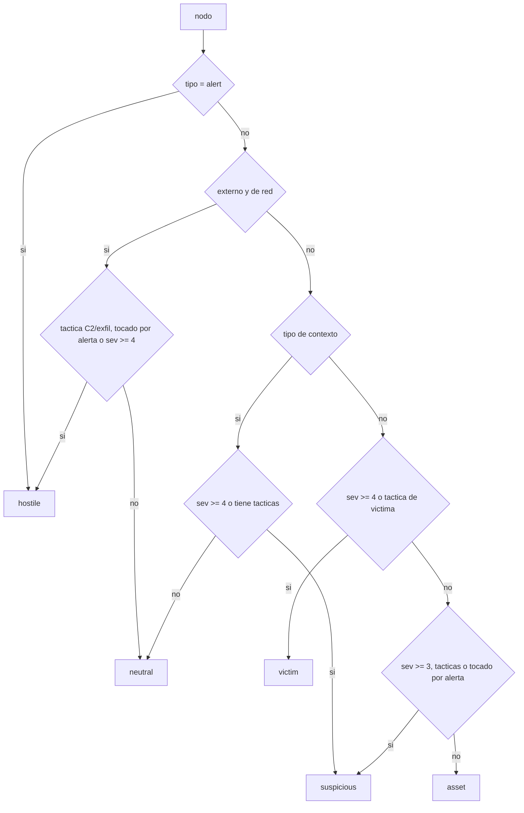

# Ontología

Qué es un nodo, qué es una arista, qué papel juega cada entidad en el incidente y
qué reglas convierten un evento normalizado en un trozo de grafo.

La fuente de verdad es `glamdring/graph/ontology.py`. El frontend la recibe por
`GET /api/ontology` (`glamdring/api/routes_meta.py`) y sobrescribe con ella su copia
local de `web/js/ontology.js`, así que **añadir un tipo se hace en un solo sitio**.

`model`, `shape` y `glyph` viven en el módulo de Python a propósito: la decisión
«un servidor se dibuja como un rack» es semántica, no de presentación, y tiene que
salir idéntica en el grafo, en la leyenda y en el informe. Si viviera en el
frontend, el informe HTML tendría su propia opinión.

**Los colores hexadecimales no se repiten en esta página.** Están en `ENTITIES`,
`ROLES`, `RELATIONS`, `SEVERITY`, `SOURCES`, `RISK_RAMP` y `CLUSTER_PALETTE`, todos
en `glamdring/graph/ontology.py`. Duplicarlos aquí solo garantiza que un día dejen
de coincidir y que la documentación mienta con aire de autoridad.

---

## Entidades

| Tipo | Etiqueta | Figura 3D (`model`) | Clave canónica | Quién la crea |
|---|---|---|---|---|
| `alert` | Alerta | `alert` | `alert:<fuente>\|<uid>` | `_finding` |
| `user` | Usuario | `person` | `user:<canon_user>` | `_add_user`, `_email_activity` |
| `host` | Host | `workstation` / `server` / `router` / `firewall` | `host:<canon_host>` | `_add_endpoint` |
| `process` | Proceso | `gear` | `process:<host>\|<canon_path>` | `_add_process`, `_add_parent_process` |
| `file` | Fichero | `document` | `file:<canon_path>` | `_add_file` |
| `hash` | Hash | `hashcube` | `hash:<digest en minúsculas>` | `_add_file` |
| `ip` | IP | `endpoint` | `ip:<dirección>` | `_add_endpoint` |
| `domain` | Dominio | `globe` | `domain:<canon_domain>` | `_add_network_target`, `_dns_activity`, `_email_activity` |
| `mailbox` | Buzon | `envelope` | `mailbox:<dirección en minúsculas>` | `_email_activity` |
| `service` | Servicio | `gear` | `service:<app en minúsculas>` | `_authentication` (solo si `event.app`) |
| `url` | URL | `globe` | `url:<url>` | — declarado, sin emisor |
| `account` | Cuenta cloud | `cloud` | `account:<id>` | — declarado, sin emisor |
| `registry` | Registro | `key` | `registry:<clave>` | — declarado, sin emisor |

Los tres últimos existen en `ENTITIES` para que la leyenda, los filtros y el panel
de administrador los conozcan, pero hoy ningún extractor los emite. La única vía
por la que puede aparecer un tipo no listado arriba es `_extra_entities`, que el
normalizador de Sentinel rellena en `glamdring/normalize/sentinel_defender.py` y
que hoy solo produce `host`, `user` e `ip`.

Cada entrada lleva además dos campos que no son cosméticos:

- `rank` — capa por defecto en la vista kill-chain cuando el nodo no tiene táctica
  MITRE. `alert` es 0 y `hash` es 6: el orden es «quién manda la historia» arriba y
  «artefacto de apoyo» abajo.
- `size` — radio base. El tamaño final lo modula el riesgo, así que el `size` solo
  fija la proporción entre tipos (una alerta es 9, un hash es 4).

Un tipo desconocido cae en `UNKNOWN_ENTITY` en vez de romper el render. Es
deliberado: un tipo nuevo emitido por un normalizador que se adelantó a la
ontología debe verse feo, no hacer desaparecer el nodo.

### De dónde sale la clave canónica

Las cuatro funciones viven en `glamdring/normalize/base.py` y son la razón de que
tres SIEM distintos produzcan un solo nodo:

| Función | Entrada típica | Salida |
|---|---|---|
| `canon_user` | `CORP\JLopez`, `jlopez@corp.com`, `JLOPEZ` | `jlopez` |
| `canon_host` | `WKS-0421.corp.local` | `wks-0421` (las IP pasan tal cual) |
| `canon_path` | `C:/Windows/Temp/M.EXE` | `c:\windows\temp\m.exe` |
| `canon_domain` | `https://cdn-update-svc.com/a?b=1` | `cdn-update-svc.com` |

`canon_domain` exige al menos un punto y valida la forma del hostname. Sin esa
comprobación, `c:` de `C:\Windows\Temp` colaba como dominio y acababa publicado
como indicador de compromiso.

---

## Qué NO es un nodo

Convertir cada campo del log en nodo produce una bola de pelo ilegible, así que las
reglas de `glamdring/graph/extract.py` son deliberadamente conservadoras: solo hay
nodo si hay **identidad estable**.

- **Puertos, PIDs, ids de sesión, líneas de comandos** → propiedades del nodo o de
  la arista (`props.pid`, `props.cmdline`, `props.port` en la arista de red).
- **Cuentas de máquina** (`WKS-0421$`) y **cuentas de servicio de Windows**
  (`SYSTEM`, `LOCAL SERVICE`, `NETWORK SERVICE`, `ANONYMOUS LOGON`) → devuelven
  `None` en `canon_user`. Aparecen en todos los eventos de todas las máquinas: si
  fueran nodos, unirían el grafo entero por el sitio equivocado y la comunidad
  resultante no diría nada.
- **La IP de un host cuyo hostname ya conocemos** → propiedad `ip` de ese host.
  `_add_endpoint` prefiere el hostname porque es la identidad estable; la IP
  cambia. Con dos nodos, la misma máquina saldría partida en dos.
- **Aristas a la nada** → `_Collector.link` descarta cualquier relación sin origen,
  sin destino o consigo misma, y `build_graph` vuelve a filtrar las que apunten a
  entidades que ese evento no llegó a crear.

---

## Por qué los procesos se anclan al host

La clave es `process:<host>|<ruta>`, no `process:<ruta>`:

```python
host_part = host_key.split(":", 1)[1] if host_key else "?"
return collector.add("process", f"{host_part}|{path}", ...)
```

Si fuera solo la ruta, `powershell.exe` sería **un único nodo** compartido por todas
las máquinas del dominio, con grado enorme, riesgo inflado y aristas cruzando el
grafo de punta a punta. El grafo diría que todo el parque está conectado entre sí y
el movimiento lateral quedaría enterrado bajo ese ruido. Anclado al host, cada
máquina tiene su propio `powershell.exe` y el salto de una a otra se ve como lo que
es: dos nodos distintos unidos por una arista `lateral`.

El anclaje tiene un borde: cuando el evento no identifica la máquina, `host_part`
es `"?"`. Esos procesos se agrupan entre sí en un host ficticio. Es preferible a
mezclarlos con los de una máquina real, pero conviene saber que ese `?|...` en el
inspector significa «el log no decía dónde».

---

## Papel en el incidente

El papel no es propiedad del tipo sino del **contexto**, y es lo que decide la
figura que se dibuja. Lo calcula `assign_roles` en `glamdring/graph/enrich.py` sobre
el grafo ya montado, no evento a evento: una IP no es hostil por sí misma, lo es
porque es externa, porque una alerta apunta a ella y porque el tráfico hacia ella
está etiquetado como mando y control.

| Papel | Etiqueta | Criterio exacto en `_decide_role` | Efecto |
|---|---|---|---|
| `hostile` | Hostil | tipo `alert`; **o** externo y de tipo `ip`/`domain`/`url` con táctica de `HOSTILE_TACTICS`, o tocado por una alerta, o severidad ≥ 4 | figura `attacker`, emisión 0.75 |
| `victim` | Victima | entidad propia con severidad ≥ 4 **o** con táctica de `VICTIM_TACTICS` | alarma encendida, emisión 0.55 |
| `suspicious` | Sospechosa | entidad propia con severidad ≥ 3, con cualquier táctica o tocada por una alerta; tipo de contexto con severidad ≥ 4 o con tácticas | tono de aviso, emisión 0.40 |
| `asset` | Activo sano | entidad propia sin nada de lo anterior | figura tranquila, emisión 0.18 |
| `neutral` | Contexto | tipo de contexto sin hallazgos; externo de red sin evidencia | sin acento, emisión 0.12 |

Los conjuntos son explícitos y están en el mismo fichero:

- `HOSTILE_TACTICS` = `command-and-control`, `exfiltration`, `resource-development`,
  `reconnaissance`. Vistas desde fuera del perímetro, delatan al atacante.
- `VICTIM_TACTICS` = `credential-access`, `lateral-movement`, `impact`,
  `collection`, `privilege-escalation`, `persistence`. Vistas dentro, delatan a la
  víctima.
- `NETWORK_TYPES` = `ip`, `domain`, `url`. Los únicos que pueden ser externos.
- `CONTEXT_TYPES` = `hash`, `file`, `process`, `registry`, `service`. Nunca se
  pintan como hostiles: un fichero no es un actor.



`is_external` decide la rama de la izquierda: un `domain` o una `url` son externos
siempre; una `ip` lo es si no es RFC1918, loopback ni link-local; un `host` con
nombre se considera nuestro, porque si estuviera en el inventario de otro no
tendríamos su hostname. De ahí sale la garantía práctica de que **una IP privada
nunca se pinta como hostil**, por muy grave que sea el evento: será víctima, pero
no infraestructura del atacante.

El orden dentro de `assign_roles` importa y está escrito así a conciencia: primero
se propaga la evidencia desde las alertas (`alert_tactics`, `alert_severity` sobre
los vecinos de cada nodo `alert`) y solo después se decide el papel. Al revés, un
host que solo aparece como destino de una alerta se quedaría como activo sano.

Después hay dos pasadas correctoras:

1. **Dominio hostil contagia a sus direcciones.** Un `mailbox`, `user` o `account`
   cuya parte de dominio coincida con un `domain`/`url` ya marcado como hostil pasa
   a hostil y a externo. Es lo que coloca a `billing@cdn-update-svc.com` del lado
   correcto, en vez de dejarlo como víctima solo porque los buzones se consideran
   nuestros por defecto.
2. **El contexto hereda de la víctima.** Un nodo de `CONTEXT_TYPES` que siguiera en
   `neutral` sube a `suspicious` si tiene severidad ≥ 3, si tiene tácticas o si
   alguno de sus vecinos es `victim`. Un proceso malicioso en la máquina
   comprometida no es «contexto neutro».

Esa segunda pasada usa el umbral 3 y `_decide_role` usa el 4 para los mismos tipos:
el resultado efectivo para ficheros y procesos es 3, pero se llega por la pasada
correctora, no por la decisión principal.

### De rol a figura

`model_for(entity_type, role, device_class)` resuelve la figura con prioridad
**rol > clase de equipo > tipo**, porque «esto es del atacante» es más urgente de
comunicar que «esto es un servidor». Las sustituciones están en `ROLE_MODELS`, y
todas apuntan a `attacker`: `ip`, `domain`, `url`, `user`, `account` y `mailbox`
hostiles dejan de ser su figura habitual y pasan a la figura encapuchada, que se
reconoce desde el otro extremo de la escena sin leer la etiqueta.

La figura se resuelve en el servidor (`node.props.model`) y no en el navegador para
que el informe, la leyenda y el grafo dibujen exactamente lo mismo.

### Clase de equipo

Para los `host`, `guess_device_class` deduce del hostname si es puesto, servidor,
router o cortafuegos buscando subcadenas: `fw`, `asa`, `palo`, `fortigate`, `fgt`,
`checkpoint`, `srx`, `perim` → cortafuegos; `rtr`, `router`, `gw`, `gateway`,
`switch`, `sw-`, `core-`, `edge` → router; `srv`, `server`, `dc0`, `dc1`, `-dc`,
`sql`, `web`, `app`, `fs0`, `exch`, `mail`, `vc`, `esx`, `node`, `db` → servidor.
Lo que no encaja es puesto de trabajo.

Es una heurística de nomenclatura corporativa, no un inventario. Se mira el
hostname porque es lo único que hay: los logs no traen el tipo de equipo. Acierta en
un parque con convenciones, falla del lado seguro cuando no las hay, y se corrige
desde [[Admin-Panel]].

---

## Relaciones

`weight` pesa en el riesgo del nodo (`rel_weight` en `build.py` suma el peso a los
dos extremos) y en el grosor de la arista. `dashed` marca inferencia.

| Tipo | Etiqueta | Peso | Trazo | De → A | Regla que la emite |
|---|---|---|---|---|---|
| `affects` | afecta a | 5 | sólido | alert → * | `_finding` |
| `lateral` | movimiento lat. | 5 | sólido | host\|ip → host\|ip | `_authentication` |
| `triggered` | dispara | 5 | sólido | — | declarada, sin emisor |
| `spawned` | lanza | 4 | sólido | process → process | `_process_activity` |
| `persisted` | persiste en | 4 | sólido | user → host | `_account_change` |
| `authenticated` | autentica en | 3 | sólido | user → host\|service\|ip | `_authentication`, `_process_activity`, `_network_activity` |
| `executed` | ejecuta | 3 | sólido | user → process | `_process_activity`, `_network_activity` |
| `connected` | conecta con | 3 | sólido | process\|host\|ip → ip\|domain\|host | `_authentication`, `_network_activity`, `_dns_activity` |
| `downloaded` | descarga | 3 | sólido | — | declarada, sin emisor |
| `wrote` | escribe | 2 | sólido | process → file | `_file_activity` |
| `deleted` | borra | 2 | sólido | process → file | `_file_activity` |
| `sent_to` | envía a | 2 | sólido | mailbox → mailbox | `_email_activity` |
| `failed_auth` | fallo login en | 2 | **discontinuo** | user → host\|service | `_authentication` |
| `contains_url` | contiene URL | 2 | **discontinuo** | mailbox → domain | `_email_activity` |
| `ran_on` | corre en | 1 | **discontinuo** | process → host | `_process_activity`, `_network_activity`, `_file_activity` |
| `read` | lee | 1 | **discontinuo** | process → file | `_file_activity` |
| `resolved` | resuelve a | 1 | **discontinuo** | domain → ip | `_network_activity`, `_dns_activity` |
| `has_hash` | hash | 1 | **discontinuo** | file\|process → hash | `_process_activity`, `_file_activity`, `_finding` |
| `blocked` | bloqueado hacia | 1 | **discontinuo** | process\|host\|ip → ip\|domain | `_network_activity` |
| `owns` | posee | 1 | **discontinuo** | user → mailbox | `_email_activity` |

Una relación desconocida cae en `UNKNOWN_RELATION`, que es discontinua y de peso 1:
si no sabemos qué es, no puede pintarse como un hecho duro ni pesar en el riesgo.

### El trazo discontinuo no es decorativo

Marca la diferencia entre **lo que el log dice** y **lo que deducimos**. `wrote` es
un hecho: Sysmon vio la escritura. `ran_on` es una inferencia nuestra a partir de
que el evento del proceso lo reportó esa máquina. `resolved` es contexto: el evento
traía dominio e IP juntos, no una resolución DNS observada. `has_hash` une dos
representaciones del mismo artefacto, no una acción.

En forense esa es justo la distinción que no se puede perder. El dato estaba en la
ontología desde el principio y el render lo ignoraba: un hecho observado y una
deducción salían exactamente iguales en pantalla. Hoy lo consume
`web/js/render/graph3d.js` (`linkOptions().dashed && ont.relation(link.type).dashed`)
y lo dibuja `dashedLine()` en `web/js/render/links.js` con `LineDashedMaterial`.
Se puede desactivar desde el panel, y `dashed` es editable por relación.

---

## Reglas de extracción: de evento a grafo

Una función por clase de evento OCSF, despachadas por `_RULES` en
`glamdring/graph/extract.py`. Una clase desconocida cae en `_finding`, que es la
regla más genérica: cuelga todo lo que el evento mencione de un nodo alerta.

| Clase | Evento típico | Nodos | Aristas |
|---|---|---|---|
| `Authentication` | 4624 correcto | user, device, src, service si hay `app` | `user −authenticated→ destino`; `src −connected→ destino` |
| `Authentication` | 4624 tipo 3/10 correcto | src, destino | `src −lateral→ destino` |
| `Authentication` | 4625 fallido | user, host | `user −failed_auth→ destino` |
| `Process Activity` | 4688 / Sysmon 1 | user, host, proc, padre, file, hash | `padre −spawned→ proc`; `user −executed→ proc`; `proc −ran_on→ host`; `proc −has_hash→ hash` |
| `Network Activity` | Sysmon 3 / DeviceNetworkEvents | host, src, proc, ip o dominio | `origen −connected→ destino`; `dominio −resolved→ ip`; `proc −ran_on→ host` |
| `Network Activity` | denegación de firewall | host, ip | `origen −blocked→ destino` |
| `File System Activity` | Sysmon 11 | proc, file, hash | `proc −wrote\|read\|deleted→ file`; `file −has_hash→ hash` |
| `DNS Activity` | Sysmon 22 | proc, dominio, ip | `proc −connected→ dominio`; `dominio −resolved→ ip` |
| `Email Activity` | EmailEvents | mailbox ×2, user, dominio | `emisor −sent_to→ receptor`; `user −owns→ receptor`; `receptor −contains_url→ dominio` |
| `Account Change` | 4720 | user, host | `user −persisted→ host` |
| `Detection Finding` | SecurityAlert / ofensa QRadar | alert + todo lo que nombre | `alert −affects→ *`; `file −has_hash→ hash` |

Tres detalles que explican comportamientos que a primera vista extrañan:

- **`authenticated` hace de comodín.** En `_process_activity` sin proceso padre
  conocido y en `_network_activity` sin proceso, se emite `user −authenticated→
  host` para que el usuario no quede suelto. La arista dice «este usuario estaba en
  esta máquina», que es lo que el evento demuestra, aunque la etiqueta suene a
  logon.
- **La elección de origen en red es una cascada:** proceso, si no el origen del
  evento, si no el equipo que reportó. El nodo más específico gana.
- **`lateral` solo aparece con origen y destino identificados** en un logon remoto
  correcto (tipos 3 y 10, marcados como `logon_remote` en el normalizador). Esa es
  exactamente la firma del movimiento lateral, y por eso pesa 5.

La agregación posterior en `glamdring/graph/build.py` colapsa 400 logons del mismo
usuario contra el mismo servidor en **una** arista con `count=400`, conservando
hasta `MAX_UIDS_PER_LINK` (200) `eventUids` para poder volver al log literal desde
el inspector. En las propiedades, la primera aparición manda: un evento tardío con
el campo vacío no puede borrar lo que ya sabíamos.

---

## Las tres fusiones

Se aplican en `build_graph` tras la agregación y en este orden: IP en host, fichero
por hash, proceso por nombre. Las tres comparten `_apply_alias`, que suma
contadores, une fuentes y tácticas, extiende la ventana temporal y recablea las
aristas. Y las tres comparten la misma regla de prudencia: **si hay ambigüedad, no
se funde**, porque unir dos cosas distintas es peor que dejarlas separadas.

| Fusión | Cuándo sí | Cuándo NO |
|---|---|---|
| `_merge_ip_into_hosts` | un único `host` declara esa IP en `props.ip` | dos o más hosts la reclaman: DHCP a lo largo del tiempo, NAT, inventario sucio |
| `_merge_files_by_hash` | dos ficheros cuelgan del mismo `hash` por `has_hash` y **exactamente uno** tiene ruta | hay varias rutas con ese hash: son copias reales en sitios distintos y fundirlas ocultaría información |
| `_merge_processes_by_name` | mismo host, mismo nombre de ejecutable y **exactamente una** ruta candidata | conviven `c:\windows\svchost.exe` y `c:\users\x\svchost.exe` en la misma máquina: no sabemos a cuál se refiere el log, y esa ambigüedad **es** un hallazgo |

Sin la primera, `SRV-DC01` (al que Splunk y Sentinel nombran por hostname) y
`10.4.1.5` (que QRadar y el firewall solo conocen por IP) serían dos nodos, y el
grafo diría que el tráfico sale de una máquina que no existe. Para que funcione, los
normalizadores de red adjuntan la IP local al equipo que reporta: en una conexión
saliente el origen **es** esa máquina, así que ahí se aprende su dirección.

La segunda resuelve el caso de la alerta que nombra `m.exe` a secas mientras Sysmon
da `c:\windows\temp\m.exe`. El hash es la única identidad fiable de un fichero, así
que la unión se hace a través de la arista `has_hash` que ambos comparten. Por eso
`_finding` enlaza fichero y hash aunque la alerta no describa ninguna acción: sin
esa arista no habría por dónde fundirlos.

La tercera resuelve que Sysmon dé `c:\windows\explorer.exe` y Defender, en el campo
del proceso iniciador, solo `explorer.exe`. Es el mismo proceso en la misma máquina,
y verlo dos veces hace dudar de todo lo demás.

Una arista que tras el recableado uniría un nodo consigo mismo se descarta: ya no
dice nada.

---

## Severidad

Escala OCSF 0-6 comprimida a 0-5 en `SEVERITY`. Es lo único cálido de la interfaz:
si algo está naranja o rojo, importa.

| Nivel | Clave | Etiqueta | De dónde sale |
|---|---|---|---|
| 0 | `unknown` | Desconocida | sin dato |
| 1 | `info` | Informativa | valor por defecto de `parse_severity` |
| 2 | `low` | Baja | evento normal (logon correcto, conexión interna) |
| 3 | `medium` | Media | fallo de login, destino público, línea de comandos con técnica ATT&CK |
| 4 | `high` | Alta | `AlertSeverity=High`, magnitud QRadar 7-8, 4720, veredicto de phishing o malware |
| 5 | `critical` | Critica | `AlertSeverity=Critical`, magnitud QRadar 9-10 |

`parse_severity` en `glamdring/normalize/base.py` traduce palabras (Sentinel),
magnitud 1-10 (QRadar), 0-10 (CEF) y severidad syslog invertida (0 = emergencia).
**El redondeo es hacia arriba en los empates** (`_round_half_up`), no el bancario de
`round()`: en una escala de riesgo hay que errar por exceso, y magnitud 9 de QRadar
es crítica, no alta.

Varios normalizadores suben la severidad después de traducirla, siempre con `max`
para no bajarla nunca: una línea de comandos que dispara técnicas conocidas no puede
quedarse en informativa y desaparecer bajo los filtros.

En el grafo, un nodo se queda con la severidad máxima de los eventos que lo tocaron
(`agg.max_severity`), y ese número entra multiplicado por 12 en la puntuación de
riesgo de `enrich.score` — el factor dominante, frente al volumen de eventos, que
pesa como mucho 5 puntos: que una máquina sea habladora no la hace peligrosa.

---

## Tácticas MITRE

El orden de `TACTICS` **es** el orden de las capas de la vista kill-chain:

`reconnaissance` → `resource-development` → `initial-access` → `execution` →
`persistence` → `privilege-escalation` → `defense-evasion` → `credential-access` →
`discovery` → `lateral-movement` → `collection` → `command-and-control` →
`exfiltration` → `impact`

`tactic_rank()` devuelve la posición en esa lista, y 99 si la táctica no se conoce,
que es lo que manda los nodos sin clasificar al final en vez de romper la ordenación.
Los nombres en castellano están en `TACTIC_LABELS`.

Si el SIEM ya etiqueta la técnica (Sentinel y Defender lo hacen), se usa la suya. Si
no, `glamdring/mitre.py` la infiere de la línea de comandos con `_CMDLINE_RULES`:
`powershell -enc` → T1027, `certutil -urlcache` → T1105, `sekurlsa` → T1003.001,
`vssadmin delete shadows` → T1490, `psexec` o `\admin$` → T1021.002.

Las reglas se recorren **todas**: un `powershell -enc ... certutil -urlcache` merece
T1027 **y** T1105. Y una subtécnica desconocida (`T1059.999`) cae a su técnica
padre, que es lo único que hace falta para colocar el nodo en su capa.

El catálogo de `TECHNIQUES` no es ATT&CK entero a propósito: solo las técnicas que
aparecen de verdad en un incidente Windows o cloud típico.

---

## Añadir un tipo

1. Entrada nueva en `ENTITIES` o `RELATIONS` de `glamdring/graph/ontology.py`.
2. Emitirla desde la regla que toque en `glamdring/graph/extract.py`.
3. Nada más. El frontend la recoge por `GET /api/ontology`, y la leyenda, los chips
   de filtro y los colores del grafo se actualizan solos.

Si el tipo necesita figura propia, hay que añadirla en `web/js/render/models.js` y
referenciarla desde `model`. Sin figura propia se usa `endpoint`, que es el
respaldo de `model_for`. Receta completa en [[Extending]].

---

[[Visual-Language]] · [[Normalizers]] · [[Extending]]
