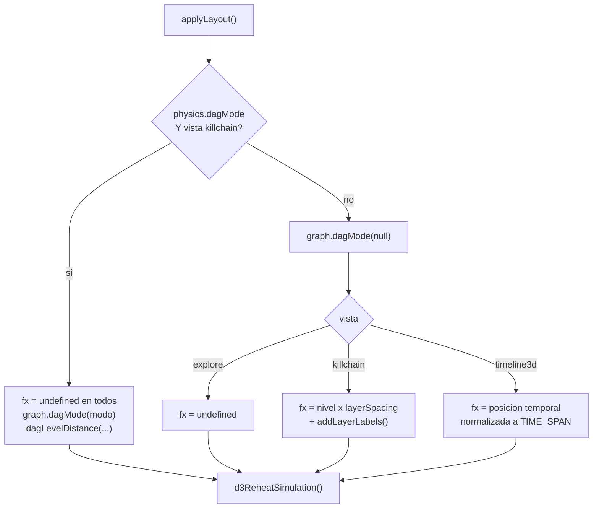

# Vistas e interacción

Cómo se maneja el grafo: las tres disposiciones y qué hace cada una por dentro, el
replay temporal, el brush del histograma, y la lista completa de gestos, atajos y
acciones del menú contextual.

---

`web/index.html` monta cinco zonas fijas y nunca cambia de esqueleto: barra superior
(vistas, modo de color, buscador), panel izquierdo `#filters`, escenario `#graph` con
sus overlays, panel derecho `#inspector` y el pie `.timeline-bar`. Todo cambio de
estado (filtro, brush, búsqueda, ingesta, perfil visual) acaba en `reload()` de
`web/js/app.js`: un único camino de refresco, y por tanto ningún estado intermedio
inconsistente que perseguir cuando algo se ve raro.

---

## Las tres disposiciones

Una sola instancia de `ForceGraph3D` sirve las tres. **No se reconstruye el grafo al
cambiar de vista**: lo único que cambia es cómo se fijan las posiciones, y de eso se
encarga `applyLayout()` en `web/js/render/graph3d.js`. Reconstruir costaría volver a
crear un `THREE.Group` por nodo y perdería la cámara y la selección.

| Vista | `data-view` | Eje X | Mecanismo |
|---|---|---|---|
| Explorar | `explore` | ninguno | `node.fx = undefined`, simulación libre; los clústeres emergen solos |
| Kill-chain | `killchain` | capa MITRE | `node.fx = node.__gdLevel * layerSpacing - offset` |
| Cronología | `timeline3d` | primer avistamiento | `node.fx = ratio * TIME_SPAN - TIME_SPAN / 2`, con `TIME_SPAN = 900` |

En las tres, Y y Z los sigue decidiendo la simulación de fuerzas. Solo se ata X, que
es el eje que en cada vista *significa* algo. Al final de `applyLayout()` siempre se
llama a `graph.d3ReheatSimulation()`, porque soltar o fijar `fx` sobre una simulación
ya enfriada no movería nada.



`addGrid()` se ejecuta en las tres vistas si `render.grid` está activo, con una rejilla
mayor en kill-chain (1400 / 28 divisiones frente a 900 / 18). Sin referencia fija en
el suelo, en 3D se pierde la noción de dónde se está, y en kill-chain se pierde además
el eje que cuenta la historia.

### Por qué la kill-chain fija `fx` y no usa `dagMode`

La capa la calcula el servidor, no el navegador: `assign_levels()` en
`glamdring/graph/query.py` puntúa por táctica MITRE, propaga por BFS a los vecinos sin
táctica (una IP no tiene táctica propia) y compacta los niveles a enteros consecutivos
para no dejar columnas vacías en medio. Llega como `props.level` y `decorate()` lo
copia una vez a `node.__gdLevel`.

`dagMode` de 3d-force-graph haría algo parecido y más vistoso, pero **exige un grafo
acíclico**. Un incidente real casi nunca lo es: un host habla con un C2 y el C2 vuelve
a hablar con el host; un usuario toca un fichero que a su vez ejecuta como ese
usuario. Con un ciclo, `dagMode` aborta el layout. Los dos caminos están disponibles,
y esa es la razón de `onDagError(() => false)` en `wireAccessors()`:

| | `fx` fijado (por defecto) | `dagMode` de la librería |
|---|---|---|
| Se activa con | `physics.dagMode = ""` | `physics.dagMode` = `td`, `bu`, `lr`, `rl`, `zout`, `zin`, `radialout`, `radialin` |
| Origen del nivel | servidor (`props.level`) | la propia librería, recorriendo el grafo |
| Con ciclos | funciona igual | necesita `onDagError` para no tumbarse |
| Separación | `physics.layerSpacing` (130) | `physics.dagLevelDistance` (130) |
| Etiquetas de capa | sí, `addLayerLabels()` | no |

`onDagError(() => false)` devuelve `false` para decirle a la librería que ignore el
ciclo en vez de lanzar. Sin eso, elegir `dagMode` en el panel dejaba la vista muerta
en cuanto el incidente tenía una relación de ida y vuelta. El selector vive en el
[[Admin-Panel]], sección de física.

Cuando se va por `fx`, `addLayerLabels()` rotula cada columna con la táctica más
frecuente de esa capa (`ont.tacticLabel`), o con `capa N` si ninguno de sus nodos
tiene táctica. Las etiquetas se guardan en `sceneExtras` y `clearExtras()` las quita
al cambiar de vista; si no, se acumularían una capa de rótulos por cada cambio.

### Cronología 3D

`decorate()` calcula `__gdTmin` y `__gdTmax` sobre los `firstSeen` de los nodos y la
vista normaliza cada nodo a ese rango. Los nodos sin marca de tiempo caen en
`ratio = 0`, al extremo izquierdo; y si todos los eventos comparten instante,
`decorate()` fuerza `__gdTmax = __gdTmin + 1` para no dividir por cero.

---

## Replay temporal: el cursor no reconstruye nada

El botón ▶ recorre el incidente en orden cronológico. Lo que **no** hace es volver a
pedir el grafo al servidor ni tocar `graph.graphData()`.

El mecanismo son dos accesores declarados una sola vez en `wireAccessors()` y una
función de tres líneas:

```javascript
.nodeVisibility(visibleAt)
.linkVisibility(visibleAt)

function visibleAt(item) {
  if (timeCursor === null) return true;
  return item.__gdFirst === null || item.__gdFirst <= timeCursor;
}
```

`setTimeCursor(cursor)` guarda el instante y llama a `refresh()`. El grafo entero
sigue en memoria con sus posiciones ya calculadas; solo se decide, nodo a nodo y
arista a arista, si se dibuja. Reconstruirlo en cada fotograma habría significado
relanzar la simulación 60 veces por segundo: los nodos saltarían de sitio en cada paso
y el replay dejaría de ser una película para ser un baile. Que `__gdFirst` sea un
número precalculado en `decorate()` y no un `Date.parse` por llamada es la otra mitad
de que esto vaya fluido: `visibleAt` se ejecuta por cada nodo y cada arista en cada
refresco.

`tick()` en `web/js/ui/timeline.js` avanza el cursor con `requestAnimationFrame`
escalando por `REPLAY_SECONDS = 24`: el incidente completo dura siempre 24 segundos,
abarque diez minutos o tres días. A velocidad real, un caso de dos semanas sería
inservible.

Cada avance dispara `onCursor(cursor, previous)` en `app.js`, que además de mover el
cursor lanza un destello (`graph3d.pulse`, es decir `graph.emitParticle`) por cada
arista con `__gdFirst > previous && __gdFirst <= cursor`: el evento "ocurre" a la
vista en el instante exacto en que pasó. `pulse()` va dentro de un `try` porque la
librería lanza si la arista no está visible, y un destello perdido no puede tumbar el
replay.

⏮ (`#btn-rewind`) pausa y pone el cursor a `null`, que por `visibleAt` devuelve el
grafo entero a la vista.

---

## Brush contra cursor

Las dos interacciones viven sobre la misma barra y hacen cosas distintas. Confundirlas
es el error más fácil de cometer leyendo el código.

| | Brush (arrastrar) | Cursor (reproducir) |
|---|---|---|
| Qué cambia | **los datos**: acota la ventana y recarga | **lo que se enseña**: oculta lo que aún no ha pasado |
| Ruta | `onBrush` → `state.window` → `reload()` → `GET /api/graph?from=&to=` | `onCursor` → `graph3d.setTimeCursor()` → `refresh()` |
| Toca el servidor | sí | no |
| Recuentos de aristas | se recalculan sobre la ventana | intactos |
| Se quita con | clic seco sobre la barra | ⏮ |
| Overlay | `#timeline-brush` | `#timeline-cursor` |

Dos detalles del brush que se notan al usarlo:

- **El histograma no se redibuja al aplicar el brush.** `reload()` se llama con
  `keepTimeline: true`, así que la barra sigue mostrando el incidente completo con el
  recorte marcado encima. Si se repintase con los datos recortados, el brush se
  quedaría sin contexto: se perdería de vista qué hay fuera de la ventana, que es
  justo lo que se está decidiendo. `GET /api/timeline` ni siquiera acepta `from`/`to`.
- **Mover un chip de filtro tampoco toca el brush.** Misma llamada con
  `keepTimeline: true`. Si no, el histograma pelearía con el analista cada vez que
  apaga una entidad.

El histograma se pinta en `<canvas>` y no en SVG porque son hasta mil barras
repintándose durante el arrastre, y un DOM de mil nodos moviéndose va a tirones. Las
alturas van en escala raíz: en lineal, un pico de 500 eventos aplasta visualmente los
buckets de uno o dos, que suelen ser los interesantes. Las barras posteriores al
cursor se pintan en gris (`rgba(91,104,128,0.25)`) en vez de con su color de
severidad. El arrastre se distingue del clic por un umbral de 4 px.

---

## Gestos

| Gesto | Sobre | Qué hace | Dónde |
|---|---|---|---|
| Hover | nodo | resalta el nodo y su vecindad; atenúa el resto a `interaction.dimOpacity` (0.07) | `onNodeHover` |
| Hover | arista | resalta la arista y sus dos extremos | `onLinkHover` |
| Clic | nodo | selecciona, centra la cámara y abre el inspector | `onNodeClick` → `selectNode()` |
| Clic | arista | selecciona la arista y abre el inspector de relación | `onLinkClick` → `selectLink()` |
| Clic | fondo | limpia selección y vacía el inspector | `onBackgroundClick` |
| Ctrl+clic *o* Mayús+clic | nodo | añade o quita de la selección múltiple; con dos o más abre la comparación | `toggleMultiSelect()` |
| Doble clic | nodo | expande vecinos pidiéndolos al servidor | `expandNode()` |
| Clic derecho | nodo | menú contextual | `interactions.openNodeMenu()` |
| Arrastrar | nodo | lo mueve y lo deja fijado (`fx`/`fy`/`fz`) si `interaction.fixOnDrag` | `onNodeDragEnd` |
| Arrastrar | fondo | rota u orbita la cámara, según `camera.controlType` | trackball por defecto |
| Arrastrar | histograma | brush: acota la ventana temporal | `timeline.js` |
| Rueda | escenario | zoom | controles de three.js |
| Soltar ficheros | escenario | ingesta | `wireDragAndDrop()` |

- **El hover solo manda si no hay nada seleccionado.** `onNodeHover` y `onLinkHover`
  comprueban `!selection.node && !selection.link` antes de tocar el resaltado: una vez
  fijado un foco, pasar el ratón por encima no se lo debe robar.
- **El doble clic se detecta a mano.** La librería no expone `onNodeDoubleClick`, así
  que `app.js` guarda `lastClick = { id, at }` y considera doble clic dos pulsaciones
  sobre el mismo nodo separadas por menos de 380 ms. Se desactiva con
  `interaction.expandOnDoubleClick`.
- **Expandir fusiona, no reemplaza.** `expandNode()` pide `GET /api/graph/neighbors`,
  descarta lo que ya estaba y añade el resto al grafo actual. Reemplazar haría perder
  todo lo que el analista ya tenía colocado, que es media investigación.

---

## Atajos de teclado

Los declara `SHORTCUTS` en `web/js/ui/interactions.js`, que es a la vez la lista real
de atajos y el contenido del panel de ayuda: pulsando `?` se ve exactamente lo que
está cableado, sin copias que se desincronicen.

| Tecla | Acción | Handler en `app.js` |
|---|---|---|
| `espacio` | reproducir / pausar la cronología | `togglePlay` |
| `f` | encuadrar todo el grafo | `fit` → `graph3d.zoomToFit()` |
| `1` | vista Explorar | `setView('explore')` |
| `2` | vista Kill-chain | `setView('killchain')` |
| `3` | vista Cronología | `setView('timeline3d')` |
| `c` | siguiente modo de color | `cycleColorMode` |
| `/` | ir al buscador | enfoca `#search` |
| `a` | panel de administrador | `openAdmin` |
| `r` | generar informe | `openReport` |
| `esc` | limpiar selección y cerrar diálogos | `escape` |
| `?` | mostrar / ocultar esta ayuda | `toggleHelp` |

Dos guardas en el `keydown` evitan los fallos clásicos. Si el foco está en un `input`,
`textarea` o `select` no se dispara ningún atajo, y `Escape` solo saca el foco del
campo: sin esto, escribir `farga` en el buscador reencuadraría el grafo y cambiaría de
vista. Y si el evento lleva `ctrlKey`, `metaKey` o `altKey` se ignora, para que
`Ctrl+R` siga recargando y `Ctrl+F` siga siendo el buscador del navegador. `espacio` y
`/` llaman a `preventDefault()`: uno para que la página no haga scroll, el otro para
que el navegador no abra su búsqueda rápida.

---

## Menú contextual

Clic derecho sobre un nodo. Cada acción se declara con su `id`, su etiqueta y una
pista opcional en `NODE_ACTIONS`; la implementación vive en `contextActions()` de
`app.js`. Añadir una entrada es tocar una lista, no buscar entre el cableado.

| Entrada | Qué hace |
|---|---|
| Centrar aquí | selecciona, mueve la cámara al nodo y abre el inspector |
| Expandir vecinos | `GET /api/graph/neighbors?node=…&hops=1` y fusiona lo nuevo |
| Fijar / soltar | conmuta `fx`/`fy`/`fz` del nodo vivo; avisa con un toast |
| Ocultar | añade el id a `state.hidden` y recarga; `#stats` muestra "N ocultos" |
| Copiar como IOC | copia `props.full` si existe, y si no la etiqueta |
| Copiar identificador | copia el id canónico (`host:wks-0421`, `user:jlopez`…) |
| Buscar en el grafo | vuelca la etiqueta en `#search` y dispara el evento `input` |

`Ocultar` y `Buscar en el grafo` pasan por el servidor: el primero recarga con
`keepTimeline: true` y `fit: false`; el segundo entra por el mismo `input` que teclea
el analista, con su rebote de 320 ms, para no reconstruir el grafo en cada pulsación.

El menú se coloca **después** de mostrarlo: `placeMenu()` necesita el
`getBoundingClientRect()` real para voltearlo cuando el clic cae cerca del borde. Se
cierra con un clic fuera, con cualquier scroll (escuchado en fase de captura, porque
el de los paneles no burbujea hasta `document`) y con el `blur` de la ventana.

> **Estado real del menú de aristas.** `LINK_ACTIONS` y `openLinkMenu()` existen en
> `web/js/ui/interactions.js` con tres entradas (ver logs de esta relación, marcarla
> con un destello, ocultar ese tipo de relación) y sus tres handlers (`inspect`,
> `pulseLink`, `hideRelation`) están implementados en `contextActions()`. Pero
> `graph3d.js` no cablea ningún `onLinkRightClick` y `app.js` nunca llama a
> `openLinkMenu()`, así que hoy ese menú no se puede abrir. De sus tres acciones,
> solo `inspect` es alcanzable, con un clic izquierdo sobre la arista.

`copyToClipboard()` usa `navigator.clipboard` con contexto seguro y cae a un
`<textarea>` oculto con `document.execCommand('copy')` cuando no lo hay: GLAMDRING se
despliega habitualmente en `http://` dentro del SOC, donde esa API no existe.

---

## Inspector: la vuelta al log crudo

Es la parte que hace la herramienta defendible: un grafo del que no se puede volver al
registro original no sirve para un informe. `web/js/ui/inspector.js` pinta tres cosas
distintas según lo seleccionado:

| Función | Cuándo | Qué enseña |
|---|---|---|
| `showNode(node, neighbors)` | clic en un nodo | cabecera con papel y severidad, métricas (riesgo, eventos, conexiones), ventana temporal, tácticas MITRE, orígenes, propiedades, vecinos y logs |
| `showLink(link, source, target)` | clic en una arista | origen → relación → destino, recuento, severidad, duración, detalles y logs |
| `showComparison(nodes)` | ctrl+clic sobre varios | tácticas en común y la lista de entidades |

`showComparison()` responde a "¿qué tienen en común estas tres máquinas?" sin abrirlas
una a una: intersecta los conjuntos de tácticas de todo lo seleccionado. Los vecinos
se listan hasta 40 y el resto se resume con "… y N más"; cada fila es clicable y
navega con `onNavigate`, que vuelve a `selectNode(id, true)`.

### La trazabilidad

Los logs se cargan **bajo demanda**, no con el resto del panel: un nodo puede arrastrar
doscientos `eventUids` y traerlos siempre haría el inspector lento sin motivo.

```
nodo   → GET /api/events?node=host:wks-0421&limit=60
arista → GET /api/events?uids=<hasta 60 uids>&limit=60
```

En el backend, `get_events()` de `glamdring/api/routes_graph.py` acepta `uids` o
`node` (sin ninguno de los dos, 400; con un nodo inexistente, 404) y devuelve
`{count, events}`. Cada evento se pinta como un `<details>` con hora, punto de color
del origen y mensaje; al desplegarlo aparece `event.raw` en un `<pre>`, que es el
registro **literal** tal y como llegó del SIEM, sin normalizar. Todo pasa por `esc()`
antes de tocar el DOM. El contrato de la ruta está en [[API-Reference]]; lo que hay
entre el log crudo y el nodo, en [[Normalizers]].

---

## Resaltado, atenuado y selección

`highlight.nodes` y `highlight.links` son dos `Set` que gobiernan lo destacado.
Cuando tienen algo, lo que queda fuera se clona su material y baja a
`interaction.dimOpacity` (0.07, con suelo en 0.04). Se clona porque compartir el
material entre nodos haría que atenuar uno atenuase a todos los de su tipo.

`labels.nodeMode` en modo `smart` (el de fábrica) usa esos mismos conjuntos: si hay
resaltado, rotula solo lo resaltado; si el grafo tiene menos de 60 nodos, los rotula
todos; y si no, solo los de riesgo por encima de `labels.nodeRiskThreshold` (45). Un
grafo de 400 nodos con todas las etiquetas puestas es ilegible.

`clearSelection()` (`esc` o clic en el fondo) vacía selección simple, múltiple y hover
de una vez; la acción `escape` de `app.js` además cierra el modal, el panel de
administrador y el diálogo de informe. Los ajustes que gobiernan todo esto
—`interaction`, `labels`, `physics`, `camera`— viven en el perfil del servidor y se
editan desde el [[Admin-Panel]].

---

Sigue por [[Visual-Language]] para leer lo que el grafo dibuja · [[Demo-Incident]] para
un recorrido guiado con datos reales · [[Admin-Panel]] para cambiar el comportamiento
de las vistas.
