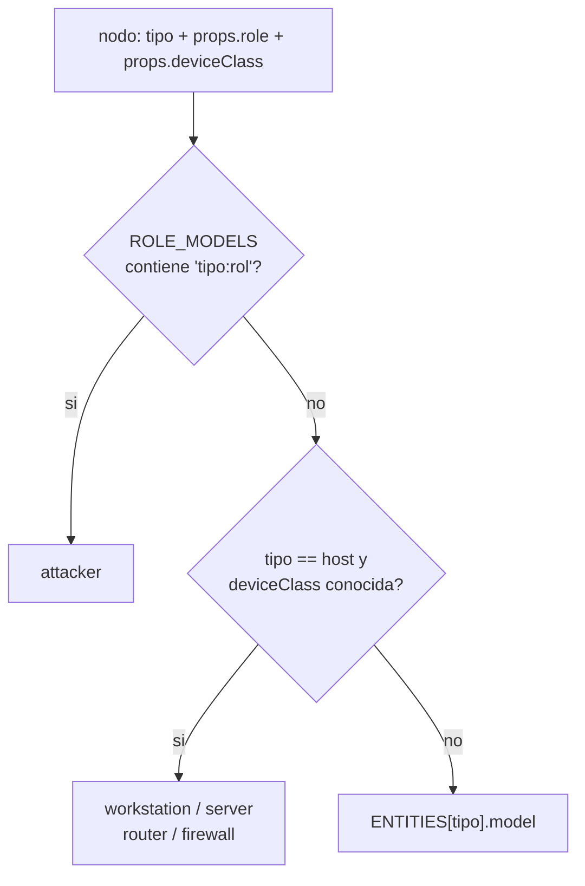
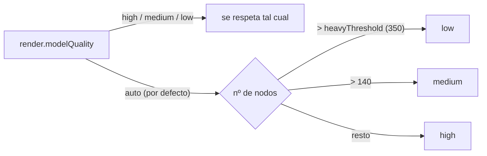

# Lenguaje visual

Cómo se lee el grafo de un vistazo: qué significa cada figura, cada color, cada
grosor y cada partícula, y por qué se decidió así.

El principio cabe en una frase: **en una escena de doscientos nodos la silueta se
lee desde el otro extremo y el texto no**. Por eso la forma carga con la
semántica estable (qué es esto y qué papel juega) y el color con la pregunta
variable (lo que el analista quiera mirar ahora mismo).

---

## Las quince figuras

Todas se construyen con primitivas de three.js en `web/js/render/models.js`. No
hay ni un fichero de asset: la herramienta tiene que arrancar en un portátil
aislado sin red, y una figura procedural se recolorea sola según la severidad,
cosa que un `.glb` no hace. Cada constructor dibuja dentro de una caja de ~2
unidades de alto centrada en el origen y `buildModel()` escala al final con
`group.scale.setScalar(radius / 1.15)`, de modo que un `hash` y un `host` son
comparables sin ajustar cada figura a mano.

| Figura (`model`) | Qué representa | Primitivas |
|---|---|---|
| `workstation` | `host` con clase de equipo *puesto* | caja marco + `PlaneGeometry` emisiva (pantalla) + cilindro (cuello) + 2 cajas (peana, teclado) |
| `server` | `host` con clase *servidor* | caja 1,05×2×0,9 + 5 cajas finas (bandejas) + 5 esferas (pilotos) |
| `router` | `host` con clase *router* | caja plana + 3 cilindros inclinados (antenas) + 4 esferas emisivas |
| `firewall` | `host` con clase *cortafuegos* | 18 cajas en 6 hiladas alternadas (ladrillos) + caja emisiva de remate |
| `person` | `user` | cápsula (cuerpo) + esfera (cabeza) + toro flotante (aro) |
| `attacker` | cualquier tipo con papel `hostile` | cono (túnica) + esfera oscura (cabeza) + cono abierto (capucha) + 2 esferas emisivas (ojos) |
| `gear` | `process`, `service` | `Shape` de 10 dientes con `Path` de agujero, pasado por `ExtrudeGeometry` (profundidad 0,26; sin bisel) |
| `document` | `file` | caja (hoja) + cono de 3 lados girado (esquina doblada) + 3 cajas finas (renglones) |
| `alert` | `alert` | octaedro + toro que gira sobre Z |
| `globe` | `domain`, `url` | esfera translúcida (opacidad 0,55) + 3 toros (aro base, meridiano, ecuador) |
| `envelope` | `mailbox` | caja + cono de 3 lados girado (solapa) |
| `cloud` | `account` | 3 esferas, la superior escalada ×1,18 |
| `key` | `registry` | toro (anilla) + cilindro (vástago) + 2 cajas (dientes) |
| `hashcube` | `hash` | 8 cajas en rejilla 2×2×2 |
| `endpoint` | `ip` y cualquier tipo desconocido | icosaedro + esfera emisiva (piloto) |

Cuatro de las quince no las alcanza ningún tipo de entidad por sí solo:
`server`, `router` y `firewall` solo salen de la clase de equipo, y `attacker`
solo del papel. Están en `BUILDERS` de `models.js` y `availableModels()` las
lista igual, porque el panel de administrador deja sustituir cualquiera de ellas
por un `.glb` propio.

### Movimiento

Dos helpers, `pulse()` y `spin()`, se enganchan a `onBeforeRender` en lugar de
montar un bucle de animación propio: el renderer ya llama a ese hook una vez por
fotograma y por objeto, así que no hay nada que sincronizar ni que parar.

| Figura | Qué se mueve | Cuándo |
|---|---|---|
| `workstation` | la pantalla late (0,35 → 1 de opacidad) | `alarm` |
| `server` | el piloto superior late en color de severidad | `alarm` |
| `firewall` | el remate superior late | `alarm` |
| `person` | el aro pasa a color de severidad y late | `alarm` |
| `gear` | el engranaje gira sobre Y | `alarm` |
| `alert` | el aro gira sobre Z | siempre |

La alerta gira siempre porque un objeto en movimiento atrae la mirada aunque
esté al fondo de la escena.

---

## La figura la decide la pareja (tipo, papel)

Esto es lo que separa a GLAMDRING de un grafo con bolitas de colores. El tipo de
entidad es una propiedad del dato; el **papel** es una propiedad del incidente, y
lo calcula `assign_roles()` en `glamdring/graph/enrich.py` mirando el grafo
entero ya montado, no un evento suelto.

La resolución vive en `model_for()` de `glamdring/graph/ontology.py`:



Prioridad: **papel > clase de equipo > tipo**. El papel manda porque "esto es del
atacante" es más urgente de comunicar que "esto es un servidor".

`ROLE_MODELS` tiene hoy seis entradas y todas apuntan al mismo destino:
`ip:hostile`, `domain:hostile`, `url:hostile`, `user:hostile`,
`account:hostile` y `mailbox:hostile` → `attacker`.

Por qué importa: una `ip` normal es un icosaedro con un piloto, indistinguible
de las otras cuarenta IPs de la escena. La misma `ip` con tráfico de mando y
control marcada como `hostile` deja de ser una cajita y pasa a ser una figura
encapuchada. Se reconoce **por la forma**, no por el color, lo que significa que
sigue funcionando para quien no distingue el rojo del verde y sigue funcionando
en una captura en blanco y negro pegada en un informe.

El campo `props.model` se resuelve en el servidor y viaja en el `GraphDoc`; el
navegador solo lo lee. Es a propósito: el grafo, la leyenda y el informe HTML
dibujan así exactamente la misma figura para el mismo nodo.

Detalle de cómo se decide cada papel en [[Ontology]].

---

## Clase de equipo: una heurística sobre el hostname

Los logs no traen el tipo de equipo. Lo único disponible es el nombre, así que
`guess_device_class()` busca subcadenas en el hostname en minúsculas:

| Clase | Subcadenas que la disparan |
|---|---|
| `firewall` | `fw`, `asa`, `palo`, `fortigate`, `fgt`, `checkpoint`, `srx`, `perim` |
| `router` | `rtr`, `router`, `gw`, `gateway`, `switch`, `sw-`, `core-`, `edge` |
| `server` | `srv`, `server`, `dc0`, `dc1`, `-dc`, `sql`, `web`, `app`, `fs0`, `exch`, `mail`, `vc`, `esx`, `node`, `db` |
| `workstation` | nada: es el valor por defecto |

Dos cosas que hay que tener claras antes de fiarse:

- **El orden de `_DEVICE_PATTERNS` desempata.** Se evalúa cortafuegos, luego
  router, luego servidor, y gana la primera clase que casa: `FW-CORE-01` es un
  cortafuegos, no un router.
- **Son subcadenas, no prefijos.** `db`, `app`, `web`, `vc` y `node` casan en
  cualquier posición, así que `LAPTOP-WEBB` sale como servidor. Es el precio de
  aceptar nomenclaturas corporativas que no son consistentes.

Acierta en la mayoría de parques, donde `SRV-DC01` es un controlador de dominio
y `WKS-0421` el portátil de alguien, y sin pista asume puesto de trabajo porque
es lo más numeroso. No es un inventario: es un heurístico de nomenclatura.
`assign_roles()` la escribe con `setdefault`, así que si algo aguas arriba ya
puso `props.deviceClass`, se respeta.

---

## Los siete modos de color

El grafo es siempre el mismo. Lo que cambia es qué dimensión se lleva el color,
porque "¿qué tipo de cosa es esto?" y "¿quién es el atacante?" son preguntas
distintas y merecen mapas distintos. Los declara `COLOR_MODES` en la ontología y
los resuelve `nodeColor()` en `web/js/render/colors.js`.

| `id` | Etiqueta | De dónde sale el color | Para qué sirve |
|---|---|---|---|
| `type` | Tipo de entidad | `ENTITIES[type].color` | orientarse: dónde están los usuarios, dónde los ficheros |
| `role` | Papel en el incidente | `ROLES[props.role].color` | la vista de triaje: hostil rojo, víctima naranja, sospechoso amarillo, activo sano verde, contexto gris |
| `severity` | Severidad | `SEVERITY[maxSeverity].color` | qué eventos son graves, independientemente de a quién toquen |
| `risk` | Riesgo | rampa continua sobre `risk / 100` | ordenar la atención cuando todo parece igual de malo |
| `source` | Origen del dato | `SOURCES[sources[0]].color` | ver qué aporta cada SIEM y dónde hay puntos ciegos |
| `tactic` | Táctica MITRE | rampa según la posición de `tactics[0]` en la cadena | leer si algo es del principio del ataque o del final |
| `cluster` | Comunidad | `CLUSTER_PALETTE[cluster % 10]` | separar la cadena del atacante del ruido de fondo del dominio |

Notas de implementación que se notan al usarlo:

- `risk` y `tactic` comparten la misma rampa `RISK_RAMP` (verde → lima → ámbar →
  naranja → rojo). En `tactic` no significa peligro sino avance en la cadena.
  La interpolación es RGB plano (`lerpHex`): para una rampa de cinco paradas
  que se mira de reojo no compensa una dependencia de espacios perceptuales.
- `cluster` usa una paleta cíclica de tonos bien separados porque el número de
  comunidad no significa nada, solo hay que distinguir uno de otro. Los
  identificadores los reordena `assign_clusters()` por tamaño y de forma
  determinista, para que los colores no bailen entre refrescos.
- Cualquier fallo del resolutor devuelve `#94a3b8`. Un modo de color roto no
  puede dejar el grafo en negro.

### La leyenda se genera de lo que hay en pantalla

`legendFor(mode, nodes)` recorre los nodos visibles, no la ontología completa:
una leyenda con trece tipos cuando en la escena hay cuatro estorba más que
ayuda. `risk` devuelve `{kind: 'ramp'}` y se pinta como barra continua porque el
riesgo no tiene categorías; el resto devuelve `{kind: 'list'}` ordenada por
nivel (`severity`), por posición en la cadena (`tactic`) o alfabéticamente.
Debajo, `renderLegend()` en `web/js/app.js` añade **siempre** la escala de
severidad de "Baja" para arriba: la severidad se lee aunque el color esté
ocupado en otra cosa.

---

## Severidad: pantallas, pilotos y halos

El color de acento de un nodo lo da `accentColor()` y **no cambia con el modo de
color**: es el color del papel `hostile` si el nodo lo tiene, y si no el de
`SEVERITY[maxSeverity]`. Al lado, `isAlarmed()` decide si la figura entra en
estado de alarma:

```javascript
export function isAlarmed(node) {
  const role = node.props && node.props.role;
  return (node.maxSeverity || 0) >= 4 || role === 'hostile' || role === 'victim';
}
```

Esos dos valores entran en `buildModel()` como `severityColor` y `alarm`, y cada
figura los coloca donde su forma lo permite: la pantalla del puesto, el piloto
superior del rack, el remate del muro, el aro sobre la cabeza, los ojos dentro
de la capucha, el anillo de la alerta. Un equipo comprometido se ve "encendido
en rojo" desde lejos sin leer una sola etiqueta.

Las partes emisivas usan `MeshBasicMaterial` y no `MeshLambertMaterial`: un
piloto de alarma no puede depender de dónde estén las luces de la escena, tiene
que verse igual desde cualquier ángulo.

En calidad baja el acento se dibuja como un anillo interior del icono y, si hay
alarma, como un **halo radial** difuminado. El halo es un `Sprite` y no un anillo
plano en 3D porque un anillo visto de canto desaparece justo en el momento en
que más falta hace que se vea.

---

## Riesgo: tamaño con raíz cuadrada

`radiusOf()` en `web/js/render/graph3d.js`:

```javascript
const base = (meta.size || 5) * (meta.scale || 1);
const risk = Math.max(0, Math.min(100, node.risk || 0));
return base * (0.75 + Math.sqrt(risk / 100) * 0.85);
```

El `size` base sale de la ontología (`alert` 9, `host` 8, `user` 7 … `hash` 4),
y el riesgo lo calcula `enrich.score()` en una escala 0-100 donde la severidad
es el factor dominante y el volumen pesa poco a propósito.

La raíz cuadrada hace la curva cóncava: el salto de riesgo 10 a 40 se ve mucho,
y de 70 a 100 casi no. Es lo que se quiere, porque la decisión que importa es
"esto merece una mirada o no", y esa se toma en la parte baja de la escala; una
vez algo es grave, cuánto más grave sea que otra cosa grave ya no cambia el
tamaño de forma útil. El factor multiplicador va de ×0,75 (riesgo 0) a ×1,6
(riesgo 100).

El radio no es solo estético: alimenta la fuerza de colisión propia de
`web/js/render/forces.js` con un margen de `collideRadius` (1,15 por defecto).
Desde que los nodos dejaron de ser esferas pequeñas, un rack y una figura humana
ocupan volumen y sin esa fuerza se atraviesan entre sí.

---

## Volumen y sentido en las aristas

Una arista tiene que contar cuatro cosas a la vez: qué relación es, en qué
sentido va, cuánto volumen mueve y si es un hecho del log o algo inferido.
`web/js/render/links.js` reparte esa carga en cuatro canales distintos en lugar
de meterlo todo en el color.

**Grosor, logarítmico** (`widthOf`: `0,5 + log10(1 + count) * 1,5`), porque 500
eventos no pueden ser 500 veces más gordos que uno: 1 evento da 0,95 de grosor;
10 dan 2,06; 100 dan 2,78 y 1000 dan 3,50. Una arista atenuada baja a ×0,4 y la
seleccionada se fija en 3,4.

**Partículas** (`particlesOf`), el volumen se ve *fluir*:
`min(8, ceil(log10(1 + count) * 3 * density))`, con velocidad
`0,004 + min(0,012, count/4000)`. La velocidad satura a partir de unos 48
eventos y el número, en 8. Se apagan enteras cuando el grafo es pesado
(`context.heavy`): con miles de aristas las partículas asfixian la GPU sin
aportar nada legible.

**Flechas** (`linkDirectionalArrow*` en `graph3d.js`), longitud 3,4 y posición
relativa **0,92**, no 1,0: en el extremo mismo la punta queda dentro de la
figura del destino, que con radios de hasta ~14 unidades se la traga entera. Las
flechas se apagan en las aristas atenuadas para que la selección respire.

**Trazo discontinuo** para lo inferido. La ontología marca `dashed: true` en las
relaciones que son contexto y no un hecho duro del log — `ran_on` ("corre en"),
`resolved` ("resuelve a"), `has_hash`, `read`, `failed_auth`, `blocked`,
`owns`, `contains_url` — y `dashedLine()` las dibuja con
`LineDashedMaterial`. En forense esa es justo la distinción que no se puede
perder: un hecho observado y una inferencia no pueden pintarse igual.

Dos trampas resueltas ahí, por si se toca el fichero: `colorOf()` devuelve
`rgba(0,0,0,0)` para las relaciones discontinuas, porque la línea propia de la
librería seguiría rellenando los huecos del trazo (la geometría sigue viva, así
que el ratón la detecta igual); y `positionDashed()` llama a
`computeLineDistances()` tras mover los vértices, sin lo cual el patrón de
guiones se queda congelado en la longitud anterior.

Las multiaristas entre el mismo par se abren en abanico con `assignCurvature()`,
que guarda sus valores en `link.__gdCurve` y `link.__gdCurveRot`. **Todo campo
propio lleva prefijo `__gd`**: `three-forcegraph` usa `link.__curve` para su
curva interna y colisionar con ese nombre hacía desaparecer las aristas curvas
entre errores de `Computed radius is NaN`.

---

## Tres niveles de calidad y degradación automática



| Calidad | Qué dibuja cada nodo | Alarma |
|---|---|---|
| `high` | la figura completa de `BUILDERS` | pantallas, pilotos, latidos y giros |
| `medium` | una primitiva sola de `SIMPLE` según el campo `shape` del tipo (esfera, caja, cono, cilindro, octaedro, tetraedro, icosaedro, toro) | solo sube el `emissiveIntensity` de 0,2 a 0,5 |
| `low` | `iconSprite()`: un sprite plano que siempre mira a cámara | anillo de severidad + halo radial |

La lógica está en `qualityFor()` y la aplica `buildModel()`. El umbral
`heavyThreshold` es el mismo que marca `heavy`, que además baja
`nodeResolution` de 12 a 6, `linkResolution` de 6 a 3 y apaga las partículas.

Por qué degradar la forma y no solo el detalle: a esa escala cada figura ocupa
unos pocos píxeles, la silueta detallada **ni se aprecia** y sí cuesta
fotogramas, y un icono plano encarado a la cámara se lee mejor que una geometría
diminuta girada de canto. La degradación no es solo una concesión al
rendimiento: también es más legible.

Los cachés de `models.js` (`geometryCache`, `materialCache`) comparten
geometrías y materiales entre nodos por clave; sin ellos un grafo de 400 nodos
crearía 400 geometrías idénticas. `disposeCaches()` los libera al reconstruir el
grafo entero, y sin esa llamada cambiar de vista diez veces deja diez juegos de
geometrías vivos.

---

## Por qué los iconos son `CanvasTexture` y no PNG

`web/js/render/sprites.js` dibuja cada icono en un `<canvas>` de 128×128 y lo
sube como `THREE.CanvasTexture`. Tres razones, en orden de peso:

1. **Cero ficheros de assets.** Es el mismo motivo que las figuras procedurales:
   la herramienta arranca en un portátil aislado sin red y sin `npm install`.
   Una carpeta de PNG es una carpeta más que puede faltar, romperse o quedar
   desincronizada de la ontología.
2. **La combinatoria no cabe en imágenes fijas.** El icono lleva un anillo
   exterior con el color del **tipo** y otro interior con el de la
   **severidad**. Precocinado haría falta un PNG por cada pareja tipo × severidad,
   y el número se multiplica otra vez en cuanto el sysadmin cambia un color desde
   el panel. Pintándolo en tiempo de ejecución, el color es un parámetro.
3. **Nitidez y control.** Se pinta a 128 px con `anisotropy = 4` y `colorSpace`
   sRGB, y el disco de fondo `rgba(7,10,16,0.92)` da contraste al glifo sobre
   cualquier fondo de escena.

El glifo es el emoji declarado en la ontología (`ENTITIES[type].glyph`), con la
pila `"Segoe UI Emoji", "Apple Color Emoji", "Noto Color Emoji"`. Las texturas
se cachean por la clave `glyph|color|accent`, así que dos nodos del mismo tipo y
severidad comparten una sola.

El sysadmin puede sustituir cualquier figura por un `.glb` propio desde el
panel; lo resuelve `loadGlb()` en `graph3d.js`, que normaliza el modelo a 2
unidades de alto para que no descuadre las escalas, muestra la figura procedural
mientras llega y trata un fallo de carga como "sigue con la procedural".

---

[[Ontology]] · [[Views-and-Interaction]] · [[Admin-Panel]]
